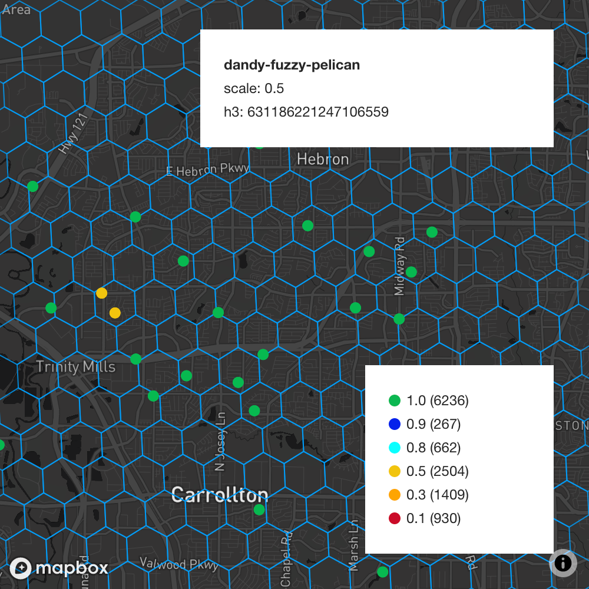
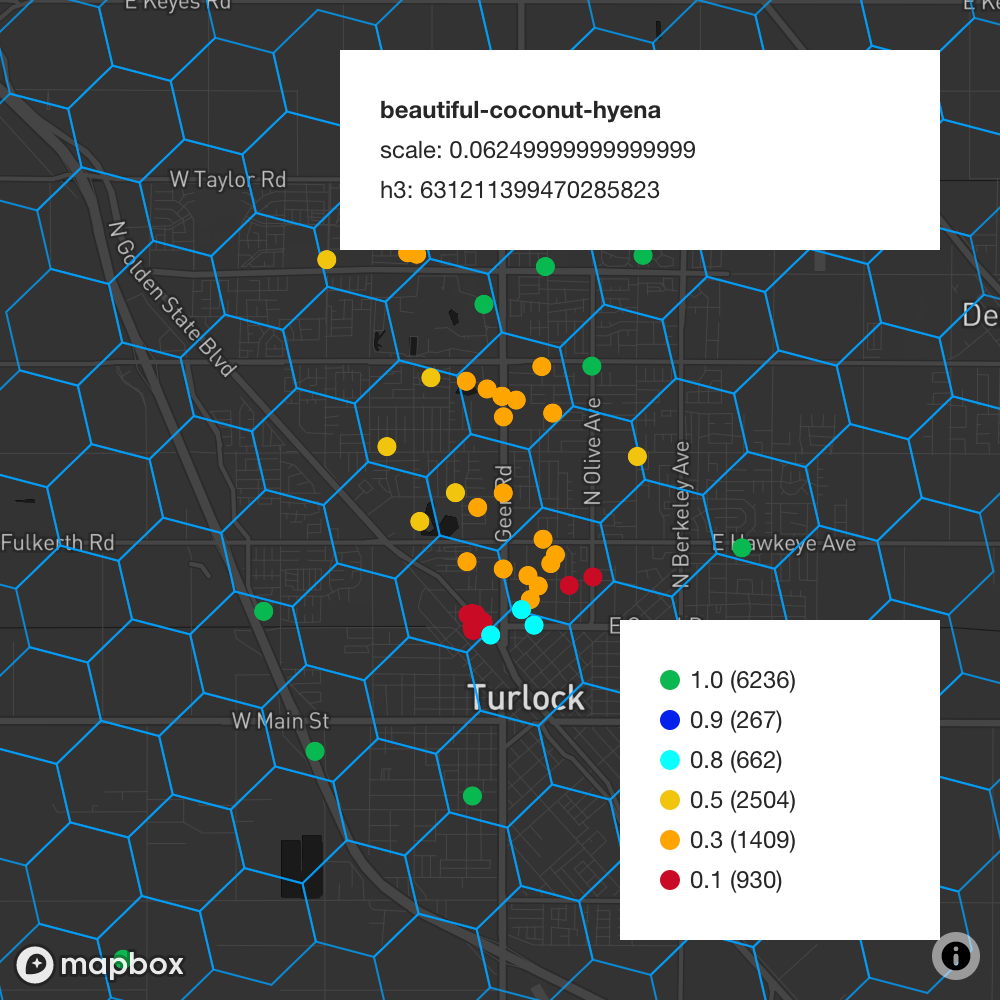
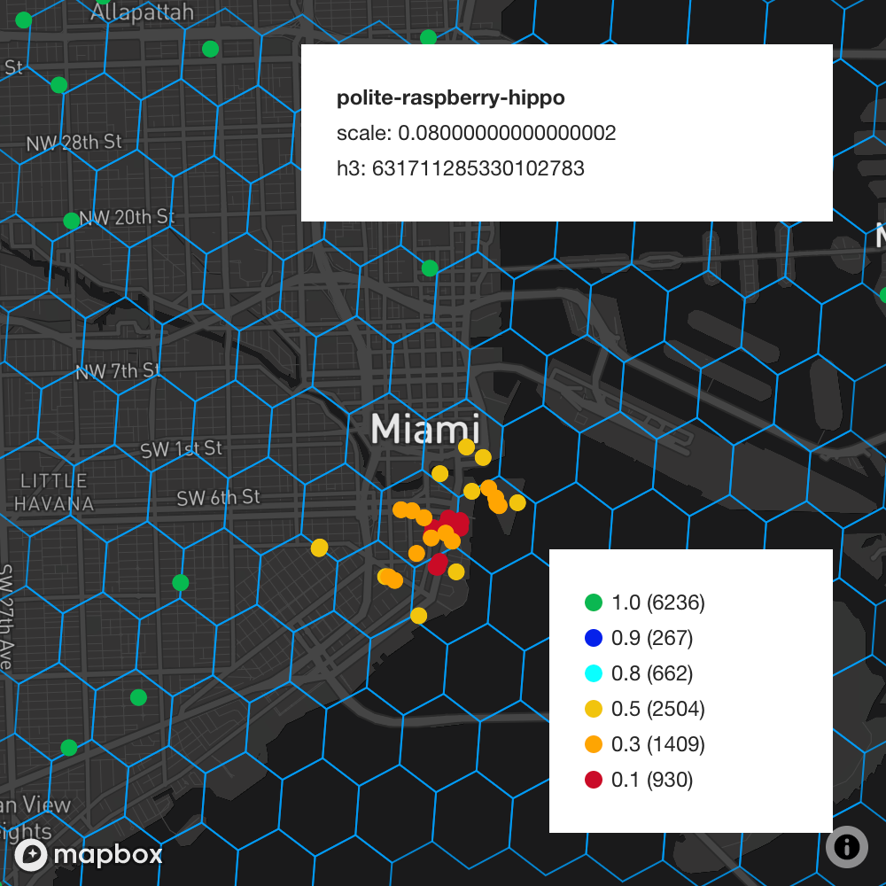
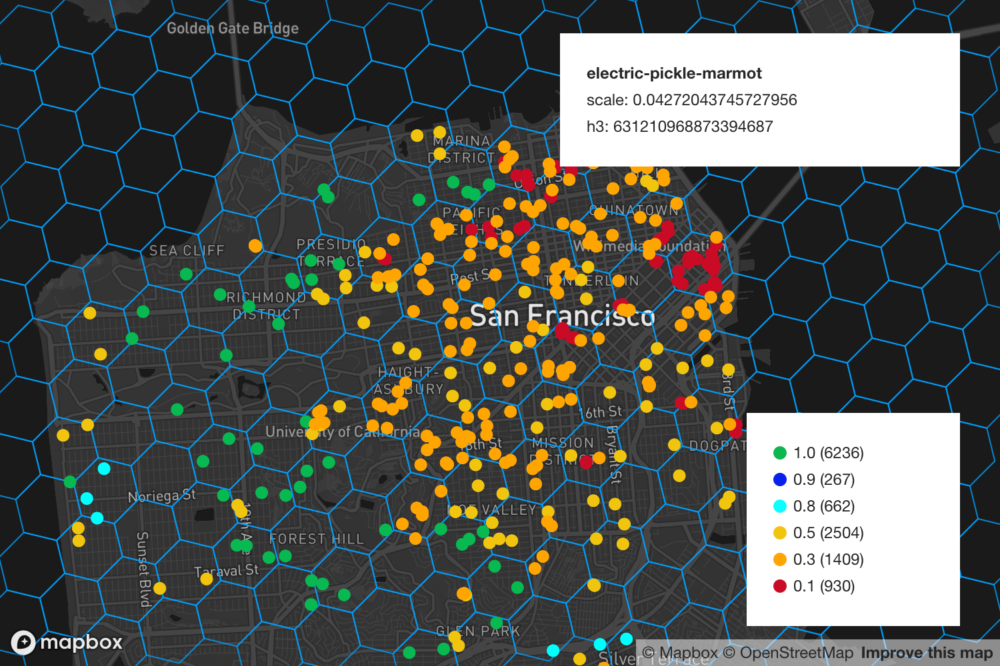

The `2020.12.15.2` release was a monumental release adding support for
[HIP17](https://github.com/helium/HIP/blob/master/0017-hex-density-based-transmit-reward-scaling.md).
**Note that we have decided to scrap the `2020.12.09.0`, `2020.12.11.0`, and `2020.12.15.1` releases
because of bugs we identified during ongoing testing. Details about those bug fixes can be found
[here](https://engineering.helium.comhttps://docs.helium.com/blog/2020/12/14/blockchain-release-hip-17-bugfixes.html)
and
[here](https://engineering.helium.comhttps://docs.helium.com/blog/2020/12/15/blockchain-release-hip-17-additional-bugfixes.html).**

<!--truncate-->

#### HIP17: Hex density based reward scaling

The primary goal of HIP17 is to scale the rewards for challengees (transmitters) and witnesses
(receivers) depending on the [h3](https://h3geo.org/) hexagon they are asserted at. This change to
reward distribution is to better incentivize coverage by reducing rewards earned by
transmitting/witnessing hotspots in close proximity to each other. The formulae used for the scaling
are detailed in the above link.

Essentially we expect an optimum density at every possible
[h3 resolution](https://h3geo.org/docs/core-library/restable), these would be supplied as chain
variables when we activate this feature. If the challengee is found to be in a hex where the density
is higher than the configured optimum value, they would get scaled rewards. The witnesses for those
transmissions would get the scale of the transmitter applied to their rewards as well. It's
important to note that the scale of the witness does not matter.

The team has modeled all the Hotspots on the network with their corresponding scale values, below
are some examples of scale values from the map.

**NOTE: The scale value on the below images does not apply to overall reward scaling, it's only an
indicator for PoC transmission reward scaling. A scale of `0.2` does _not_ mean that a Hotspot's
overall rewards will go down by `80%`.**

_Sparse Density Scaling_

_Variable Scaling_

_Dense Cluster Scaling_

_Finally, here's San Francisco with Scaling_

The team had previously published `2020.11.10.0` which added support for
[HIP15](https://github.com/helium/HIP/blob/master/0015-beaconing-rewards.md), this release adds on
top of that since HIP17 goes in conjunction with HIP15.

**NOTE: This release only adds support for HIP17, please refer to the plan to know the exact
activation time.**

#### HIP17: Proposed chain variables

These are the same chain variables as proposed in the HIP17, just written in a way that the chain
understands.

| Chain Variable             | Proposed Value          | Reason                                                                   |
| -------------------------- | ----------------------- | ------------------------------------------------------------------------ |
| hip17_res_0                | `<"2,100000,100000">>`  | Default (unused)                                                         |
| hip17_res_1                | `<"2,100000,100000">>`  | Default (unused)                                                         |
| hip17_res_2                | `<"2,100000,100000">>`  | Default (unused)                                                         |
| hip17_res_3                | `<"2,100000,100000">>`  | Default (unused)                                                         |
| hip17_res_4                | `<<"1,250,800">>`       | Number of siblings: 1, density_tgt: 250, density_max: 800                |
| hip17_res_5                | `<<"1,100,400">>`       | Number of siblings: 1, density_tgt: 100, density_max: 400                |
| hip17_res_6                | `<<"1,25,100">>`        | Number of siblings: 1, density_tgt: 25, density_max: 100                 |
| hip17_res_7                | `<<"2,5,20">>`          | Number of siblings: 2, density_tgt: 5, density_max: 20                   |
| hip17_res_8                | `<<"2,1,4">>`           | Number of siblings: 2, density_tgt: 1, density_max: 4                    |
| hip17_res_9                | `<<"2,1,2">>`           | Number of siblings: 2, density_tgt: 1, density_max: 2                    |
| hip17_res_10               | `<<"2,1,1">>`           | Number of siblings: 2, density_tgt: 1, density_max: 1                    |
| hip17_res_11               | `<<"2,100000,100000">>` | Default (unused)                                                         |
| hip17_res_12               | `<<"2,100000,100000">>` | Default (unused)                                                         |
| density_tgt_res            | `4`                     | Resolution to calculate density                                          |
| hip17_interactivity_blocks | `3600`                  | Number of blocks since last_poc_challenge a Hotspot is considered active |

Furthermore, below are the proposed chain variables for HIP15:

| Chain Variable        | Proposed Value | Reason                                                     |
| --------------------- | -------------- | ---------------------------------------------------------- |
| witness_redundancy    | 4              | Optimum desired redundant witnesses for a poc transmission |
| poc_reward_decay_rate | 0.8            | Decay rate for additional poc transmission                 |

In order to have full effect for HIP17 all the above mentioned chain variables (HIP15 + HIP17) are
required.

#### Bump snapshot to 624961

This release also bumps the blessed snapshot to height `624961` which will improve sync times of
newly onboarded Hotspots.

#### Related PRs

- _Add support for HIP17_
  - [blockchain-core/677](https://github.com/helium/blockchain-core/pull/677)
- _Add support for HIP17 and bump snapshot_
  - [miner/579](https://github.com/helium/miner/pull/579)
- _Bugfixes_
  - [blockchain-core/695](https://github.com/helium/blockchain-core/pull/695)
  - [blockchain-core/696](https://github.com/helium/blockchain-core/pull/696)
  - [blockchain-core/697](https://github.com/helium/blockchain-core/pull/697)
  - [blockchain-core/703](https://github.com/helium/blockchain-core/pull/703)

### Plan

~~We began beta-testing `2020.12.09.0` around 5:00 PM PST, December 8th, 2020 and plan to GA on
Thursday, December 10th, 2020 around 2PM PST. We will activate HIP17 and HIP15 chain variables on
Monday, December 14th, 2020 and will be announcing this change via push notification and on
Discord.~~

~~We began beta-testing `2020.12.09.0` around 5:00 PM PT, December 8th, 2020 and deployed the
release to GA on Thursday, December 10th, 2020 around 3:00 PM PT. After identifying an issue that
required an additional deployment before the chain variable activation, we began beta-testing
`2020.12.11.0` around 4:00 PM PT, Friday, December 11, 2020. We plan to GA around 10:00 AM, Sunday,
December 13, 2020.~~

~~We planned to activate the HIP17 and HIP15 chain variables on Monday, December 14th, 2020 but
scrapped the change due to bugs we found in HIP17 implementation. A future blog post will describe
our next steps.~~

We activated the HIP17 and HIP15 chain variables on Wednesday, December 16th, 2020 at 10AM PST.
Activation Transaction can be found on Helium Explorer.
