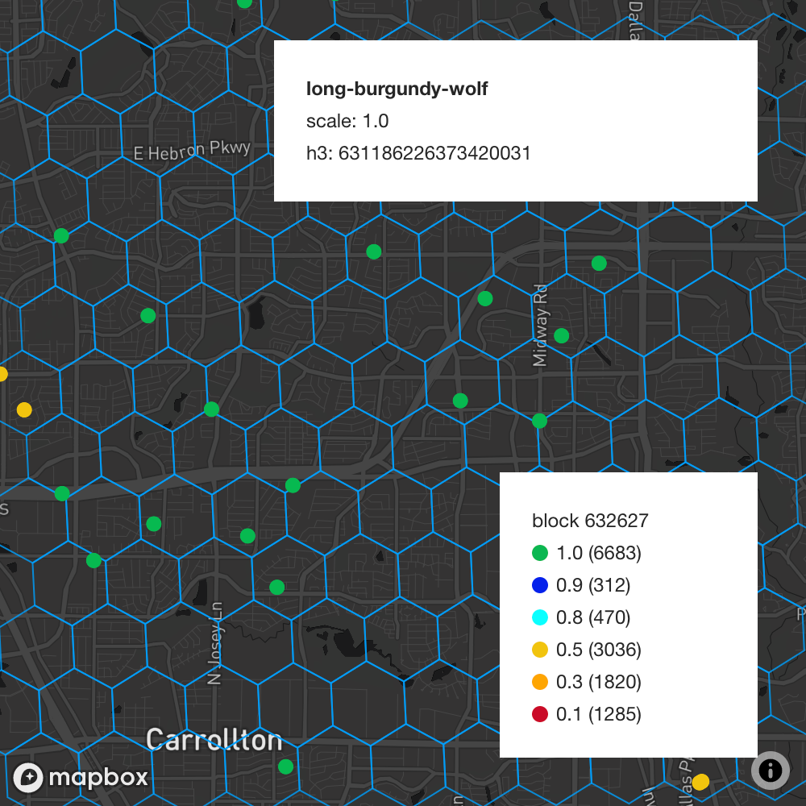
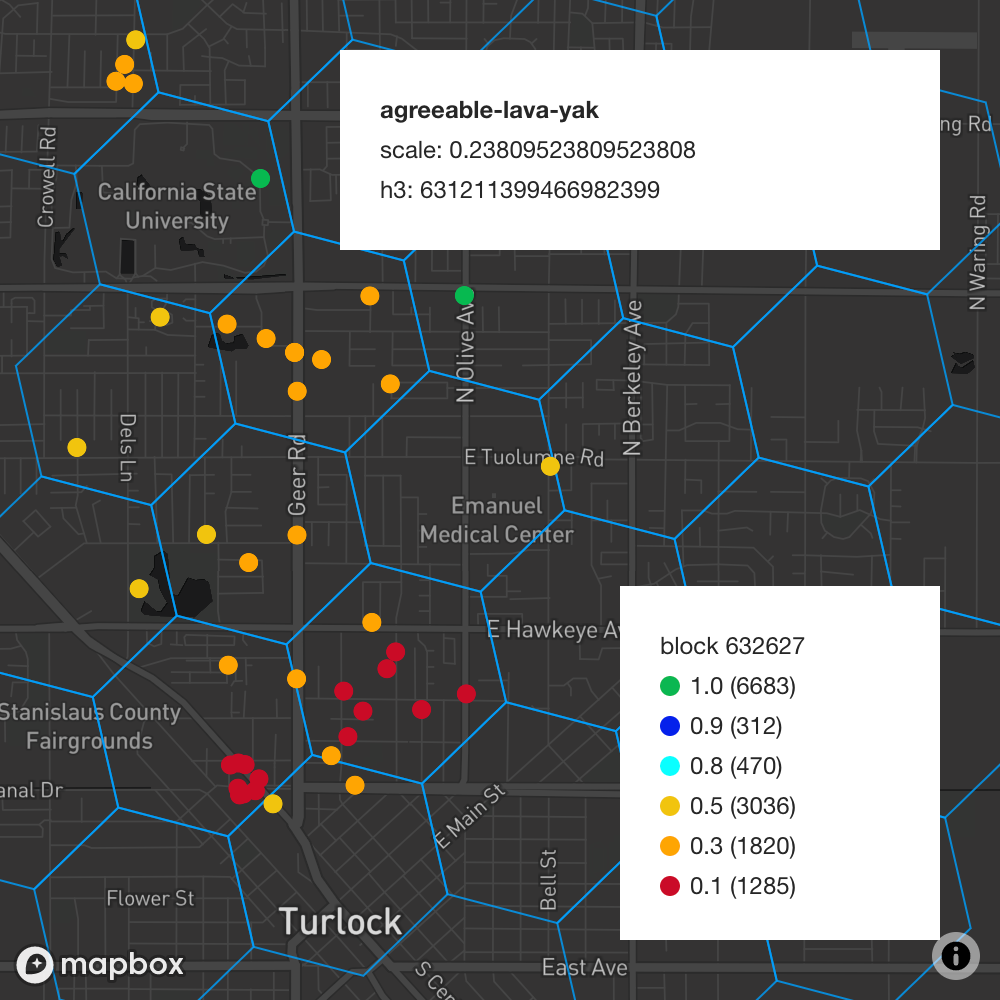
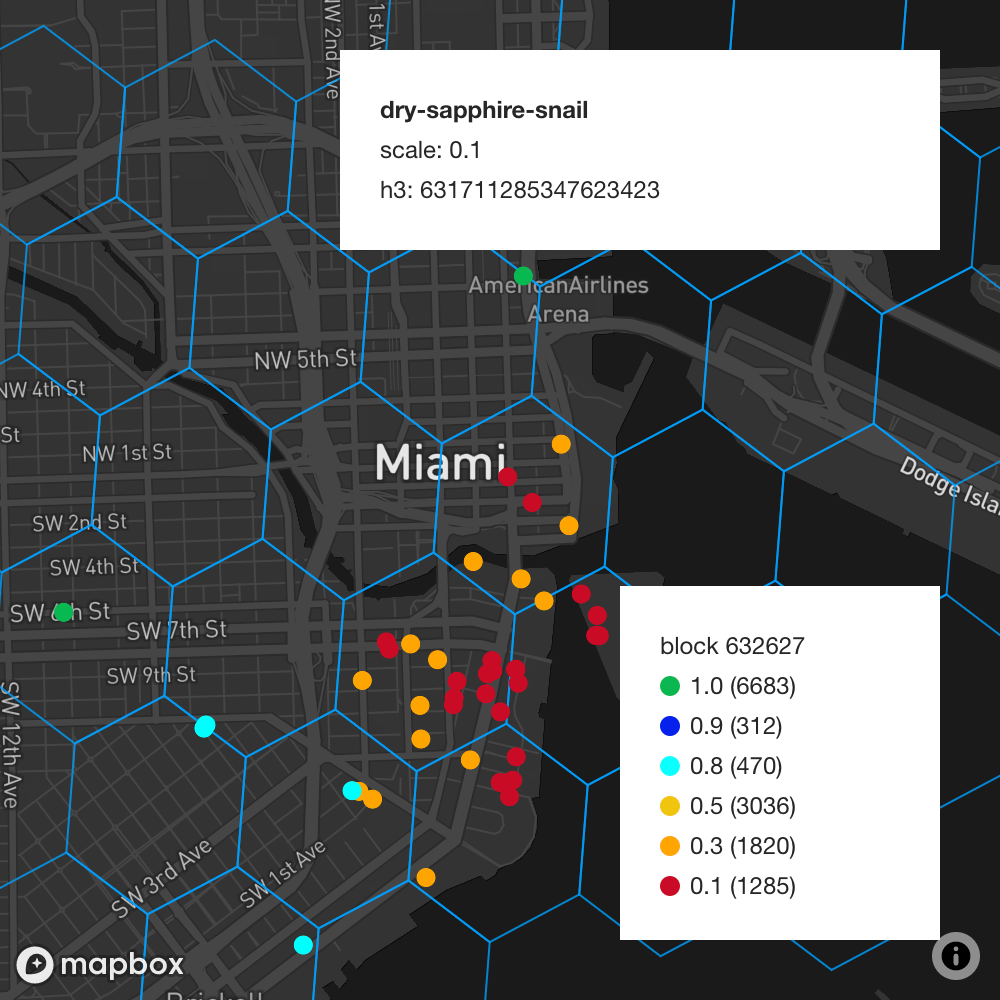
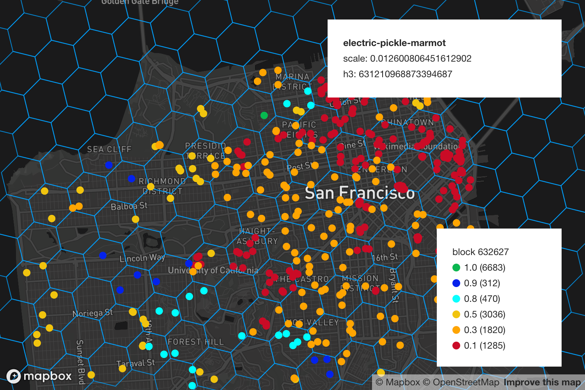

The `2020.12.15.1` release is a bugfix release to add support for
[HIP17](https://github.com/helium/HIP/blob/master/0017-hex-density-based-transmit-reward-scaling.md).
Please find a detailed breakdown of the bugfixes below.

<!--truncate-->

#### [blockchain-core#697](https://github.com/helium/blockchain-core/pull/697): Fix H3 Index Corruption

Before the team could activate support for HIP 17 in a previous release (you can read more about
this
[here](https://engineering.helium.comhttps://docs.helium.com/blog/2020/12/09/blockchain-release-hip-17.html)),
we realized that the network could run into a potential blockchain halt due to mismatching h3
indexes, which are updated on every `add_gateway` and `assert_location` transaction. We had an
internal discussion on the impact of this issue and collectively decided to address the bug and
postpone HIP 17 activation for a day. Please find the plan below.

The bug was quickly root caused to malformed case clauses in `assert_location` transaction which
were not correctly updating the h3 indexes when a Hotspot's location changed on the network. Please
feel free to view the commits on the bug
[here](https://github.com/helium/blockchain-core/pull/697/commits).

#### Debugging HIP 17 Variables

The team continues to make improvements in how Hotspot owners can visualize their Hotspot
performance and needs to make some blockchain core changes to visualize the rewards scale. As a stop
gap, we've modeled all the Hotspots on the network with their corresponding scale values, we
currently use [this debugging tool](https://hip17.helium.wtf/) to help us understand reward scales
at a particular block height. This tool is not updated live and bound to the specific block height
that is in the legend (currently: `632627`, approximately `2020-12-14 @ 5:47 PM PT`).

As mentioned in a prior post, the scale value in the visualization does not apply to overall reward
scaling. It is only an indicator for PoC transmission reward scaling. A scale of `0.2` does _not_
mean that a Hotspot's overall rewards will go down by `80%`.

Here are some updated images from the tool for reference

_Sparse Density Scaling_

_Variable Scaling_

_Dense Cluster Scaling_

_Finally, here's San Francisco with Scaling_

#### [miner#580](https://github.com/helium/miner/pull/580): Adjust Spreading Factor

This release also adjusts spreading factors again to take into account the lack of a LoRaWAN header
for PoC. We're including this change in this release since it's a minor code change but a
significant improvement for EU Hotspots and a useful improvement for US Hotspots. You can see a past
description of spreading factor changes in this
[old post](https://engineering.helium.comhttps://docs.helium.com/blog/2020/10/02/spreading-factor-changes-poc.html).

#### [blockchain-core#699](https://github.com/helium/blockchain-core/pull/699): Fix Bad Snapshot Binary Tag

We also fixed the snapshot binary tag which wasn't getting updated correctly therefore doing
incorrect deserialization and enhanced the tests to avoid future slippage.

### Plan

We began beta testing `2020.12.15.1` around 10:00 AM PT, December 15th, 2020 and plan to deploy to
GA on Tuesday, December 15th, 2020 around 3:00 PM PT.

We plan on activating HIP15 and HIP17 chain variables on Wednesday, December 16th, 2020 and will be
announcing this change via push notification and on Discord.
