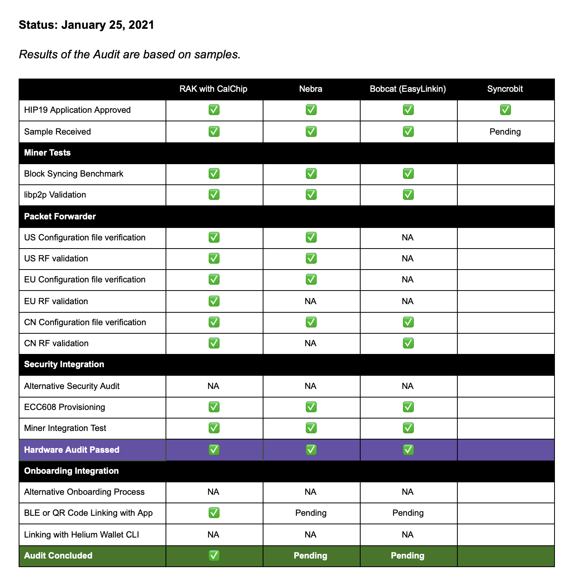

&nbsp;

# The Maker Audit

The Helium community places a lot of trust in
[HIP19](https://github.com/helium/HIP/blob/master/0019-third-party-manufacturers.md) approved
hardware vendors and grants them the ability to add full mining gateways to the Helium blockchain.
These manufacturers, also known as “Makers”, are limited by chain variables and the Onboarding
Server as described previously on
[the Helium blog](https://blog.helium.com/onboarding-for-third-party-hotspots-f8b99df35be). The
community trusts that the Maker will produce and deliver a real physical Hotspot with approved
security methods.

<!--truncate-->

As the network grows, it's important to put forth a set of guidelines that all Makers should adhere
to, for the growth and stability of the Network, but also for the community to understand the
progress of each Maker before purchasing products.

The Helium team has been asked by the Decentralized Wireless Alliance (DeWi) to review the hardware
that has been presented and wants to provide transparency of our process thus far and it may evolve
as more Makers are approved.

## EDIT: As of April 2021, the Maker Audit Process has evolved and changed

The new process is below (current as of April 2021). Previous Makers approved before April 2021 are
legacied and will not be subject to the new process.

1. Submit application
2. Hardware audit
3. Onboarding server integration
4. FCC/CE or other application radio certification
5. Community approval
6. Pre-orders note: items 2-4 can occur simultaneously

For continuity, the old process is below.

A summary of how a Maker goes from HIP19-approved to market:

1. Makers submit a HIP.
2. DeWi and Community approve.
3. Makers send hardware samples for Audit.
4. Once Makers pass hardware audit, they are allowed to proceed to Network Integration.
5. The final stage of Network Integration is being able to add Hotspots to the Onboarding Server.

If at any point, a Maker is unable to proceed to the next step, it will be up to the Maker to
process refunds to pre-orders. It is important as consumers to be aware of the Maker's Hotspot
status before purchasing.

# Audit Status (Current as of January 25, 2021)

**Results of the Audit are based on samples provided at start of audit. Consumer discretion is
advised.**

## Table Definitions

#### HIP19 Application

Before being eligible for sample audit, a vendor must be community approved via
[HIP19](https://github.com/helium/HIP/tree/master/0019-third-party-manufacturers).

#### Sample Received

A sample representative of final production quality must be sent

#### Block Syncing Benchmark

The Miner’s data is wiped and the rate at which the device syncs from a specific block height is
monitored for roughly an hour. This is to ensure its processor is able to handle syncing the
blockchain and load snapshots.

#### libp2p Validation

The Miner’s peer book is inspected after roughly an hour; in addition, a direct connection over a
LAN is attempted

#### Radio Configuration File Verification

Insofar as the configuration files are compatible with those used in the Semtech Packet Forwarders,
channel configurations are verified to match the configuration required for each region using
[this utility](https://github.com/helium/packet-forwarder-test). The configuration files may be
present on the sample but may also be provided digitally.

#### RF Validation

For each hardware sample provided, an automated gateway-to-gateway test is done over the air to
further validate the regional configuration using
[this utility](https://github.com/helium/packet-forwarder-test). When possible, a gateway other than
the vendor’s gateway is used is the control.

#### Alternative Security Audit

When proposing an alternate security model than the ECC608 approach, a Maker may be subject to a
third-party verification of their security claims. This may block the conclusion of the audit,
however, providing these measures as an enhancement to the ECC608 model will avoid any blocking.

#### ECC608 Provisioning

When the ECC608 model is implemented, the provisioning of the ECC608 may be verified using
[this utility](https://github.com/helium/gateway_mfr). This proves that the ECC608 is configured in
the same way as the original Helium Hotspots. Makers should run the test themselves if they make any
changes to this stage of their manufacturing process.

#### Miner Integration Test

The Miner is queried to verify that it returns the same keys output from the ECC608 utility

#### Onboarding Integration

Only one of these three methods must be passed to conclude the audit.

#### Alternative Onboarding Process

When a Maker provides an alternative onboarding process, its integration with the onboarding server
shall be tested.

#### BLE or QR Code Linking with App

Onboarding using the Hotspot App will be tested with a dummy onboarding key to test proper
integration.

#### Linking with Helium Wallet CLI

Onboarding using the Helium Wallet CLI will be tested with a dummy onboarding key to test proper
integration.
