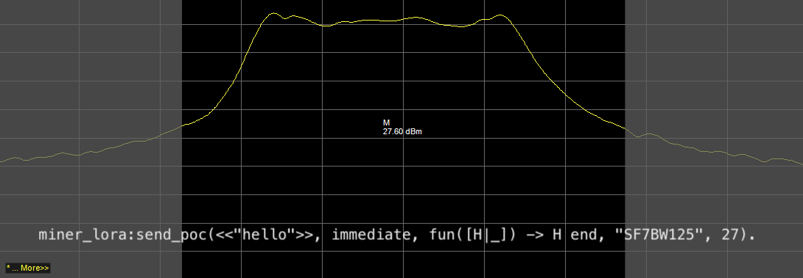

The team has a new release tagged `2021.01.27.0` containing a change to the Radio Power Output,
updates to RSSI offset, support for the onboarding server, bug fixes, and a snapshot bump.

<!--truncate-->

Please read on for more details and plan for GA.

### [miner#597](https://github.com/helium/miner/pull/597): Power Output Change

Please read to understand the impact in your region:

#### US 915 Hotspots (Helium and RAK):

We’ve discovered that Hotspots with the Semtech SX1302 chip inside (v2 Helium Hotspots, RAK
Hotspots) had their Transmit Power table configured incorrectly. This change will increase the power
output from 20 dBm to 27 dBm, which will significantly increase the range of PoC.

#### EU868 Hotspots (Helium and RAK):

We also discovered through this process that the power output for PoC in the EU region was too high.
This update will scale down the Power Output for these Hotspots as they were above what is allowed
in ETSI regulations. Transmit Power has been adjusted from 20dBm to 14dBm, which will reduce PoC
range in the majority of situations. This is not something we wanted to do, as we know the community
works hard to improve range, however, we need to stay within the recommendations from governing
bodies. We apologize for this initial misconfiguration.

We have tested the new power output for both regions and confirmed it is within specifications.

#### RSSI Offset

Add optimizations to RSSI Offset. This does not affect PoC range but will improve witness validity.

### [miner#607](https://github.com/helium/miner/pull/607): Ignore mark_done message in hbbft handler

The team noticed occasional consensus manager crashes in the miner due to an unhandled response,
this has been fixed.

### [miner#605](https://github.com/helium/miner/pull/605): Snapshot bump to 693361

We have updated the snapshot block to `693361` to allow newly onboarded hotspots to sync faster to
the current blockchain head block.

### Plan

We have been beta testing `2021.01.27.0` since January 26th, 2021 3:00PM PT. Current ETA for GA is
12:30 PM PT, January 27th, 2021.
