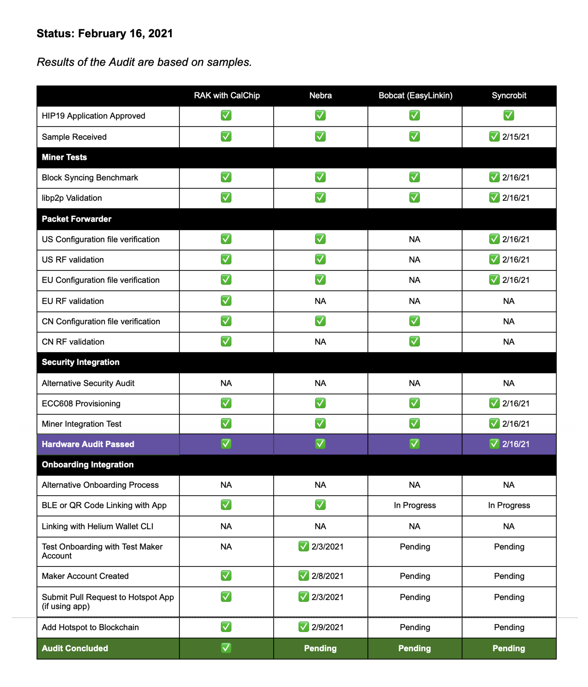

## Maker Update

The three newly approved Makers of the Helium network have made great progress in their audit and
integration with the Hotspot app. We’d like to take this opportunity to inform the community on
their progress and how long each Makers took to progress through the milestones so you, as a
potential Hotspot owner, can understand when to expect your Hotspot once a Maker starts their audit
process.

<!--truncate-->

A summary of how a Maker goes from HIP19-approved to market:

1. Makers submit a HIP.
2. DeWi and Community approve.
3. Makers send hardware samples for Audit.
4. Once Makers pass hardware audit, they are allowed to proceed to Network Integration.
5. The final stage of Network Integration is being able to add Hotspots to the Blockchain.

To expand on Step 5, Makers will have to accomplish 4 additional milestones that is
[documented here](https://docs.helium.com/hotspot-makers):

&nbsp;

# Add a Test Hotspot using the Test Maker account

This step is to verify that the Maker’s Hotspot is communicating with the Hotspot app over Bluetooth
and it is able to submit signed transactions using the Hotspot app and the Test Maker address.

Makers that choose to use other onboarding methods will still need to complete this step.

This is verified by looking at the
[API endpoint of the Test Maker address](https://api.helium.io/v1/accounts/138LbePH4r7hWPuTnK6HXVJ8ATM2QU71iVHzLTup1UbnPDvbxmr/pending_transactions)
(it is expected for transactions to fail).

Nebra completed this step on February 3, 2021. Bobcat is in progress. Syncrobit is in progress.

# Requesting a Maker account

In order to receive a Maker account, the Maker must prove that they’re able to submit signed
transactions using the Hotspot app using the Test Maker address.

As of February 16 2021, Nebra Ltd, Cal-Chip Connected Devices, and Helium have a Maker Account. A
list of Makers with accounts can be found [here](https://onboarding.dewi.org/api/v2/makers).

# Submitting a Pull Request to the Hotspot App OSS Repository

The next step of integration is submitting accompanying imagery, copy, and code, specific to the
Maker’s Hotspot. This allows the App to display Hotspot-specific instructions on how to pair,
diagnose, and request support.

Nebra started this step on February 3, 2021, pending last minute debugging with help from Helium
engineers. You can [find the PR here](https://github.com/helium/hotspot-app/pull/175).

Makers that opt to use other onboarding methods will not need to complete this step.

# Add a Maker Hotspot to the Network

The last step of integration is verifying that a Hotspot can be added to the blockchain using their
Maker Account and the Hotspot app.

Nebra completed this step on February 9, 2021. You can see their Add Hotspot transaction
`b66b9xz7YZoOtJM59L_xiftfbukDshU484uAp0OmLiI`.

## Audit Status (Current as of February 16, 2021)

**Results of the Audit are based on samples provided at start of audit.**

