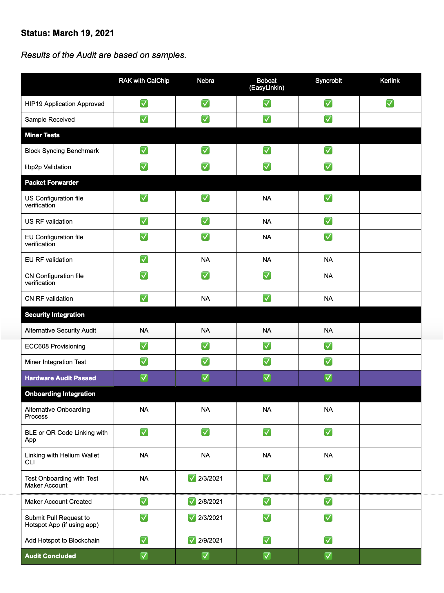

## Maker Update

Since the last update in February, Makers Nebra, Syncrob.it and Bobcat have concluded their Audit.

<!--truncate-->

We also have an additional Maker, Kerlink, recently approved to add to the Audit Status table.

A summary of how a Maker goes from HIP19-approved to market:

1. Makers submit a HIP.
2. DeWi and Community approve.
3. Makers send hardware samples for Audit.
4. Once Makers pass hardware audit, they are allowed to proceed to Network Integration.
5. The final stage of Network Integration is being able to add Hotspots to the Blockchain.

## Audit Status (Current as of March 19, 2021)

**Results of the Audit are based on samples provided at start of audit.**

