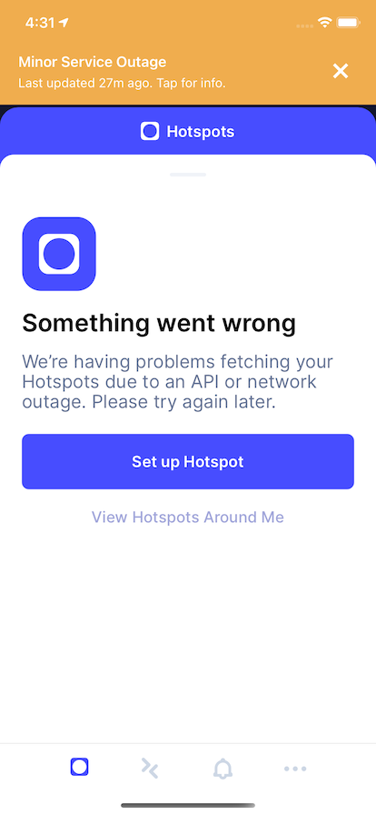

## April 4-6 API Outage Retrospective

Starting on April 4, our daily active users (DAU) on Helium Explorer doubled from 15,000 to 30,000.
As a result, the API services that Explorer relies on was unable to handle the additional load. The
reason for this cannot be fully attributed to DAU, but rather a symptom of the root cause. This API
is used by multiple services including the Explorer, Helium App, and Wallet CLI. Many third party
services also depend on this API.

<!--truncate-->

### Root Cause:

In the development of Explorer and the Helium App, we rapidly deployed new features that gave
insight to new users to the network. Useful information such as daily rewards, rewards overtime, and
Hotspot checklists, were not optimized for scale.

This, in addition to creating a system where anyone can query the API, resulted in many community
API calls that queried computationally expensive endpoints, like `/stats`, `/rewards/sum`,
`/hotspots`, and `/accounts`, that the API could not handle at scale.

As more users navigated to Explorer, these expensive API calls grew exponentially, and created the
outage. This is colloquially known as a thundering herd.

### What we’ve done:

- Scaled up several instances of our API services and added load balancing across all services.
- Changed how queries from Explorer and Helium App are handled.
- Either removed features or show on request to ease the load on the API for both Explorer and app.
  We will reoptimize the features and relaunch them.

## Hidden features:

- 1 year earnings chart for Hotspots
- Hotspot Checklist in Helium App

## By request:

- Hotspot Checklist in Explorer

## Additional Communication:

We’ve added a Network Status banner notification in the Helium app that appears when an incident is
reported. This update is available in 3.0.6.

We’ve created a twitter bot [@helium_status](https://twitter.com/helium_status) to automatically
tweet incidents and updates from our [status page](https://status.helium.com).
