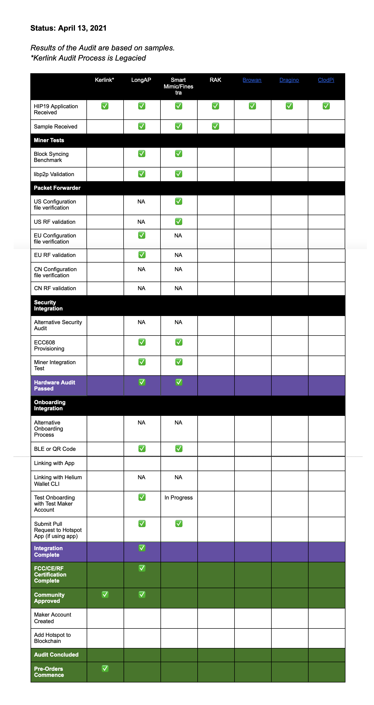

&nbsp;

# Maker Update

Here is the latest update from our Makers manufacturing Hotspots for the Helium Network.

<!--truncate-->

## A Better Process for Makers

DeWi, Makers, and Helium have agreed on an improved process that outlines how a Maker goes from
application to approved - where more of the work is done upfront before it goes to community
approval.

### The New Process

Once a Maker submits their intention to be manufacturer of Hotspots via a HIP19 application, Makers
no longer need to wait for community approval before starting hardware audit. By front-loading
technical work (audits and integration) and due diligence (radio certification) and placing
community approval and pre-orders last, the community will be better informed when approving new
Makers and informing purchase decisions.

Here is a summary of steps that all new Makers will adhere to.

1. Submit HIP19 Application
2. Hardware Audit\*
3. Onboarding Integration\*
4. FCC, CE, or an equivalent radio certification, depending on regional requirements\*
5. Community Approval
6. Pre-orders Begin

\*These steps can occur in parallel

With that, existing Makers already approved will follow the legacy process. This includes Kerlink
that has been community approved but not passed hardware audit.

## New Makers

[LongAP One](https://github.com/HeNet/HIP/blob/feature/hip19-henet-application/0019-third-party-manufacturers/henet.md)
is the first Maker to progress through the new process, congratulations!

[SmartMimic](https://github.com/onterferon/HIP/blob/master/0019-third-party-manufacturers/Smart-Mimic.md)
is well on their way through onboarding integration. Once that’s complete, DeWi will verify
certification and move onward to community approval.

[RAKwireless](https://github.com/helium/HIP/blob/a23147091130841584950c00f346f2577459d588/0019-third-party-manufacturers/RAKwireless%20-%203rd-party%20manufacturer%20application.md),
a previously approved HIP-19 Maker has shown intention on producing their own Hotspots separate from
CalChip and has submitted hardware for audit.

[Browan](https://github.com/browanofficial/HIP/blob/patch-1/0019-third-party-manufacturers/Browan-Cellular-Gateway.md),
[Dragino](https://github.com/dragino/HIP/blob/master/0019-third-party-manufacturers/dragino.md), and
[ClodPi](https://github.com/clodpi/HIP/blob/master/0019-third-party-manufacturers/clodpi.md) have
all submitted applications and pending hardware audits.

## Audit Status (Current as of April 13, 2021)

**Results of the Audit are based on samples provided at start of audit.**

