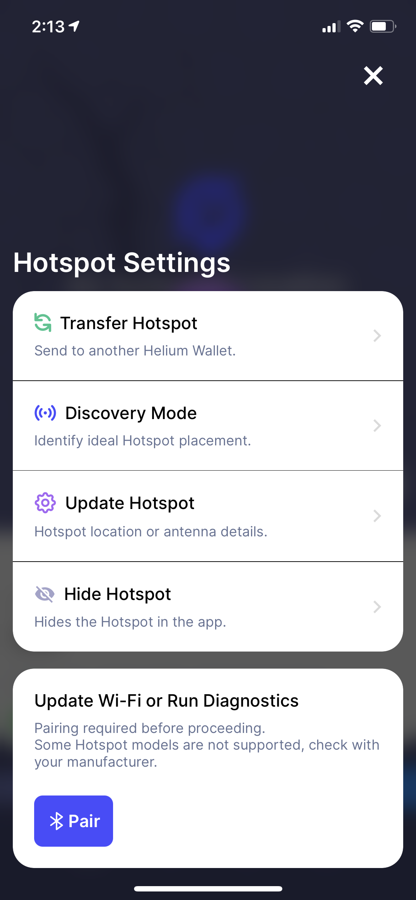
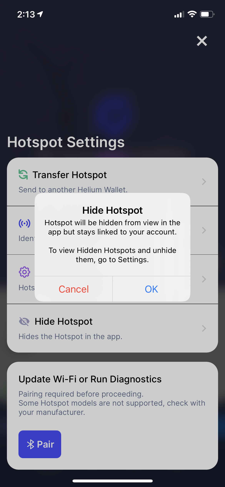
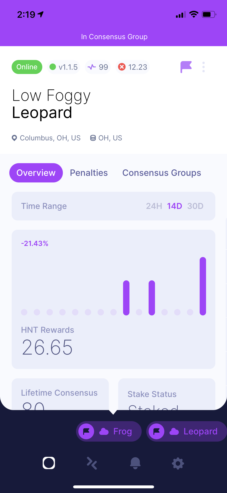
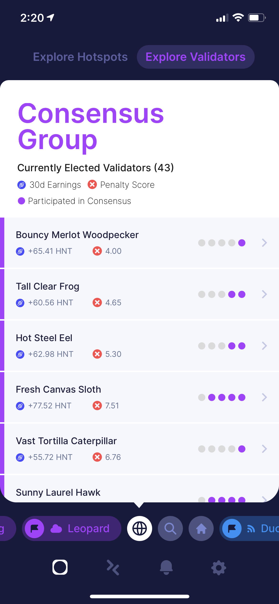

App Version 3.5.0

&nbsp;

# New Features

## Hide Hotspot

Have a Hotspot that has met their untimely demise and the daily reminders just reminds you of the
good old days and it just hurts too much? Or maybe you want to hide it for other reasons - we don't
judge. Now you can hide it from app view (but it’ll stay associated with your account). To unhide
Hotspots, go to Settings to view hidden Hotspots.

<!--truncate-->

## Validators

This new release enables anyone to search, follow, and view their validators! Do you have validators
staked in a different wallet, but want to keep tabs on it? Search and Follow and it’ll appear in the
app, see its earnings, penalties, online status, and how many consensus groups it's been in.

You'll also be able to see the current consensus group in the app.

## Adds iPad support

Take advantage of the screen real estate and use the app on an iPad. Thanks @compojoom for the
contribution :raisehands:

## Payment Notifications

Receive an app notification any time someone sends you HNT.

# New Hotspot Support

Adds FreedomFi, Controllino, and Heltec to Hotspot list.

# Improvements

## Adds unasserted Hotspot filter when in Fleet Mode

When in Fleet Mode, adds a new Hotspot filter list to show all unasserted Hotspots you own. Thanks
for the feature suggestion @pooley92!

## Improves error message when adding a Hotspot not found in the Onboarding server

We no longer speak nonsense when a Hotspot does not exist on the onboarding server.

# Bug Fixes

- Handle `/` in add_gateway transactions generated from QR codes and deeplinking gracefully and not
  crash
- Handle misasserted locations when showing Hotspot witnesses
- Fixes gain keyboard input for all locales
