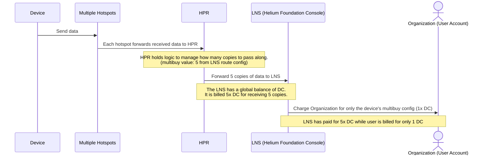

# Foundation Console Exploit Postmortem (2023-5-27 to 2023-6-16)

## Summary

The Helium Foundation Console faced an exploit that was amplifying existing network usage and
allowing bad actors to earn more than they were spending in DC. In essence, they were paying for 1
DC while the Console was burning up to 5 DC due to an accounting bug. This bug also affected all
instances of Console that weren't managing their routes. This bug only affected these public
instances and did not result in unpaid traffic on the Helium Network as a whole.

<!--truncate-->

Two additional potential exploits were also identified and are in the process of being resolved.

### Background

After the migration to Solana, routing was transferred over to the Helium Packet Router (HPR). HPR
keeps track of routes which it uses to determine which LoRaWAN Network Server (LNS) to forward the
data packets it receives from the network's hotspots to. These routes include a multibuy field which
determines how many copies of the data packet the LNS is willing to pay for. There will be multiple
copies of the same data packet when multiple hotspots receive a sensor device's uplink. Upon
receiving the packets from HPR, an LNS can then forward them to its users and bill them
appropriately.

### Cause

The Helium Foundation Console (an LNS) was software initially designed around the Helium L1
blockchain and used the blockchain for routing. As such, it had a single system route for all
devices. In the interest of supporting multiple packet purchasing for the existing devices, this
route was set to multibuy value of 5. The multibuy accounting was abstracted in the UI. Due to this,
post-migration, a device without multibuy (or a multibuy of less than 5) would cause the LNS to pay
for up to 5 copies of the data while the user was only being billed for 1 copy. This bug affected
all the devices setup on our console and erroneously amplified the network usage. One or more bad
actors further amplified the effects of this bug by creating additional traffic for the sole purpose
of having their hotspots transfer the data and farming the associated rewards. In essence, their
hotspots could receive 5 DCs worth of traffic for the cost of sending a single DC from a device.

 

### Solution

An investigation and sweep of active devices on Foundation Console revealed several dozen devices
under a small subset of organizations accounting for at least the majority of traffic on the
Foundation Console despite representing a fraction of the total devices. These accounts were removed
and account creation was temporarily halted while developers implemented an update.

The update introduced a feature-add for the entire network which allows setting multi-buy logic on
specific devices. This functionality was added in addition to the existing multi-buy logic on
routes. This prevented the need for drastic overhaul of Console's route code and made
device-specific controls easier for other LNS operators in the future.

This device-level control is available by attaching a multibuy value to the device's session key
filter (SKF). This SKF is transmitted to the Config Server which in turn forwards it to the HPR. If
an LNS operator does not submit a multibuy value in a device's SKF, it will default to the route's
multibuy value to determine how many copies of a packet should be purchased.

### Outcome

This fix was deployed on June 13, 18:00 UTC. The result was a precipitous drop in DC burned for
network traffic. Following this fix, IoT Network traffic remained stable until about June 15, 03:00
UTC when network traffic began to increase at an inorganic rate again. Since then the data usage has
gone back down to the post fix levels. We are still investigating the potential cause for this and
whether this was a continued effort to take advantage of the fixed exploit or a new exploit
altogether. As of now, we are leaning towards the former due to the reduction in usage after a day.
We will continue monitoring DC usage for suspect activity.

## Next Steps

The core mechanism of these exploits resides in having the LNS pay for more data than is billed to
the users. As such we will start tracking the amount of DC billed to the user's allocation of the
overall DC pool and the amount of network usage (DC) that the LNS has paid for. When the two diverge
we'll quickly know that an exploit was likely found.

Exploration revealed two additional attack vectors that have not yet been exploited.

The first is similar to the multibuy bug by being a configuration bug that was introduced with the
migration to Solana and the adoption of HPR for routing. In essence, a user with a balance of 0
whose devices were still running would cause the Console to pay for the device's uplinks. To fix
this bug, the Console now properly informs the Config Server and HPR that the user's devices should
be disabled when their balance reaches zero. This was not an issue pre-migration as the Console
would run state channels and was able to verify a user's balance itself.

The second has not yet been resolved so, due to the opportunity for abuse, it will not be detailed
here. Core stakeholders have however been notified and a design has been proposed which will prevent
its use in the future, making the Helium IoT Network increasingly robust into the future.

## Timeline

**April 19th** Migrate to Solana. HPR takes over routing. The amplification of network usage starts.
This was initially attributed to improved packet delivery due to the more streamlined packet routing
system.

**May 27th** Network usage starts growing rapidly.

**June 8th** Foundation starts investigating the legitimacy of the network usage growth.

**June 12th** The multibuy bug is identified. Developers work on necessary code changes.

**June 12th - 04:08 UTC** New signups to the console are disabled and the bad actors' accounts are
deleted.

**June 12th - 04:38 UTC** Discord Announcement with regards to disabled signups and that an exploit
was identified.

**June 13th - 17:53 UTC** Config Service and IoT Packer Router are updated to enable SKF based
multibuy configurations. The Foundation console stops overpaying for network usage.

**June 14th - 03:18 UTC** The bug being resolved, Abhay reveals more details about the exploit in
the Foundation channel.

**June 15th - 04:00 UTC** Network usage nearly doubles in an hour. The team starts investigating
other possible exploits. Another potential exploit is found. It does not however seem to be actively
exploited.

**June 16th - 13:00 UTC** Network usage has returned to expected levels. The running hypothesis is
that gamers realized they are no longer benefiting from it and stopped their traffic.
