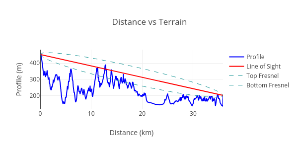
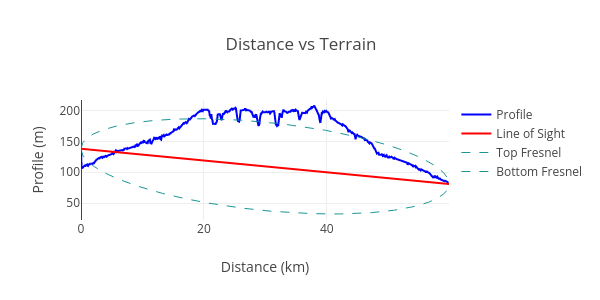
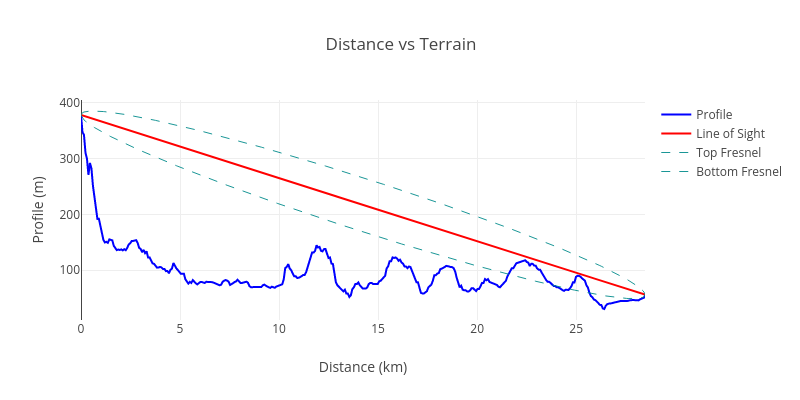
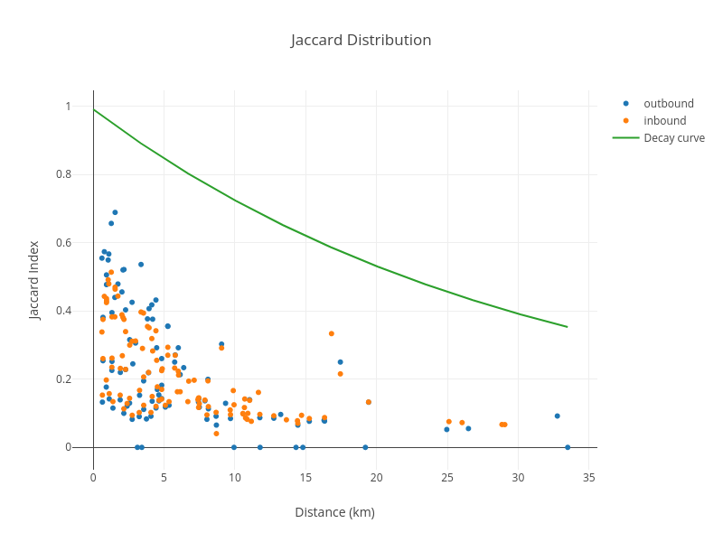
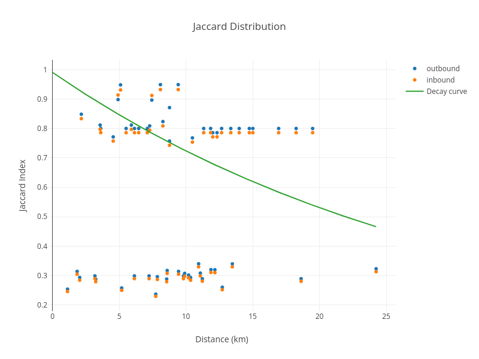

# IOT Denylist Evolution

On August 21, 2023, the IOT denylist will be updated to use a new weekly generation process and set
of classifiers to identify hotspots that are gaming the IoT Proof of Coverage system.

<!--truncate-->

# Background

On January 13, 2022, the
[community approved](https://heliumvote.com/14iwaexUYUe5taFgb5hx2BZw74z3TSyonRLYyZU1RbddV4bJest)
that Nova Labs would be allowed to operate and enforce a
[deny list](https://docs.helium.com/iot/denylist) to handle widespread abuse of the Helium Proof of
Coverage (PoC) system.

The system that was put in place relied on both simple metrics and more involved learning algorithms
to detect various gaming techniques which would, with high confidence, flag a gaming hotspot.

The list of identified hotspots is placed on the [deny list](https://github.com/helium/denylist/)
which, in the current system is picked up by the IoT Oracles to exclude those hotspots from earning
PoC rewards.

Owners of hotspots on the deny list could issue removal requests to [crowdspot](http://crowdspot.io)
with evidence that they were mischaracterized and should be removed from the deny list.

The following are the limitations encountered using this approach as implemented currently:

- The algorithmic detection of bad actors has a small but noticeable false positive rate.
- Many deny list removal requests were submitted, often with multiple submissions per hotspot.
- A large set of removal requests attempted to create confusion by submitting false information with
  hotspots that were correctly added to the deny list.
- The number of removal requests quickly exceeded that which could be reasonably processed by a team
  of volunteer reviewers.
- Maintaining and managing a well-staffed and motivated team of volunteer reviewers has proven very
  challenging.
- The small number of false positives and a large percentage of false submitted information,
  combined with a slow, very manual review process, resulted in some hotspots remaining on the deny
  list for weeks or months before being reviewed.

# The Goal

The deny list system is a step towards the end goal of being able to augment the PoC pipeline with
normal, HIP-approved, and open-sourced classifiers that detect gaming techniques and scale rewards
down appropriately as PoC data is processed.

Since the HIP process takes time and doesn’t allow for a fast reaction to new PoC gaming vectors,
the deny list offers a way to apply fast stop-gap measures to stop gaming attempts. Once those
measures are proven out and solid, they should be promoted into the PoC pipeline using the normal
HIP process.

To be effective the deny list _must_ be authoritative in that an individual hotspot on the deny list
can _not_ be appealed. What can be appealed is the algorithm used to put that hotspot on the list by
analyzing all tagged hotspots with a given algorithm and proving that it is flawed. This improves
the algorithm itself, reducing false positives, while avoiding non-scalable human reviews.

The new process for managing the deny list must have the following properties:

- Detection criteria are transparent, public, and reproducible using data that are available to
  everyone. The exact code may not be made public to reduce the breakdown speed of a detection
  algorithm.
- Removals from the list are automatic and happen quickly (within 7 days) when a new denylist is
  generated, assuming hotspot behavior has adjusted.
- Hotspots can be added manually to the deny list in an emergency measure but will be removed from
  the manual list automatically after 14 days. This allows for fast reaction while forcing the
  algorithm to improve within the given window of time and does not let hotspots languish on the
  deny list.

We recognize that any detection technique for bad actors on the IoT network will have an associated
error rate. The objective is to minimize the impact of that error while maximizing the number of
hotspots that are correctly added to the deny list, so that rewards may be distributed as fairly as
possible. As mentioned above, the approach to false positives is to improve the detection criteria
to reduce the error rate.

# The New Deny List

The new deny list detection criteria is based on **classifiers** which have the following properties

- A classifier produces an 0-1 output as to the confidence of a hotspot providing proper coverage
  according to the classifier algorithm
- A (growing) number of classifiers are used to produce a scorecard for a hotspot on the deny list
  where each classifier score is **weighted** to produce the final score. This scorecard is tied to
  the deny list version the hotspot is on and is produced and statically available.
- A manual classifier is used to allow for emergency blacklisting of hotspots. This classifier
  overrides all other classifiers. Hotspots are automatically removed from the manual deny list
  after 14 days.
- The classifiers are run every 7 days to produce a new deny list and may include improvements to
  the previous classifiers as well as new classifiers to improve detection criteria and reduce false
  positives.
- The current deny list is replaced by a deny list that is generated by the initial set of
  classifiers. The target date for this is **August 21, 2023**

# Classifiers

The following classifiers will be used for the initial deny list

## Terrain-Aware Signal Verification

Beacons and data sent over the IOT network do not propagate through significant terrain, such as
mountains, or hills. Signals are generally only received if there is a clear line of sight between
the transmitter and the receiver. We use the public NASA Shuttle Radar Topography Mission (SRTM)
data (available at [https://www2.jpl.nasa.gov/srtm/](https://www2.jpl.nasa.gov/srtm/)) to determine
the terrain profile between hotspots. This terrain profile is used to evaluate the line of sight
between the asserted locations of hotspots and their witnesses. This concept is illustrated below:

The line of sight between the transmitter and the receiver is shown in orange, and the terrain
between them is blue. In this example, the line of sight is blocked and successful radio
communication is unlikely. We measure the amount of terrain blocking communication by taking the
area under the terrain curve and above the line of sight. This number will be zero for a perfect
line of sight between the transmitter and the receiver, and large if it intersects significant
terrain features. We call this measurement “terrain intersection”.

The terrain intersection is calculated for all the communication between a hotspot and its witnesses
over days. A hotspot that has a high terrain intersection for most of its witnesses and received
witnesses is likely mis-asserted, or being rewarded for IOT coverage which it is not providing. Here
is an example of the terrain intersection for a hotspot with abnormal behavior, and one which is
correctly asserted:

Note the line of sight in the abnormal case goes through a very large amount of terrain.

Note that the line of sight is well above the terrain in the normal case. The classifiers will allow
some terrain intersections to account for some terrain overlap.

A hotspot is added to the deny list when the terrain intersection for its received and transmitted
witnesses is unusually high compared to the other hotspots on the network. We currently define the
threshold as three standard deviations from the network average, but this can be adjusted as new
data becomes available.

## Witness Distance Sensitivity Measurement

Hotspots that are close together tend to share the same witnesses. Distant hotspots may have no
witnesses in common with each other, due to terrain, obstacles, and the range limits of their
radios. There is a way to measure how similar two hotspots are by looking at the lists of their
witnesses. This measurement is called the
[**Jaccard index**](https://en.wikipedia.org/wiki/Jaccard_index). We also distinguish the analysis
of inbound vs outbound witnesses for the hotspot. It works by counting the total number of witnesses
between two hotspots and dividing by the number which is shared. Here is an example of this
calculation for a normal hotspot:

The amount of shared information between this hotspot and its witnesses falls off naturally with
distance. Here is an example of an abnormal hotspot:

Witness similarity that does not decay with distance is a strong indicator of hotspots that are
close together, or relaying witnesses artificially, and are added to the deny list.

## Witness Similarity Measurement

Note that in addition to similarity not varying with distance, in this instance many of the inbound
and outbound similarity values for a given peer are very close, or identical, to each other. In
general, the similarity is not expected to be so symmetric because of asymmetries in the
transmit/receive paths.

For example, a hotspot up on a hill with good antenna placement may see poorly placed hotspots below
it in a suburban environment, but those hotspots may not all see each other. A hotspot with a
high-gain antenna will have more receive sensitivity than a hotspot with a stock antenna. A hotspot
with nearby interference may have worse receive sensitivity for distant signals, etc. Thus we would
expect, and we do observe, some variation in the inbound/outbound Jaccard index for a given peer.

Measuring the difference between these examples is accomplished by correlating the Jaccard index for
a given witness to the distance between the points on the graph and seeing how many of those
inbound/outbound pairs are similar to each other. Hotspots that are abnormally similar in this sense
are added to the deny list.

## Manual Classifier

As a backstop measure, hotspots can be added to the deny list manually. This classifier will always
add any hotspots in the manually provided list, but will age out added hotspots after 14 days of
having been added unless removed manually.
