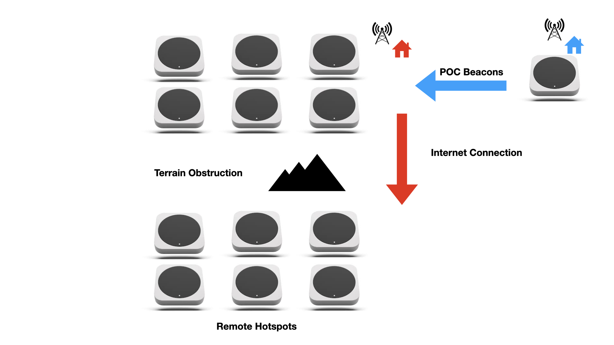
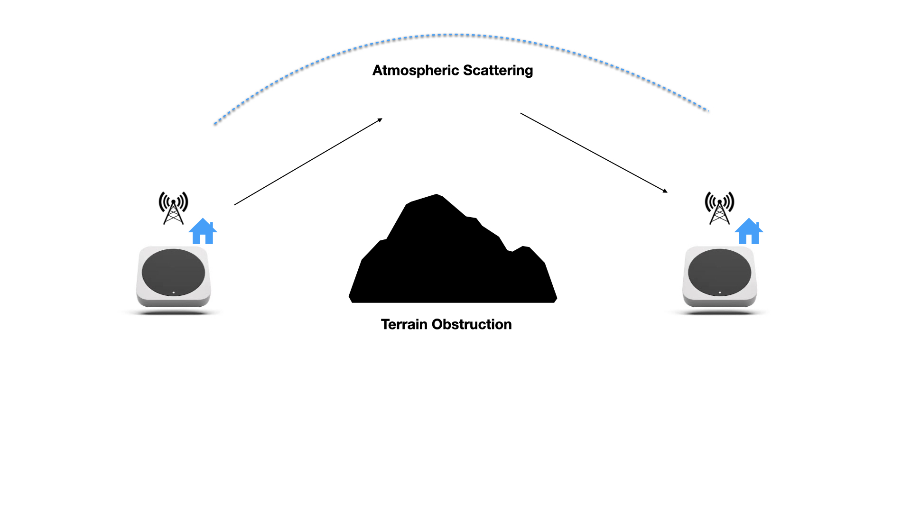

# IOT Denylist Refinement

In early August Nova Labs
[posted a change](https://docs.helium.com/devblog/2023/08/07/denylist-evolution) in how the denylist
is operated. This change has resulted in several positive effects on the network in terms of the
number of hotspots that were improved and cleared from the denylist, as well as clusters of
misbehaving hotspots getting turned off, clearing innocent hotspots that were swept up in the
analysis.

The ongoing challenge with the current approach is that innocent hotspots are still being swept up
by the classifiers if they have especially good antenna setups since they are attractive targets for
beacon replay.

Nova Labs will be deploying a refinement to the denylist that instead of denying _hotspots_ for
exhibiting improbable RF behavior denying witness _events_, also known as _edges_ or _connections_,
that are improbable. This would allow hotspots to continue to operate and earn PoC rewards for RF
behavior that benefits the network overall even if they have improbable RF links.

We expect this new approach to be deployed before the end of September.

<!--truncate-->

The rest of this post explains the introduction in more detail.

# Current Methodology

The IOT denylist is currently implemented as a list of hotspot addresses that are denied PoC
rewards. This list is generated weekly based on the previous two weeks of PoC data. There are
currently three metrics by which hotspots are added to the denylist:

- **Terrain Intersection Margin**: A hotspot is added to the deny list when greater than 50 percent
  of its witnesses pass through significant terrain obstructions as
  [described here](https://docs.helium.com/devblog/2023/08/07/denylist-evolution/#terrain-aware-signal-verification).
- **Witness Reciprocity**: A hotspot is added to the deny list when the reciprocity (ratio of the
  count of incoming to outgoing witnesses) is zero. This indicates that a hotspot is either
  exclusively receiving or transmitting beacons, which is a strong indication of either spoofing
  activity or a hardware/software malfunction of the hotspot.
- **Distance Insensitivity**: A hotspot is added to the deny list when the distance insensitivity is
  above 50 percent, as
  [described here](https://docs.helium.com/devblog/2023/08/07/denylist-evolution/#witness-distance-sensitivity-measurement).

The above metrics were designed based on a statistical analysis of hotspot behavior on the network.
Abnormal behavior for each metric is identified at the 90 percent confidence level by comparison
with the network average. This approach has two problems:

- **Exceptional Actors**: Some rare hotspots are installed on telecom towers or mountaintops, and
  may have properties that are abnormal but not fraudulent.
- **Blame by Association**: Some legitimate hotspots are surrounded by large numbers of bad actors.
  This makes the good actor appear to be part of the surrounding gaming activities and may result in
  them being wrongly added to the deny list.

A significant amount of research has gone into identifying how to identify good actors in the case
where the majority of surrounding hotspots are participating in spoofing activities.

Attempts at applying label-propagation and PageRank-based classifiers have yielded some positive
results, but it is currently not clear how to choose an appropriate threshold to assign blame to an
individual hotspot using these techniques. No good solution to this problem likely exists based on
currently available data.

# Edge Methodology

Since hotspots can unknowingly participate in fraudulent proof-of-coverage activities, there is
always a potential for false positives (i.e. deny-listed).

This problem may be avoided by denying PoC rewards based on the network edge (connection) between
two hotspots rather than the hotspots themselves (nodes).

Using some of the same criteria as are currently used to classify nodes (terrain intersection margin
and distance insensitivity), edges may be classified as either good or bad. Bad edges, such as those
that go through significant terrain, may then be denied rewards by the network oracles in the same
way as hotspots are on the current deny list.

This has the following effects:

- **Reduced Collateral Damage:** Good actors will not be blocked from receiving legitimate
  proof-of-coverage rewards from legitimate edges. False positives can happen on _edges_ but will
  not affect the whole hotspot.
- **Reduced Risk of Packet Replay Attacks**: A known current attack is where a LoRaWAN gateway,
  which is not necessarily a node on the IOT network, is programmed to re-broadcast any
  proof-of-coverage packets it receives. This results in hotspots appearing to receive packets over
  improbable or impossible paths and may result in them being added to the deny list. In the
  edge-based methodology, these packets would simply not be rewarded, and would therefore result in
  no damage to the network.
- **More Precise Denying**: The various classifiers can be tuned more aggressively for edge events
  instead of tagging a whole node for partially incorrect behavior. The effects of a bad classifier
  are less extreme than the current version.
- **Handling Transient and Sporadic Events**: Some rare events, such as tropospheric ducting,
  reflection of water, and scatter around obstacles, may occasionally allow proof of coverage
  packets to travel beyond the visual line of sight between the transmitter and receiver. These
  effects are difficult to model and are currently accounted for by relaxing the detection threshold
  for the terrain intersection and distance insensitivity metrics.

  By not rewarding proof of coverage packets that propagate beyond the line of sight, the risk of
  adding hotspots to the deny list based on transient events is minimized. Further, these events are
  not useful to the network and do not accurately represent the sensor coverage being provided by
  hotspots, which needs to be consistent.

## Examples

Here are two examples of how an edge-based deny list can help hotspot owners and users of the
network.

Consider a hotspot (represented in blue) that is located near several bad actors (red). The bad
actors receive proof of coverage beacons over RF, and then forward them to distant hotspots via an
Internet link.

Since the distant hotspots are obstructed by terrain, no radio signals from the beaconing hotspot
can reach them. All the LoRa beacons are compared against a terrain map, and signal paths that are
significantly obstructed are prevented from receiving rewards.

This denies rewards to the hotspots forwarding and receiving illegitimate beacons while protecting
the good actor from their traffic.

Hotspots may also occasionally receive beacons that are beyond the visual line of sight.

This can sometimes happen due to reflections off of water, or radio scatter due to atmospheric
effects. Devices that use the network require consistent coverage. By preventing these sporadic
links from being rewarded, good coverage for sensor deployments is incentivized. This is illustrated
below.

# Implementation

The engineering work required to implement an edge-based deny list is minimal. The edge-based
deny-list will exist alongside the existing node-based deny-list.

The following need to be completed for an edge-based deny list implementation:

1. Oracles will need to check the denylist xor filter for a lexicographically sorted hotspot-hotspot
   edge pair. This is accomplished in [this PR](https://github.com/helium/oracles/pull/627)

2. The edge-based denylist needs to be generated with the node deny list weekly and adjusted when
   necessary to make it as effective as possible. This is accomplished in
   [this PR](https://github.com/helium/xorf-generator/pull/22)

3. A way to visualize/explain the denied edges. The initial approach will be to generate report
   cards for hotspots that have more than 50% of their edges denied.
