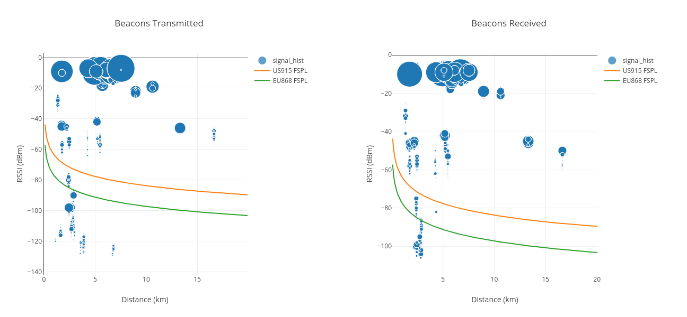
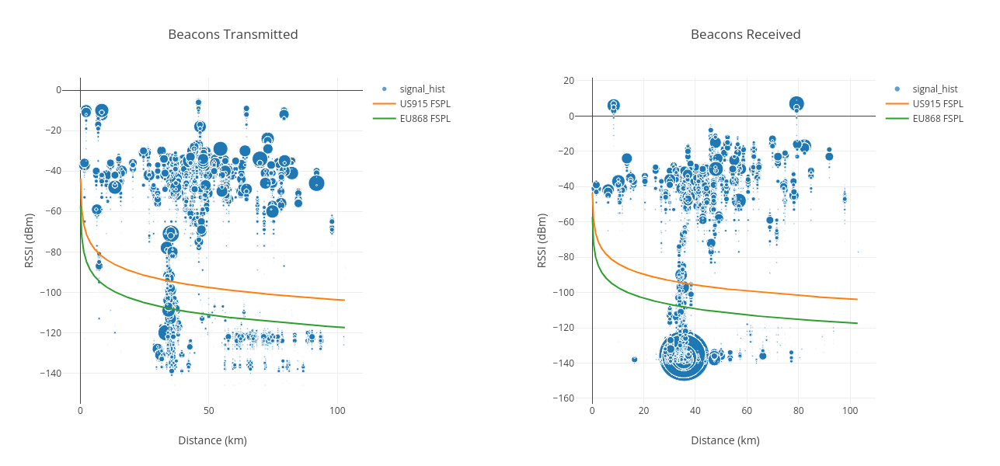

# Updated antenna denylist classifier

[Back in January](https://docs.helium.com/devblog/2024/01/17/new-denylist-classifiers), we added two
new denylist classifiers, the antenna split classifier and the latency classifier. In the time
since, we've identified some shortcomings with the antenna classifier, so we've put in some time
improving it.

The old classifier was rather crude in that we only ever configured it to look for reciprocal (in
both directions) links where the RSSI was above 0db. It was difficult to extend it beyond that
because the classifier didn't have access to some information about how powerful the signal was so
it could not properly calculate the attentuation. We've since improved that by adding the missing
information and we've been testing a significantly improved version of the classifier for the last
few weeks. During the last few IoT working group meetings we've presented the classifier and its
results. At last week's meeting (February 4th), the working group concluded we should move ahead
with enabling it for the March 11th deny list.

The key changes to the classifier are that it now looks at the hotspot's antenna gains, for both the
transmitter and receiver, and the transmit power used. It then calculates the free space path loss
over a short distance, that is considered to be within the hotspot owner's sphere of influence, and
then looks for hotspot connections that have loss less than that (by a configurable value) that are
significantly farther away (another configurable multiplier).

Thus, if we calculate the FSPL loss for two hotspots, both with a 2.3dBi antenna, 30 meters apart in
EU868, we get a loss of 56.15dB. In the EU, if we assume the hotspot is complying with the 16dB
transmit power limit, we can assume the hotspot transmitted at about 14dB. This means that over a 30
meter distance, between those two antennas we should see RSSIs of at _most_ -40dB. We then add the
leniency value of 10dB to give us a cutoff of 30dB for those two hotpots. If these hotspots are more
than 20x the 30 meter "colocation distance" apart, but still show -30dB RSSIs, we can conclude there
is a significant mis-assertion. Additionally, by limiting the distance to a fairly short one, we can
also conclude that the hotspot owner either controls both hotspots or can influence the other
hotspot, because it must be very close.

It is important to also note that the FSPL curve at these short distances is almost vertical, which
means it correlates very strongly to distance (as opposed to the far end of the FSPL curve where it
becomes almost flat and therefore correlates very weakly to distance). Additionally, it is important
to remember that dB is a log scale, so a 10dB leniency factor is very generous.

Let's take a look at an actual example of this, on a graph:

As seen above this is a hotspot with at least 8 other hotspots colocated with it, asserted between
1.7km and 7.5km away, all of which are well above the expected 30 meter RSSI level of -40dB and the
-30dB adjusted level.

Another factor of this classifier is that it requires these RSSIs to be observed some number of
times, in both directions, before considering the result. This number is currently set to 5.

Finally, some cases where hotspots were right next to each other, and getting tagged by the 0dB
check will no longer be reported by this classifier. If you correctly assert your hotspots that are
right next to each other, you'll be subject to the to normal IoT PoC verifier density limits but not
this classifier.

Here's a few more examples of what this classifier finds:

# Current classifier parameters

We wanted to be very conservative when starting out with this classifier, so we've set very lenient
parameters for the classifier initially. We don't wish to overwhelm the community with denylist
complaints, so we've picked parameters that should flag only the most egregious violations and limit
the number of affected hotspots to about 4,000.

Below are the classifier parameters, their current values and a brief description:

| Parameter             | Value | Description                                                                         |
| --------------------- | ----- | ----------------------------------------------------------------------------------- |
| min_occurances        | 5     | How many times an RSSI has to be reported to be considered by the classifier        |
| colocation_distance_m | 30    | The distance, in meters, used for the loss threshold calculation                    |
| distance_multiplier   | 20    | The multiple of colocation_distance_m to apply to exclude hotspots closer than this |
| fudge_factor_db       | 10    | How many dB to add to the expected loss to account for unforseen circumstances      |

# What to do if your hotspots get caught by this classifier

If you find one of your hotspots caught by this classifier, you should look at your report card. The
report card will identify the hotspots that are extremely close to you but are asserted
significantly further away. If these are also your hotspots, please assert them more correctly. If
these are NOT your hotspots, and your hotspot is asserted correctly, the other hotspot owner must
take action (they will also be on the denylist). We have chosen the parameters carefully to try to
minimize the case when the other hotspot is controlled by someone else, but in some cases it can
still be possible.
