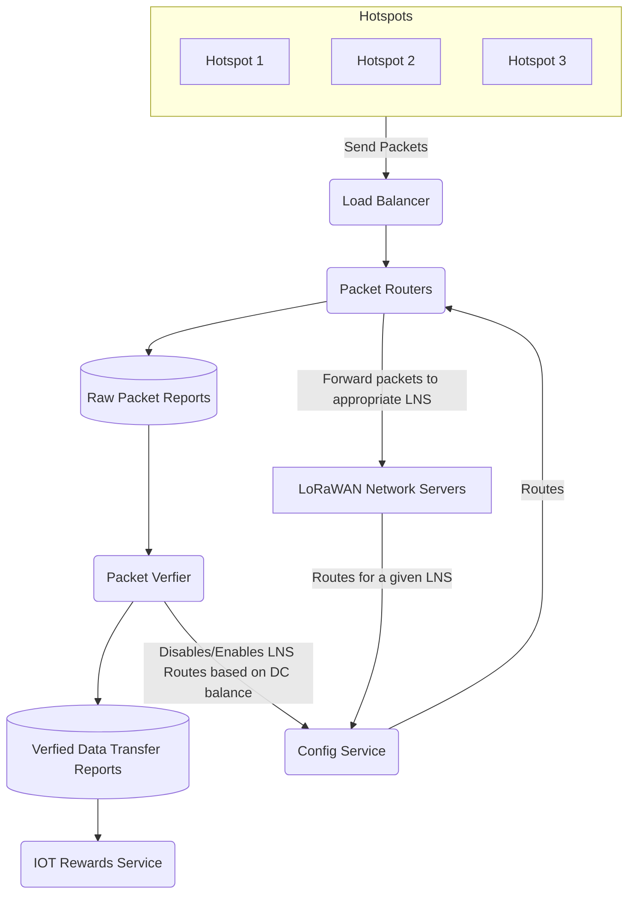

As part of the migration to Solana, the data transfer architecture is moved to Oracles, which
increases scalability and reduces points of failure. In the new architecture, the blockchain
components are decoupled from the data transfer components, which means that blockchain outages or
congestions will no not disrupt data transfer.

## OpenLNS

Before the architecture upgrade, Helium Console was the only choice of LoRaWAN Network Server (LNS)
on the Helium Network as the old architecture required the LNS to administer both LoRaWAN-specific
functions as well as blockchain overhead. Now that blockchain components are no longer intertwined
with data transfer, IoT applications can now leverage any compatible LoRaWAN Network Server. Check
out [this tutorial](/iot/run-an-lns) to more about how to run your own LoRaWAN Network Server.

The update brings the responsibilities of a Helium LNS much more in-line with a generic LNS while
also easing the integrations of existing LNS systems, further helping the expansion of the Helium
Network.

## Config Service

The Config Service keeps track of all routing rules for all devices connected to the Helium Network,
aggregating from the LNSs into a database of routes that are propagated to each Packet Router. The
Config Service immediately updates the Packet Routers whenever it receives new routing updates.

Each route contains necessary routing information such as

- A list of DevEUI + AppEUI pairs so Join Requests can be routed
- A list of [Session Key Filters](/iot/run-an-lns/advanced-configuration) so Uplinks can be routed
- An endpoint to receive the packets
- A protocol so packets can be sent under that protocol, currently GWMP/HTTP(s)/GRPC are supported.

## Packet Router Service

The Packet Routers are responsible for routing packets received from Hotspots to the appropriate
LNS. This streamlined service follows the routing rules given to it by the Config Service.

Using a real world analogy, the Packet Router is a mail sorter and the Config Service is an address
book. Whenever a new mail is delivered, the mail sorter checks against the address book to figure
out how and where to deliver the mail.

For instance, if the Packet Router received a Join Request, it will check if the DevEUI + AppEUI
pair matches with any record provided by the Config Service. If a route is successfully matched,
then the Join Request will be forwarded to the endpoint specified on that route.

If a Packet Router can match a received packet to a defined route, it will forward that message to
the appropriate LNS and submit a packet report to the Packet Reports Database, which will be
ingested by the Reward Oracles so that the hotspots delivering that packet are duely rewarded.

Each packet report includes OUI, network ID, region, gateway, and payload hash metadata. The full
definition can be found
[here](https://github.com/helium/proto/blob/master/src/service/packet_router.proto#L8).

## Load Balancing Service

In order to ensure the Helium Network has a robust and scalable foundation for data transfer, Packet
Routers are hosted across the globe in order to provide redundancy, reduce latency and allow
horizontal scalability. There are

- 8 in Europe
- 4 in North America
- 2 in Asia
- 2 in Australia
- 2 in South America

The fleet deployments and size may change based on how the demand for processing power evolves in
each region, in order to make sure the Packet Router fleet can be dynamically adjusted without
requiring a Hotspot update every time it happens, Hotspots interface directly with a single endpoint
that will assign its traffic to Load Balancers hosted in each of those regions above, helping the
Helium Network scale horizontally when needed.

## Packet Verifier Service

The Packet Verifier uses the Config Service to fetch the list of OUIs, wallet addresses per gateway,
and wallet addresses per OUI.

The Packet Verifier verifies the submitted packets. Its primary responsibilities are to:

- Confirm that each OUI and the associated LNS have enough DC to pay for the packets received.
  - For every Packet Report received, if the DC balance for an OUI has fallen below 3.5MM DC, the
    route will be locked.
  - The Packet Verifier checks the DC balance of every locked OUI every 30 minutes, and unlocks them
    if their DC balance is above 3.5MM DC.
- Process reports into a separate database of verified and denied reports (denied reports include
  the cause of denial).
- Based on data transfer, calculate Rewards and the amount of DC to debit from each wallet
  associated with an OUI.
  - The Packet Verifier accumulates pending burns in a database for each OUI. Every minute, it
    selects the payer with a pending burn amount greater than 10,000 DC that has not burned in the
    longest amount of time and burns all of their pending DC.

## Architecture Diagram

