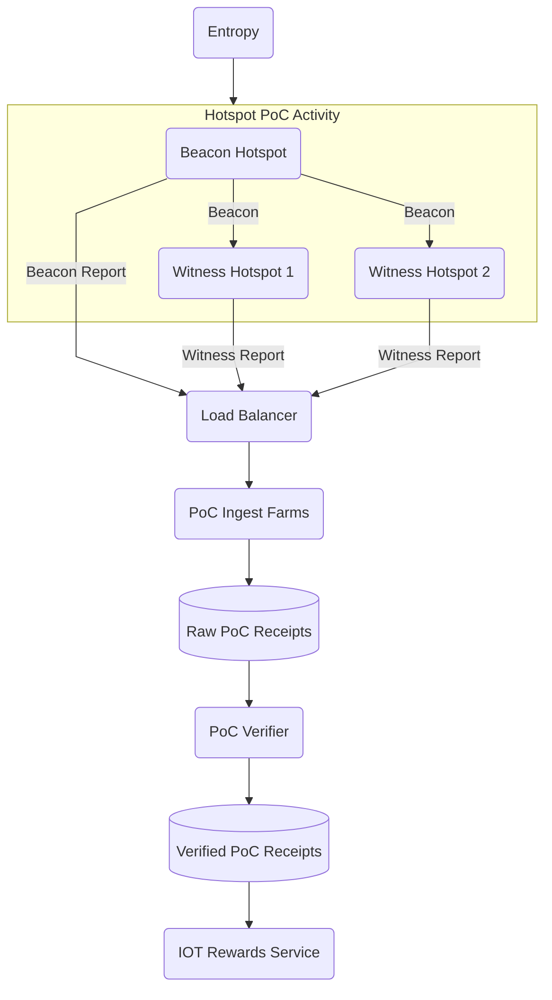

import useBaseUrl from '@docusaurus/useBaseUrl'
import LegacyContentBanner from '@site/src/theme/LegacyContentBanner'

<LegacyContentBanner />

On the Solana L1, all PoC activity is managed by Oracles, greatly simplifying the beaconing process
by allowing Hotspots to self-beacon at regular intervals. Additionally, off-chain PoC is much more
easily scalable and will remove the limitations on the number of Witnesses per beacon.

The main actors and their relationships with one another are as follows.

### Hotspots

- Hotspots will now self-beacon at regular intervals, targeting a 6-hour interval at launch.
- To prevent premature beaconing and replay attacks, the beacon will include some entropy.
- Hotspots beacon their Challenge and submit it to the PoC Ingest Farm through a Load Balancer
  proxy.
- When a Hotspot witnesses a beacon, the Hotspot directly submits the receipt to the PoC ingest
  farm.

### PoC Ingest Farm

The PoC Ingest farm only performs basic validation that filters out structurally invalid data and
then submits both the beacon receipt and the witness receipts to an S3 bucket. The limited duties of
the PoC Ingest farms make them easily scalable as the Network grows.

### PoC Verifier Oracle

The PoC Verifier Oracle verifies all the data submitted by correlating witnesses to receipts and
confirming the series of events, then submits these processed rewardable and invalid receipts to a
separate S3 bucket, including how many shares to give to each Hotspot.

