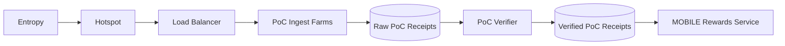

import useBaseUrl from '@docusaurus/useBaseUrl'
import LegacyContentBanner from '@site/src/theme/LegacyContentBanner'

<LegacyContentBanner />

As the MOBILE subnetwork is still in its infancy, its
[PoC model is relatively straightforward](/mobile/proof-of-coverage) and based on the following
factors:

1. The Small Cell Radio Type.
2. Heartbeats and Reliability of Service.
3. Speed Tests and Quality of Service.

Heartbeats and Speed Tests are submitted off-chain to the MOBILE Ingest farm to be verified and used
by the rewards service.

In the following year, the team plans to add modeled coverage, location-based coverage, and mappers
to MOBILE PoC. You can read this
[roadmap](https://blog.helium.com/mobile-proof-of-coverage-the-road-ahead-73a25601a13d) to learn
more about these plans.

