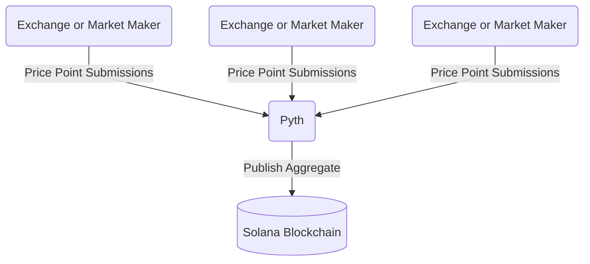

import useBaseUrl from '@docusaurus/useBaseUrl'
import LegacyContentBanner from '@site/src/theme/LegacyContentBanner'

<LegacyContentBanner />

The Price Oracle is one of many Oracles on the Helium Network. The market value of the Helium tokens
is required on-chain as the price is needed to calculate everything from burning HNT for Data
Credits (DC) to treasury allocations for the Mobile and IoT networks.

:::note Migrating Price Oracles

On the day of the chain migration, price feeds were not available for all tokens. In this time, the
existing Helium L1 Price Oracles continued to contribute market data.

Once a stable price feed is available, community-sourced price feeds can be removed in favor of
Pyth.

- ✅ [HNT/USD](https://pyth.network/price-feeds/crypto-hnt-usd) Integrated May 11, 2023
- 🔜 [IOT/USD](https://pyth.network/price-feeds/crypto-iot-usd)
- 🔜 [MOBILE/USD](https://pyth.network/price-feeds/crypto-mobile-usd)

:::

### Who are the HNT Price Oracles?

The community-sourced Oracle Price feeds are supplied by a group of eleven (11) Oracles, composed of
companies, organizations, and individuals. These Oracles were selected at the activation of Data
Credits on the Helium L1 blockchain and have proven to be a trusted source of data for the Helium
Network. The Oracle pool is comprised of:

- Helium Foundation
- Nova Labs
- Nine (9) Anonymous Individual Community Members

The names of the individual feed contributors are kept anonymous as it's essential to prevent any
external attempts at collusion.

The current Price Oracles can be viewed here:

- ~~[HNT Price Oracle](https://explorer.solana.com/address/horUtvuHQFWxPFrZ35YZUmXUZ2TSQdSXhcD4kkCVNKi/anchor-account)~~
  Handled by [Pyth HNT-USD](https://pyth.network/price-feeds/crypto-hnt-usd) as of May 11, 2023.
- [IOT Price Oracle](https://explorer.solana.com/address/iortGU2NMgWc256XDBz2mQnmjPfKUMezJ4BWfayEZY3/anchor-account)
- [MOBILE Price Oracle](https://explorer.solana.com/address/moraMdsjyPFz8Lp1RJGoW4bQriSF5mHE7Evxt7hytSF/anchor-account)

<!-- TODO: After oracle functionality is migrated to Pyth, delete 'Post-Migration' above and change below to 'Pyth Price Oracle'. -->

## Pyth Price Oracle

The Helium Network uses the tried and tested [Pyth Network](https://pyth.network/), which publishes
financial market data. As an overview, Pyth works by having publishers (exchanges and market-making
firms) submit price points for given token pair values and then aggregates this data, making it
available on-chain.

Pyth's
[exponentially-weighted moving average (EMA) price aggregation](https://docs.pyth.network/how-pyth-works/ema-price-aggregation)
adds time to the aggregation with a heavier weight given to more recent price samples, smoothing the
price and controlling for outliers to help further increase trust in the price and help shield
against potential bad actors.

