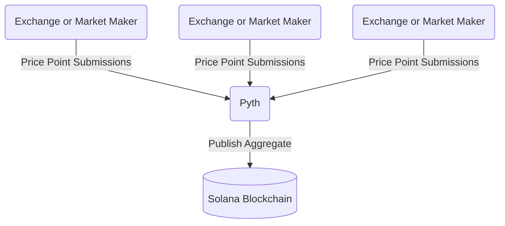

<figure className="screensnippet-wrapper" style={{ padding: '2.5em 20vw' }}>
  <svg
    width="3285"
    height="1120"
    viewBox="0 0 3285 1120"
    fill="none"
    xmlns="http://www.w3.org/2000/svg"
    style={{ width: '100%', height: 'auto', maxWidth: '300px' }}
  >
    <g fill="#110F23">
      <path d="M1252.1 654.391V578.608H1431.62C1459.07 578.608 1480.49 570.807 1495.86 555.205C1511.22 539.603 1518.91 519.036 1518.91 493.607C1518.91 468.177 1511.22 447.205 1495.86 432.008C1480.49 416.811 1459.07 409.213 1431.62 409.213H1194.94V778.956H1117.46V330.847H1431.62C1457.45 330.847 1480.49 334.646 1500.81 342.244C1521.08 349.843 1538.21 360.532 1552.16 374.31C1566.11 388.089 1576.77 404.805 1584.15 424.511C1591.53 444.216 1595.22 466.404 1595.22 491.074C1595.22 515.744 1591.53 537.374 1584.15 557.333C1576.77 577.241 1566.11 594.413 1552.16 608.8C1538.21 623.186 1521.13 634.382 1500.81 642.385C1480.55 650.389 1457.45 654.391 1431.62 654.391H1252.1Z" />
      <path d="M1849.49 778.855V608.75L1612.21 330.848H1717.33L1891.34 537.274L2065.91 330.848H2165.52L1927.58 608.75V778.855H1849.49Z" />
      <path d="M2434.74 778.855V409.112H2229.12V330.848H2718.73V409.112H2512.82V778.855H2434.74Z" />
      <path d="M3207.22 330.853H3285V778.86H3207.22V330.853Z" />
      <path d="M2871.6 778.86V584.946H3160.98V515.597H2871.6V330.853H2793.82V778.86H2871.6Z" />
      <path d="M558.73 447.988C558.73 509.84 508.694 559.99 446.984 559.99V671.992C570.404 671.992 670.475 571.692 670.475 447.988C670.475 324.285 570.404 223.984 446.984 223.984C406.299 223.984 368.091 234.876 335.239 253.973C268.425 292.675 223.494 365.063 223.494 447.988V1008L323.969 1108.7L335.239 1120V447.988C335.239 386.136 385.274 335.986 446.984 335.986C508.694 335.986 558.73 386.136 558.73 447.988Z" />
      <path d="M446.981 0C365.56 0 289.244 21.833 223.49 59.9775C181.39 84.3434 143.687 115.396 111.745 151.717C42.2014 230.69 0 334.435 0 448.008V784.013L111.745 896.015V448.008C111.745 348.518 154.907 259.109 223.49 197.561C255.735 168.687 293.59 145.891 335.236 131.201C370.159 118.739 407.812 112.002 446.981 112.002C632.111 112.002 782.216 262.452 782.216 448.008C782.216 633.563 632.111 784.013 446.981 784.013V896.015C693.871 896.015 893.961 695.415 893.961 448.008C893.961 200.6 693.871 0 446.981 0Z" />
    </g>
  </svg>
</figure>
 

The Price Oracle is one of many Oracles on the Helium Network. The market value of the Helium tokens
is required on-chain as the price is needed to calculate everything from burning HNT for Data
Credits (DC) to treasury allocations for the Mobile and IoT networks.

The Helium Network uses the tried and tested [Pyth Network](https://pyth.network/), which publishes
financial market data. As an overview, Pyth works by having publishers (exchanges and market-making
firms) submit price points for given token pair values and then aggregates this data, making it
available on-chain.

Pyth's
[exponentially-weighted moving average (EMA) price aggregation](https://docs.pyth.network/documentation/how-pyth-works/ema-price-aggregation)
adds time to the aggregation with a heavier weight given to more recent price samples, smoothing the
price and controlling for outliers to help further increase trust in the price and help shield
against potential bad actors.

 

:::note Migrating Price Oracles

On the day of the chain migration, price feeds were not available for all tokens. In this time, the
existing Helium L1 Price Oracles continued to contribute market data.

Once a stable price feed is available, community-sourced price feeds can be removed in favor of
Pyth.

The current Price Oracles can be viewed here:

- ~~[HNT Price Oracle](https://explorer.solana.com/address/horUtvuHQFWxPFrZ35YZUmXUZ2TSQdSXhcD4kkCVNKi/anchor-account)~~
  Handled by [Pyth HNT-USD](https://pyth.network/price-feeds/crypto-hnt-usd) as of May 11, 2023.
- ~~[MOBILE Price Oracle](https://explorer.solana.com/address/moraMdsjyPFz8Lp1RJGoW4bQriSF5mHE7Evxt7hytSF/anchor-account)~~
  Handled by [Pyth MOBILE-USD](https://pyth.network/price-feeds/crypto-mobile-usd) as of February
  8, 2024.
- [IOT Price Oracle](https://explorer.solana.com/address/iortGU2NMgWc256XDBz2mQnmjPfKUMezJ4BWfayEZY3/anchor-account)

:::
