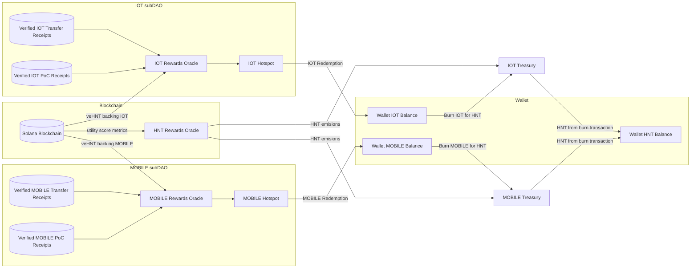

import useBaseUrl from '@docusaurus/useBaseUrl'
import LegacyContentBanner from '@site/src/theme/LegacyContentBanner'

<LegacyContentBanner />

There are initially three Rewards Oracles, one for each subDAO (MOBILE and IOT) and one for HNT,
which ingest the work of all of the above Oracles to determine the appropriate emissions for each
subDAO.

Epochs will increase from around 30 blocks (or about 30 minutes) to 24 hours, with rewards issued
every 24 hours by each Reward Oracle.

## Lazy Distribution of Rewards

On the Solana L1, Rewards will adopt a "lazily distributed" approach, altering the dynamics for Hotspot Owners who will now actively redeem their tokens instead of receiving them passively.

Upon a redemption request from a Hotspot Owner, the Rewards Oracle will calculate the disparity between the `lifetime` and `claimed` token Rewards to ascertain the unclaimed tokens per Hotspot. Subsequently, it will pre-sign a transaction, which the Hotspot Owner will then submit to the blockchain. It's crucial to note that Rewards will only be registered on-chain and linked with the respective Helium Wallet upon this submission.

## IOT Rewards Oracle

The IOT Rewards Oracle integrates Verified PoC Receipts, Verified IOT Data Transfer Receipts, and the veHNT supporting the IOT Network to distribute rewards to individual Hotspots.

It's worth noting that the Data Transfer Verifier and the PoC Verifier shoulder a significant portion of the workload by incorporating the allocation of shares for each Hotspot, thus streamlining the reward distribution process.

## MOBILE Rewards Oracle

The MOBILE Rewards Oracle combines the Verified MOBILE Receipts, the Verified MOBILE Data Transfer
Receipts, and the veHNT backing the MOBILE Network and emits rewards to each Hotspot.

## HNT Rewards Oracle

As defined in [HIP-51](https://github.com/helium/HIP/blob/main/0051-helium-dao.md), the HNT Rewards
Oracle will issue HNT Reward emissions to each subDAOs treasury using each subDAOs Utility Score to
determine which percentage of the total rewards each subDAO is due.

The following comprise the subDAO Utility Score:

- subDAO's DCs burned in USD
- subDAO's active device count and device activation fee
- veHNT backing each subDAO

DC burned, active device count, and veHNT staked are submitted to the chain through the proxy of
[Switchboard](https://switchboard.xyz/) to facilitate this process and keep a record.

Device count is a fluctuating number based on recent PoC activity and is not readily available
on-chain; a dedicated Oracle will submit device count to the blockchain via Switchboard.

## SubDAO to HNT Conversion

Each subDAO is responsible for defining its Treasury Reserve Decentralized Network Token (DNT)
Market Making Curve.

The curves for
[IOT](https://github.com/helium/HIP/blob/main/0052-iot-dao.md#treasury-reserve-dnt-market-making-curve)
and [MOBILE](https://github.com/helium/HIP/blob/main/0053-mobile-dao.md) can be found in their
respective HIPs.

This is a "one-way" transaction to convert your subDNT into HNT, as you can not burn HNT for subDNT.

## Other Notes

- Initially, all of these Oracles will be run by the Helium Foundation, with the long-term goal that
  community members will also run them.
- The buckets with raw PoC and Data Transfer receipts will be available for verification/security
  purposes.
- During the transition to Solana, data transmission will be temporarily interrupted while Makers
  roll out the new `gateway-rs` image, which will tell Hotspots to communicate with the packet
  routers instead of LNS state channels.
- To learn more about how staking and governance will change, refer to the documentation on
  [Voting Power](/governance/faq).
