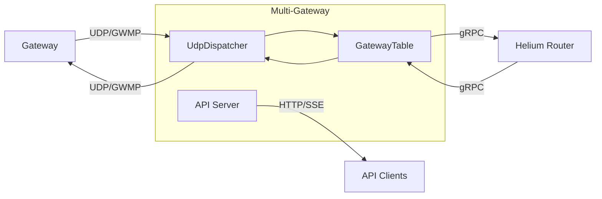

import useBaseUrl from '@docusaurus/useBaseUrl'

 

[Multi-gateway](http://github.com/helium/multi-gateway) is a server that accepts connections from
multiple LoRaWAN gateways using the Semtech UDP (GWMP) protocol. It automatically provisions a
keypair for each gateway on first connection and maintains a dedicated gRPC stream to the Helium
packet router per gateway. Each gateway appears as an independent Hotspot on the Helium network.

This enables operators to manage fleets of Hotspots from a single server, with centralized key
management, monitoring, and a REST API for integration.

## Architecture

The server runs three concurrent tasks:

1. **UdpDispatcher**: Binds a UDP port (default 1680), receives GWMP packets from gateways,
   identifies each gateway by MAC address, and routes packets to the GatewayTable.
2. **GatewayTable**: Manages per-gateway state including keypairs, connection status, and packet
   metadata. Spawns a gRPC task per connected gateway that maintains a bidirectional stream to the
   Helium packet router.
3. **API Server**: Axum HTTP server providing REST endpoints, Prometheus metrics, and a real-time
   SSE event stream.

## API Endpoints

| Method | Path                      | Description                        |
| ------ | ------------------------- | ---------------------------------- |
| GET    | `/gateways`               | List all gateways with status      |
| GET    | `/gateways/{mac}`         | Get a specific gateway             |
| GET    | `/gateways/{mac}/packets` | Recent packet metadata (last 50)   |
| POST   | `/gateways/{mac}/sign`    | Sign data with a gateway's keypair |
| GET    | `/events`                 | SSE stream of real-time events     |
| GET    | `/metrics`                | Prometheus metrics                 |

Read and write endpoints can be protected with separate API keys via the `read_api_key` and
`write_api_key` settings. The `/events` SSE endpoint is public but connection-limited.

## Supported Regions

The region is a per-instance configuration setting. Supported values:

- `US915`
- `EU868`
- `AU915`
- `AS923_1`
- `KR920`
- `IN865`

All gateways connected to a single instance must operate in the same frequency plan.
