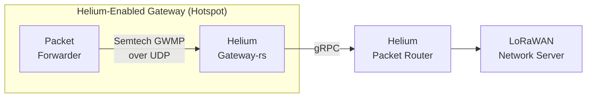

import useBaseUrl from '@docusaurus/useBaseUrl'


<br />
<br />

Any LoRaWAN gateway can be used to transfer data through the Helium Network. Data-only Hotspots are
eligible for **Network Data Transfer Rewards** but not **Proof of Coverage Rewards**. This class of
Hotspot offers a flexible path for companies and organizations looking to leverage the Helium
Network for their IoT needs.

Since data-only Hotspots do not earn Proof-of-Coverage rewards, they may be permissionlessly added
to the network. Once added to the blockchain and with location asserted, they will earn
[IOT Tokens](/tokens/iot-token) when transferring network data.

## Basic Architecture

The [gateway-rs](https://github.com/helium/gateway-rs) client backs both data-only Hotspots as well
as proof-of-coverage enabled Hotspots. Gateway-rs is designed to run alongside a packet forwarder
and handles communications with the Helium Packet Router.



The articles in this section will outline the 'Gateway' portion of the above diagram.

### Packet Forwarder

Gateway-rs is designed to interact with the
[Semtech Packet Forwarder](https://github.com/helium/packet_forwarder). If no packet forwarder is
installed on the target hardware, follow the manufacturer's instructions using their documentation
or one of the full guides below.

- [COTX X1 Lite](https://support.cotxnetworks.com/support/solutions/articles/73000567327-cotx-x1-lite-cli-user-guide)
- [Dragino LPS8/DLOS8](/iot/data-only/dragino-data-only-hotspot)
- [Dragino Concentrator PG1301 + Raspberry Pi](/iot/data-only/dragino-pg1301)
- [Kerlink Gateways](/iot/data-only/kerlink-data-only-hotspot)
- [RAKwireless Concentrator (RAK2245/RAK2247/RAK2287) + Raspberry Pi](/iot/data-only/rak-concentrators)
  - [Using Balena: RAKwireless RAK2287 Concentrator + Raspberry Pi](/iot/data-only/balena-data-only-hotspot)
- [Seeed Studio SenseCAP M2](https://wiki.seeedstudio.com/Network/SenseCAP_Network/SenseCAP_M2_Data_Only-Helium_gateway/SenseCAP_M2_Data_Only_Quick_Start/)

### Gateway-rs

Gateway-rs is the lightweight client that handles message signing and communications with Helium
Packet Router, the backbone of the IoT Network.

Gateway-rs is designed to be installed directly adjacent to the packet forwarder on the gateway. For
the latest releases and build notes, refer to the repository readme on GitHub.

- <https://github.com/helium/gateway-rs/>

### First Run

With gateway-rs installed on the gateway, initialize the key for the Hotspot.

- configure settings.toml
  - set key location. if none exists, key will be generated at this location
  - back it up, if lost a new gateway key will need to be onboarded
- run server to generate key `./helium_gateway -c /path/to/settings.toml server`

```sh title="Generate a swarm_key by running gateway-rs."
./helium_gateway -c /path/to/settings.toml server
```

## Transactions & Cost

To enable the Helium Network to communicate with the data-only Hotspot, two criteria must be met.

1. The Hotspot must be 'onboarded' to the network.  
   The **Add Hotspot** transaction links the Hotspot's key (`swarm_key`) to a user's
   [account](/wallets) and makes the Hotspot known to the network.
1. The specific location of the Hotspot must be declared.  
   This allows the network to appropriately address regional parameters and aids in location-solving
   for certain sensor applications. The **Assert Location** transaction provides the physical
   location (lat/long), elevation (in meters), and antenna EIRP (in dBi) data for the Hotspot.

The network fees are as follows:

- **Add Data-Only Hotspot**: 1,000,000 Data Credits (USD $10)
- **Assert Location**: 500,000 Data Credits (USD $5)

These fees are paid using [Data Credits](/tokens/data-credit). Transactions are submitted using the
[CLI wallet](/wallets/cli-wallet). The wallet CLI should **not** be installed on the gateway.

Existing accounts generated using the Helium Wallet App can be
[imported to the CLI](/wallets/cli-wallet#import-seed-phrase-account-into-cli).

## Add Hotspot Transaction

Adding a Hotspot to the blockchain happens in two steps. First, the transaction is generated using
the key held by gateway-rs. This transaction isn't inherently submitted to the blockchain. The
second step is to submit the transaction to the blockchain using the Helium Wallet CLI.

From a terminal connected to the device where gateway-rs is installed, execute the `add`
transaction. In most cases, the owner and payer are the same entity.

```
./helium_gateway add --owner WALLET_ADDRESS --payer WALLET_ADDRESS --mode dataonly
```

The output is a JSON object:

```json {7} // the {7} highlights line 7
{
  "address": "11TL62V8NYvSTXmV5CZCjaucskvNR1Fdar1Pg4Hzmzk5tk2JBac",
  "mode": "dataonly",
  "owner": "14GWyFj9FjLHzoN3aX7Tq7PL6fEg4dfWPY8CrK8b9S5ZrcKDz6S",
  "payer": "14GWyFj9FjLHzoN3aX7Tq7PL6fEg4dfWPY8CrK8b9S5ZrcKDz6S",
  "staking fee": 1000000,
  "txn": "CrkBCiEBrlImpYLbJ0z0hw5b4g9isRyPrgbXs9X+RrJ4pJJc9MkSIQA7yIy7F+9oPYCTmDz+v782GMJ4AC+jM+VfjvUgAHflWSJGMEQCIGfugfLkXv23vJcfwPYjLlMyzYhKp+Rg8B2YKwnsDHaUAiASkdxUO4fdS33D7vyid8Tulizo9SLEL1lduyvda9YVRCohAa5SJqWC2ydM9IcOW+IPYrEcj64G17PV/kayeKSSXPTJOMCEPUDo+wM="
}
```

The `txn` field needs to be used as the input to the wallet command `helium-wallet hotspot add`. For
example:

```
helium-wallet hotspots add CrkBCiEBrlImpYLbJ0z0hw5b4g9isRyPrgbXs9X+RrJ4pJJc9MkSIQA7yIy7F+9oPYCTmDz+v782GMJ4AC+jM+VfjvUgAHflWSJGMEQCIGfugfLkXv23vJcfwPYjLlMyzYhKp+Rg8B2YKwnsDHaUAiASkdxUO4fdS33D7vyid8Tulizo9SLEL1lduyvda9YVRCohAa5SJqWC2ydM9IcOW+IPYrEcj64G17PV/kayeKSSXPTJOMCEPUDo+wM=
```

After you verify the transaction, append the command with `--commit` to submit it to the API. Note
that you need sufficient funds to cover both the transaction cost (65000 DC) and the `staking_fee`
(1000000 DC). Thanks to the
["implicit burn" mechanism](/iot/transaction-fees/#transaction-fees-and-implicit-burn), available
HNT will be used to cover the transaction if you have insufficient DCs.

You can track the transaction progress by using the transaction hash at the following endpoint:
`https://api.helium.io/v1/pending_transactions/TXN_HASH`

Once the transaction clears, you're done linking the Hotspot with your wallet.

:::warning

At this point, you will want to be certain that you've backed up the data only hotspot's keypair.
Its location can be customized in the client's `settings.toml`, but by default, it's located at
`/etc/helium_gateway/gateway_key.bin`

:::

## Assert Hotspot

To assert the Hotspot use `helium-wallet hotspots assert`

```
helium-wallet hotspots assert --gateway DATA_ONLY_HOTSPOT_PUBKEY --lat=37.7806295 --lon=-122.4008481 --mode dataonly
```

The `DATA_ONLY_HOTSPOT_PUBKEY` in the example from the previous section would be
`11TL62V8NYvSTXmV5CZCjaucskvNR1Fdar1Pg4Hzmzk5tk2JBac`.

`--elevation` and `--gain` can be also set. Use `helium-wallet hotspots assert --help` for more
info.

After you verify the transaction, append the command with `--commit` to submit it to the API. Note
that you need sufficient funds to cover both the transaction cost (65000 DC) and the `staking_fee`
(500000 DC). Thanks to the
["implicit burn" mechanism](/iot/transaction-fees/#transaction-fees-and-implicit-burn), available
HNT will be used to cover the transaction if you have insufficient DCs.

You can track the transaction progress by using the transaction hash at the following endpoint:
`https://api.helium.io/v1/pending_transactions/TXN_HASH`

Once the transaction clears, your data-only Hotspot is ready to start earning for data transferred!

---

You should [setup a packet forwarder](/iot/setup-a-packet-forwarder) with the
[light hotspot client](/iot/hotspots).
