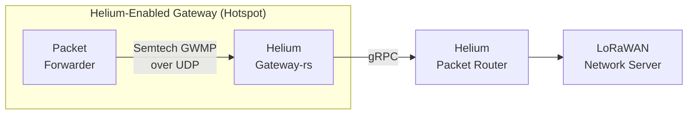

import useBaseUrl from '@docusaurus/useBaseUrl'

 
 

Any LoRaWAN gateway can be used to transfer data through the Helium Network. Data-only Hotspots are
eligible for **network data transfer rewards** but not **Proof-of-Coverage rewards**. This class of
Hotspot offers a flexible path for companies and organizations looking to leverage the Helium
Network for their IoT needs.

Since data-only Hotspots do not earn Proof-of-Coverage rewards, they may be permissionlessly added
to the network. When added to the blockchain, they will earn [IOT Tokens](/tokens/iot-token) for
transferring network data.

## Basic Architecture

The [gateway-rs](https://github.com/helium/gateway-rs) client backs both data-only Hotspots as well
as proof-of-coverage enabled Hotspots. Gateway-rs is designed to run alongside a packet forwarder
and handles communications with the Helium Packet Router.

The articles in this section will outline the 'Gateway' highlighted portion of the above diagram.

### Packet Forwarder

Gateway-rs is designed to interact with the
[Semtech Packet Forwarder](https://github.com/helium/packet_forwarder). If no packet forwarder is
installed on the target hardware, follow the manufacturer's instructions using their documentation
or one of the tutorials below.

- [COTX X1 Lite](https://support.cotxnetworks.com/support/solutions/articles/73000567327-cotx-x1-lite-cli-user-guide)
- [Dragino LPS8/DLOS8](/iot/data-only/dragino-data-only-hotspot)
- [Dragino Concentrator PG1301 + Raspberry Pi](/iot/data-only/dragino-pg1301)
- [Kerlink Gateways](/iot/data-only/kerlink-data-only-hotspot)
- [RAKwireless Concentrator (RAK2245/RAK2247/RAK2287) + Raspberry Pi](/iot/data-only/rak-concentrators)
  - [Using Balena: RAKwireless RAK2287 Concentrator + Raspberry Pi](/iot/data-only/balena-data-only-hotspot)
- [RAKwireless WisGate Edge Lite 2](https://github.com/HoBoWAN/Helium-Data-Only-Hotspot/blob/main/README.md)
- [Seeed Studio SenseCAP M2](https://wiki.seeedstudio.com/Network/SenseCAP_Network/SenseCAP_M2_Data_Only-Helium_gateway/SenseCAP_M2_Data_Only_Quick_Start/)

### Gateway-rs

Gateway-rs is the lightweight client that handles message signing and communications with Helium
Packet Router, the backbone of the IoT Network.

Gateway-rs is designed to be installed directly adjacent to the packet forwarder on the gateway. For
the latest releases and build notes, refer to the repository readme on GitHub.

- https://github.com/helium/gateway-rs/

For guidance on using gateway-rs, view the
[Data-Only Onboarding](/iot/data-only-hotspots-onboarding) guide.

## Transactions & Cost

A data-only Hotspot is capable of transferring network traffic without being onboarded. However,
rewards for data transfer will not be issued.

To enable the Helium Network to reward a data-only Hotspot for network traffic and to report a
location, two criteria must be met.

1. The Hotspot must be 'onboarded' to the network.  
   The **Add Hotspot** transaction links the Hotspot's key (`swarm_key`) to a user's
   [account](/wallets) and makes the Hotspot known to the network. This allows the Hotspot to be
   rewarded for data transfer.
1. The specific location of the Hotspot should be declared.  
   This allows the network define regional parameters and aids in location-solving for certain
   sensor applications. The **Assert Location** transaction provides the physical location
   (lat/long), elevation (in meters), and antenna EIRP (in dBi) data for the Hotspot. A Hotspot must
   be onboarded before its location can be asserted.

The network fees are as follows:

- **Add Data-Only Hotspot**: 1,000,000 Data Credits (USD $10)
- **Assert Location**: 500,000 Data Credits (USD $5)

These fees are paid using [Data Credits](/tokens/data-credit).

Transactions are submitted using the [CLI wallet](/wallets/cli-wallet). The wallet CLI should
**not** be installed on the gateway, doing so could expose account keys to the open internet if the
gateway is not properly secured. Existing accounts generated using the Helium Wallet App can be
[imported to the CLI](/wallets/cli-wallet#import-seed-phrase-account-into-cli).

For guidance on submitting these transactions, view the
[Data-Only Onboarding](/iot/data-only-hotspots-onboarding) guide.
