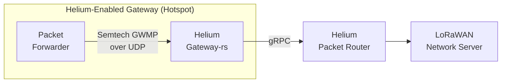

import useBaseUrl from '@docusaurus/useBaseUrl'

 
 

Any LoRaWAN gateway can join the Helium IoT Network as a Hotspot and earn HNT for the device data it
carries. Onboarding is permissionless and the same for every Hotspot: add it to a wallet and assert
its location with the [CLI Wallet](/wallets/cli-wallet).

## Two ways to run a Hotspot

The difference is where the Helium gateway software runs, and which client holds the key that signs
the add transaction. Choose based on how many gateways you're bringing online.

- **gateway-rs, on the gateway.** The client runs on the gateway itself, next to its packet
  forwarder, and the key lives on the device. Best for a single Hotspot or a few. See
  [On-Device Onboarding](/iot/onboard-a-hotspot/on-device).
- **multi-gateway, on a server.** One server fronts many gateways and holds a key for each. The
  gateways run a standard packet forwarder pointed at the server. Best for fleets. See
  [Server Onboarding](/iot/onboard-a-hotspot/server).

## Architecture

[gateway-rs](https://github.com/helium/gateway-rs) is a lightweight client that runs on the gateway,
next to its packet forwarder.

The packet forwarder sends LoRaWAN packets to gateway-rs over Semtech GWMP. Gateway-rs signs each
packet and forwards it to the Helium Packet Router, which routes it to a LoRaWAN Network Server
(LNS). For the latest releases and build notes, see the gateway-rs
[readme](https://github.com/helium/gateway-rs/blob/main/README.md).

## Packet forwarder setup

A Hotspot needs a [Semtech packet forwarder](https://github.com/helium/packet_forwarder) on the
gateway. If the hardware does not already have one, follow a hardware guide below. These guides
point the packet forwarder at gateway-rs on the same device; for the server method, point it at your
multi-gateway server instead.

- [Dragino LPS8/DLOS8](/iot/packet-forwarders/dragino)
- [RAKwireless Concentrator (RAK2245/RAK2247/RAK2287) + Raspberry Pi](/iot/packet-forwarders/rak-concentrators)
  - [Using Balena: RAKwireless RAK2287 Concentrator + Raspberry Pi](/iot/packet-forwarders/balena)
- [RAKwireless WisGate Edge Lite 2](https://github.com/HoBoWAN/Helium-Data-Only-Hotspot/blob/main/README.md)
- [Seeed Studio SenseCAP M2](https://wiki.seeedstudio.com/Network/SenseCAP_Network/SenseCAP_M2_Data_Only-Helium_gateway/SenseCAP_M2_Data_Only_Quick_Start/)

## Cost

Two transactions bring a Hotspot online. The **Add Hotspot** transaction links the Hotspot's key
(`swarm_key`) to a [wallet](/wallets) and makes the Hotspot known to the network. The **Assert
Location** transaction provides the physical location (lat/long), elevation (in meters), and antenna
EIRP (in dBi). A Hotspot must be onboarded before its location can be asserted.

- **Add Hotspot**: 50,000 Data Credits (USD \$0.50)
- **Assert Location**: 50,000 Data Credits (USD \$0.50)

These fees are paid using [Data Credits](/tokens/data-credit).

Transactions are submitted using the [CLI Wallet](/wallets/cli-wallet). The CLI Wallet should
**not** be installed on the gateway, doing so could expose account keys to the open internet if the
gateway is not properly secured. Existing accounts generated using the Helium Wallet App can be
[imported to the CLI](/wallets/cli-wallet#import-seed-phrase-account-into-cli).

For the step-by-step, see [On-Device Onboarding](/iot/onboard-a-hotspot/on-device).
