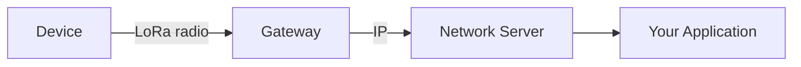

LoRaWAN is a wireless protocol built around a simple tradeoff: sacrifice bandwidth for range and
power efficiency. A LoRaWAN device can transmit small packets (sensor readings, GPS coordinates,
status updates) over several kilometers while running on a battery for years.

This makes LoRaWAN ideal for applications where devices need to report data infrequently and operate
unattended: agricultural sensors, asset trackers, smart meters, environmental monitors.

## How Data Flows

A LoRaWAN device doesn't connect directly to the internet. Instead, it broadcasts a radio signal
that any nearby gateway can receive. The gateway forwards the message to a LoRaWAN Network Server
(LNS), which authenticates the device, decrypts the payload, and delivers it to your application.

Multiple gateways can receive the same transmission. The network server deduplicates these messages
and selects the best one based on signal quality. This redundancy improves reliability without
requiring anything special from the device.

## Device Keys

Every LoRaWAN device is provisioned with cryptographic keys that authenticate it to the network and
encrypt its data. Every device, custom built or off the shelf, has three identifiers:

**DevEUI**: A unique 64-bit address that identifies the device globally, similar to a MAC address.

**JoinEUI**: Identifies which network server should handle the device's join request. On Helium,
this is how the Packet Router knows where to send your device's traffic.

**AppKey**: A secret root key shared between the device and network server. During the join process,
both sides use this key to derive session keys for encrypting data.

These keys ensure that even though your device's radio signals are received by public gateways, only
your network server can read the contents.

## On the Helium Network

Helium Hotspots are LoRaWAN gateways. When a device transmits, any Hotspot in range receives it and
forwards the packet to the [Helium Packet Router][hpr]. The router uses the JoinEUI to determine
which LNS should receive the data, then delivers it there.

This architecture means a single device can roam across the entire Helium network without
configuration changes. Any Hotspot will pick up its signal and route it correctly.

:::note

For deeper technical details on LoRaWAN, see [The Things Network Learn][ttn-learn] or the [LoRa
Alliance LoRaWAN 1.0.2 Specification][lora-spec].

:::

[hpr]: https://github.com/helium/helium-packet-router
[ttn-learn]: https://www.thethingsnetwork.org/docs/lorawan/
[lora-spec]:
  https://resources.lora-alliance.org/technical-specifications/lorawan-specification-v1-0-2
