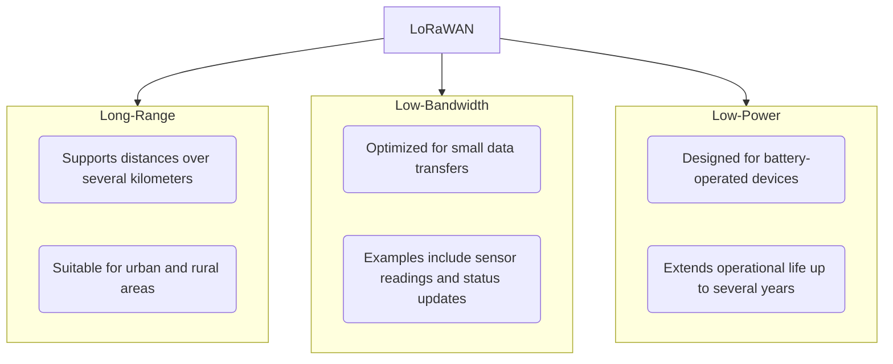

LoRaWAN is a wireless communication protocol designed for long-range, low-power, and low-bandwidth applications. It is a critical technology for IoT (Internet of Things) networks, enabling devices to communicate over large distances with minimal energy consumption.

The primary properties of LoRaWAN encompass long-range capabilities, allowing data transmission over several kilometers, making it suitable for both urban and rural deployments. It also supports low-power operations, designed for battery-operated devices, thus extending their operational life up to several years without the need for frequent recharging. Additionally, LoRaWAN is optimized for low-bandwidth applications that require small amounts of data transfer, such as sensor readings and status updates.

LoRaWAN is versatile and can be used in various applications. In smart cities, it enables connectivity for street lighting, waste management, and parking solutions. In agriculture, it facilitates soil moisture monitoring, livestock tracking, and irrigation control. Industrial IoT benefits from LoRaWAN through predictive maintenance, asset tracking, and environmental monitoring in factories. Smart homes also utilize LoRaWAN for efficient control of home automation devices and security systems.

Understanding the background of LoRaWAN involves several key components, including keys and security measures to ensure secure communications by using unique keys for device authentication and data encryption. The onboarding process for devices requires registering and commissioning end devices onto the network, which may involve configuring parameters and device keys.

Provisioning a device through a LoRaWAN Network Server (LNS) is essential. The LNS manages the network by handling tasks such as device authentication, validating each device's identity to allow secure network access. It also manages data routing, directing data traffic between end devices and application servers, and optimizes network performance by handling join requests and maintaining device connectivity.

Helium Hotspots play a fundamental role in providing coverage for LoRaWAN devices. Hotspots act as gateways that bridge the communication between end nodes (LoRaWAN devices) and the internet. By deploying Helium Hotspots, individuals and businesses contribute to a decentralized network, expanding the coverage area and enabling more devices to connect and communicate reliably. The relationship between gateways (Helium Hotspots) and end nodes (LoRaWAN devices) is that gateways transmit and receive data packets from multiple end nodes, providing the infrastructure necessary for widespread IoT applications.
