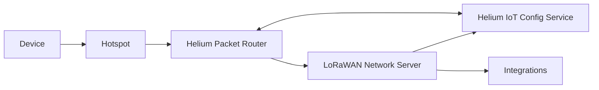

import useBaseUrl from '@docusaurus/useBaseUrl'


## Overview

The Helium Network has many points of distinction from a typical LoRaWAN network that are critical
for understanding before deploying internet of things (IoT) applications on Helium.

In conventional LoRaWAN networks, end devices, such as sensors or actuators, send LoRa wireless
messages to physical gateway devices. These gateways, in turn, forward the messages from the end
devices to central or regional LoRaWAN Network Servers (LNSs) which decompose the messages for
processing in IoT applications. Typically, LoRaWAN networks are run by a central authority in either
public or private configurations. In public configurations, the central authority allows multiple
customers to leverage gateways and LNSs in developing end-to-end IoT applications. Conversely, in
private configurations, a single entity uses the network and all of its networking components.

The Helium Network takes a different approach with respect to LoRaWAN networks. Rather than have a
centralized authority responsible for managing gateway devices (referred to as Hotspots in the
Helium parlance) or LNSs that serves as a gatekeeper for deploying end devices, Helium allows for
the decentralized operation of both Hotspots and LNSs with a completely permisionless architecture.
In practice, this means that anybody can run a Hotspot device and provide LoRaWAN coverage to the
Helium Network. Similarly, anybody can operate an LNS and provide cloud connectivity and
configuration for end devices. In turn, end devices operating on the Helium Network are able to tap
into the global network of LoRaWAN connectivity powered by community operated Hotspots and gain
access to the largest LoRaWAN network ever created.

In the remainder of this section, a high-level overview of the architecture of the Helium Network
will be provided, in addition to a discussion on terminology of networking primitives.

## High-Level Architecture

Given the unique architecture of the Helium Network in comparison to typical LoRaWAN networks, it is
helpful to understand how Helium manages a large, decentralized ecosystem of Hotspots and LNSs.

In this regard, a first primary difference is that rather than having gateway devices directly
communicate with LNSs, Helium introduces the concept of an intermediate routing service called
[Helium Packet Router (HPR)](https://github.com/helium/helium-packet-router) that handles the
connectivity between LNSs and Hotspots. As shown in the diagram below, end devices still send
messages to Hotspots, but instead of the Hotspots subsequently forwarding the messages to directly
to an LNS, the Hotspots send the messages to HPR. In doing so, HPR can identify the particular
Hotspots that forwarded the message from the end device in order to properly credit the Hotspot with
data transfer rewards on the Helium Network.

A second primary difference is with the introduction of the
[Helium IoT Config Service](https://github.com/helium/oracles/tree/main/iot_config) which serves as
an interface for users for configuring routing rules relied on by HPR when determing where to
forward messages from end devices to LNSs. Users can leverage tools including the
[Helium Config Service CLI](https://github.com/helium/helium-config-service-cli) for providing
routing rule configurations to the Config Service (and in turn HPR).



<br />

For a deeper understanding of the architecture of the Helium Network, users are encouraged to read
documentation and review the open-source code for HPR and IoT Config Service:

- [HPR](https://github.com/helium/helium-packet-router)
- [Config Service](https://github.com/helium/oracles/tree/main/iot_config)

## The OUI

Each LNS on the Helium Network acquires an Organizationally Unique Identifier (OUI). This registers
the LNS with the blockchain and allocates two very important routing objects owned and maintained by
the OUI Operator:

- one or more **slabs** of DevAddrs, reserving NwkAddr space for the OUI's devices on the Helium
  Network

A device defined by (AppEUI, DevEUI) can be allocated to any of the DevAddrs owned by the OUI. It is
even possible to multiplex many devices on the same DevAddr at the same time, using the Message
Integrity Check (MIC) to disambiguate.

Starting in 2023, Helium will be utilizing an OpenLNS Initiative to allow more choice and increase
usability. You can read more about the OpenLNS Initiative at the [Helium Foundation
Blog][foundation-blog] or read more in the [Use Helium LoraWAN](/iot/lorawan-network-servers)
section.

## Organizationally Unique Identifier

Organizationally Unique Identifiers (OUIs) are registered identities on the Helium Blockchain. To
send and receive packets to an end-device, a network user needs to be serviced an OUI.

An OUI has some specificities related to LoRaWAN and packet routing, as
[documented above](/iot/lorawan-on-helium#the-oui), but with respect to the blockchain, what's
important is that
[only libp2p addresses registered as endpoints for the OUI](https://github.com/helium/proto/blob/master/src/blockchain_txn_oui_v1.proto#L6)
may open and close state channels on behalf of an OUI.

For example, the account `13tyMLKRFYURNBQqLSqNJg9k41maP1A7Bh8QYxR13oWv7EnFooc` purchased the first
OUI on the Helium Blockchain. The address `112qB3YaH5bZkCnKA5uRH7tBtGNv2Y5B4smv1jsmvGUzgKT71QpE`
operates the OUI on behalf of the owner.

OUIs are purchased and numbered in incrementing order.

:::info

Based on the latest benchmarking tests the upper limit for a Devaddr `1024` slab is approximately
5800 devices, but results still need to be replicated and bracketed. Community members are
encouraged to run their own benchmarking tests. Requires basic familiarity with Linux and Bash
command line.

:::

### Join Request Frames and Filters

A Join Request frame has the following unencrypted header:

```bash
+---------------------------------------------------------+
|   Size (octets)  |      8     |      8     |      8     |
+------------------+------------+------------+------------+
|   Join Request   |   AppEUI   |   DevEUI   |  DevNonce  |
+---------------------------------------------------------+
```

From the gateway's perspective, the (AppEUI, DevEUI) may be used to figure out if one or more OUI's
are interested in the Join Request.

This is done by querying every filter maintained and written to the blockchain by every OUI. The
filters themselves are _xorhash_ tables, thus the AppEui and DevEui cannot be extracted. Only with
the AppEui and DevEui in hand can the gateway run it through the table to see if it's there.

In response to the Join Request, a Join Accept is sent down, assigning the NwkAddr. Due to the
multi-tenancy on the Helium Network, the LNS may only assign NwkAddrs within its DevAddr slab(s).

### Data Frames and DevAddr Slabs

Data packets have the following unencrypted header (FHDR):

```bash
+----------------------------------------------------------------------+
|   Size (octets)  |     4      |      1     |      2     |    0..15   |
+------------------+------------+------------+------------+------------+
|   FHDR           |  DevAddr   |    FCtrl   |     FCnt   |    FOpts   |
+----------------------------------------------------------------------+
```

Within DevAddr, there is the NwkAddr of a device:

```bash
+------------------------------------------------+
|                     DevAddr                    |
+------------------------+-----------------------+
|   NwkID (bits 31–25)   |  NwkAddr (bits 24–0)  |
+-----------+--------------------+---------------+
|     Helium Network     |   allocated by slab   |
|(‘H’ / 0b1001000 / 0x48)|      to OUIs          |
+-----------+--------------------+---------------+
```

From the gateway's perspective, it can use DevAddr to determine the OUI of Data frames. A quick
query can say which OUI owns this DevAddr slab. This look-up and routing by DevAddr instead of by
\(AppEUI, DevEUI\) via _xorhash_ filters is generally much quicker.

[foundation-blog]:
  https://medium.com/helium-foundation/scaling-iot-growth-with-heliums-open-lns-initiative-c906e6953d6d
