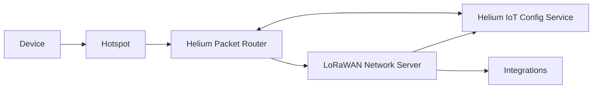

import useBaseUrl from '@docusaurus/useBaseUrl'


## Overview

The Helium Network has many points of distinction from a typical LoRaWAN network that are critical
to understand before deploying Internet of Things (IoT) applications on Helium.

In conventional LoRaWAN networks, end devices, such as sensors or actuators, send LoRa wireless
messages to physical gateway devices. These gateways, in turn, forward the messages from the end
devices to central or regional LoRaWAN Network Servers (LNSs) which decompose the messages for
processing in IoT applications. Typically, LoRaWAN networks are run by a central authority in either
public or private configurations. In public configurations, the central authority allows multiple
customers to leverage gateways and LNSs in developing end-to-end IoT applications. Conversely, in
private configurations, a single entity uses the network and all of its networking components.

The Helium Network takes a different approach with respect to LoRaWAN networks. Rather than have a
centralized authority responsible for managing gateway devices (referred to as Hotspots in Helium
parlance) or LNSs that serves as a gatekeeper for deploying end devices, Helium allows for the
decentralized operation of both Hotspots and LNSs with a completely permissionless architecture. In
practice, this means that anybody can run a Hotspot device and provide LoRaWAN coverage to the
Helium Network. Similarly, anybody can operate an LNS and provide cloud connectivity and
configuration for end devices. In turn, end devices operating on the Helium Network are able to tap
into the global network of LoRaWAN connectivity powered by community-operated Hotspots and gain
access to the largest LoRaWAN network ever created.

In the remainder of this section, a high-level overview of the architecture of the Helium Network
will be provided, in addition to a discussion on the terminology of networking primitives.

## High-Level Architecture

Given the unique architecture of the Helium Network in comparison to typical LoRaWAN networks, it is
helpful to understand how Helium manages a large, decentralized ecosystem of Hotspots and LNSs.

In this regard, a first primary difference is that rather than having gateway devices directly
communicate with LNSs, Helium introduces the concept of an intermediate routing service called
[Helium Packet Router (HPR)](https://github.com/helium/helium-packet-router) that handles the
connectivity between LNSs and Hotspots. As shown in the diagram below, end devices still send
messages to Hotspots, but instead of the Hotspots subsequently forwarding the messages directly to
an LNS, the Hotspots send the messages to HPR. In doing so, HPR can identify the particular Hotspots
that forwarded the message from the end device in order to properly credit the Hotspots with data
transfer rewards on the Helium Network.

A second primary difference is the introduction of the
[Helium IoT Config Service](https://github.com/helium/oracles-iot/tree/main/iot_config), which
serves as an interface for users to configure routing rules relied on by HPR when determining where
to forward messages from end devices to LNSs. Users can leverage tools including the
[Helium Config Service CLI](https://github.com/helium/helium-config-service-cli) to provide routing
rule configurations to the Config Service (and in turn HPR).


```mermaid
graph LR
    dev[Device] --> gateway[Hotspot]
    gateway --> hpr[Helium Packet Router]
    hpr --> lns[LoRaWAN Network Server]
    hpr <--> ics[Helium IoT Config Service]
    lns --> ics
    lns --> i[Integrations]
```

<br />

For a deeper understanding of the architecture of the Helium Network, users are encouraged to read
documentation and review the open-source code for HPR and IoT Config Service:

- [HPR](https://github.com/helium/helium-packet-router)
- [Config Service](https://github.com/helium/oracles-iot/tree/main/iot_config)

## The OUI

Each LNS on the Helium Network acquires an Organizationally Unique Identifier (OUI). This registers
the LNS with the network and establishes two very important routing objects owned and maintained by
the OUI Operator:

- one or more **slabs** of devAddrs, reserving NwkAddr space for the OUI's devices on the Helium
  Network
- one or more **routes**, each pairing an LNS endpoint with the (AppEUI, DevEUI) pairs used to route
  Join Requests to that LNS

A device defined by (AppEUI, DevEUI) can be allocated to any of the devAddrs owned by the OUI. It is
even possible to multiplex many devices on the same devAddr at the same time, using the Message
Integrity Code (MIC) to disambiguate.

Since 2023, Helium has used the OpenLNS Initiative to allow more choice and increase usability. You
can read more about the OpenLNS Initiative at the [Helium Foundation Blog][foundation-blog] or read
more in the [Use Helium LoRaWAN](/iot/lorawan-network-servers) section.

## Organizationally Unique Identifier

Organizationally Unique Identifiers (OUIs) are the registered identities of LNS operators. To send
and receive packets to an end device, a network user needs to be serviced by an OUI.

An OUI is a record held by the Config Service rather than an on-chain object. Each record pairs the
OUI number with an owner key, a payer key, and any delegate keys the owner has authorized. The owner
key manages delegate keys, and owner and delegate keys sign the Config Service requests that create
and update routes, EUI pairs, devAddr ranges, and session key filters. The one on-chain component is
the OUI's Data Credit escrow on Solana, which is derived from the payer key and funded as described
in [Fund an OUI](/iot/run-an-lns/fund-an-oui).

OUI numbers are assigned in incrementing order as records are created. Acquiring one is not
self-service; see [Buy an OUI](/iot/run-an-lns/buy-an-oui) for the process and costs.

:::info

Based on the latest benchmarking tests, the upper limit for a devAddr `1024` slab is approximately
5800 devices, but results still need to be replicated and bracketed. Community members are
encouraged to run their own benchmarking tests. Running these tests requires basic familiarity with
Linux and the Bash command line.

:::

### Join Request Frames and EUI Pairs

A Join Request frame has the following unencrypted header:

```text
+---------------------------------------------------------+
|   Size (octets)  |      8     |      8     |      8     |
+------------------+------------+------------+------------+
|   Join Request   |   AppEUI   |   DevEUI   |  DevNonce  |
+---------------------------------------------------------+
```

The (AppEUI, DevEUI) pair determines which OUIs are interested in the Join Request. Hotspots make no
routing decision of their own; they forward every packet they hear to HPR, and HPR performs the
lookup.

An OUI registers the (AppEUI, DevEUI) pairs it expects against one of its routes in the Config
Service, and HPR receives those pairs over its route stream. When a Join Request arrives, HPR
matches the pair directly and forwards the request to every route that claims it. Registering a
DevEUI of `0000000000000000` acts as a wildcard, matching every DevEUI under that AppEUI.

In response to the Join Request, a Join Accept is sent down, assigning the devAddr. Due to the
multi-tenancy on the Helium Network, the LNS may only assign devAddrs within its slab(s), and it
registers them with the Config Service so that HPR can route the device's later uplinks.

### Data Frames and devAddr Slabs

Data packets have the following unencrypted header (FHDR):

```text
+----------------------------------------------------------------------+
|   Size (octets)  |     4      |      1     |      2     |    0..15   |
+------------------+------------+------------+------------+------------+
|   FHDR           |  DevAddr   |    FCtrl   |     FCnt   |    FOpts   |
+----------------------------------------------------------------------+
```

Within a devAddr, the high bits identify the network and the low bits identify the device. Helium's
NetID, `0x00003C`, is a LoRaWAN Type 0 NetID, so its NwkID is six bits and each device is addressed
by a 25-bit NwkAddr:

```text
+------------------------------------------------+
|                     DevAddr                    |
+------------------------+-----------------------+
|   AddrPrefix (31-25)   |    NwkAddr (24-0)     |
+--------+---------------+-----------------------+
|  Type  |     NwkID     |   allocated by slab   |
| bit 31 |  bits 30-25   |        to OUIs        |
|  0b0   |   0b111100    |                       |
+------------------------------------------------+
```

That gives Helium the devAddr range `0x78000000` to `0x79FFFFFF`, written `78000000/7`, which is
subdivided into the slabs allocated to OUIs.

HPR routes Data frames by devAddr. It matches the devAddr against the ranges each OUI has registered
with the Config Service and forwards the frame to every route whose range contains it. Where an
operator has added [Session Key Filters](/iot/run-an-lns/advanced-configuration#session-key-filter),
HPR also verifies the frame's MIC against the stored session keys before buying the packet,
narrowing delivery to the route that owns the device session.

[foundation-blog]:
  https://medium.com/helium-foundation/scaling-iot-growth-with-heliums-open-lns-initiative-c906e6953d6d
