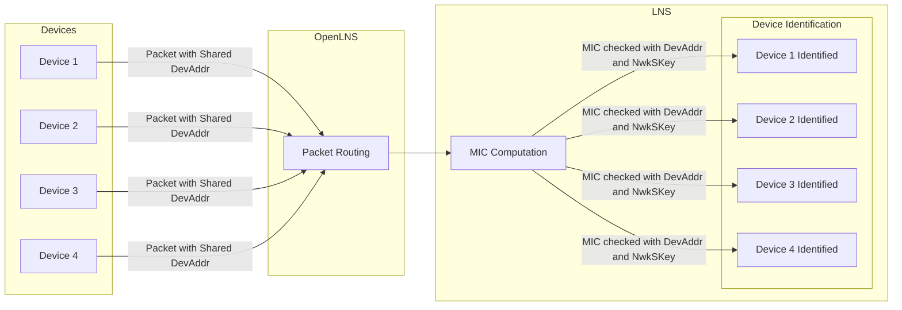

## What is an Organizationally Unique Identifier?

Each LoRaWAN Network Server (LNS) on the Helium Network is managed using an Organizationally Unique
Identifier (OUI). This registers the LNS with the network and manages the
[devAddrs](#devaddr-explained), [Data Credits](/tokens/data-credit), and routes for device traffic.

## Pricing

The minimum cost to deploy an LNS to the Helium Network is $935 USD. This cost is divided into three
parts.

The cost of an OUI is US$100. This is a one-time fee.

DevAddrs are issued in blocks of 8 and cost US$100 per devAddr for a total of $800. DevAddrs are
also purchased as a one-time fee. DevAddrs are only required if a NetID is not already obtained from
the LoRa Alliance.

A minimum of 3,500,000 Data Credits ($35 USD) must be held in the escrow account associated with the
OUI. DC are consumed in proportion to the network traffic transfered[^1]. If the DC balance drops
below 3.5M, device traffic to the routes associated with the OUI will halt.

| Item                | Fee             |
| ------------------- | --------------- |
| OUI                 | $100            |
| DevAddr             | $100 × 8 ($800) |
| Data Credit Minimum | $35             |

[^1]: [Data Credits and IoT network traffic explained.](/tokens/data-credit#dc-and-iot)

## Purchasing OUI and devAddr Slab

Currently, the purchasing of OUIs and devAddrs must be done by contacting the Helium Foundation. In
the future, these registrations will be self-service.

As an alternate to purchasing a devAddr slab, it is also an option to
[obtain a NetID](https://resources.lora-alliance.org/faq/lorawan-netid-faq) from the LoRa Alliance
and use it in a [roaming](/iot/lorawan-roaming) configuration. An OUI and data credits are required
in either scenario.

Before purchasing an OUI and devAddr slab, create the following:

- Helium wallet
- OUI owner key pair
- OUI delegate key pair

The steps provided below outline how to create a Helium wallet and OUI owner and delegate key pairs.

1. [Create Helium Wallet in Solana Format](#create-wallet)
1. [Convert Solana Formatted Public Key to Legacy Helium Format](#convert-wallet)
1. [Install The Config Service CLI](#install-cli)
1. [Generate OUI Keys](#generate-keys)
1. [Submit For Purchasing](#submit)

### Create Helium Wallet in Solana Format {#create-wallet}

To create a Helium wallet, you can follow the guide for
[creating a new Helium Account](/wallets/helium-wallet-app).

In doing so, a Helium wallet will be generated with key pairs in the native Solana format.

### Convert Solana Formatted Public Key to Legacy Helium Format {#convert-wallet}

The OUI configuration process currently leverages public keys in a format from the legacy Helium L1
blockchain. To convert a Solana public key into the legacy format, use the conversion tool below.

In using the tool, simply paste your Helium wallet public key in the Solana format into the top
"Enter Helium or Solana Wallet Address" field and copy the result from the "Helium Address" field.

**This value will be the Helium wallet public key in the legacy format required for purchasing an
OUI**.

import { DisplayLegacyWallet } from '@theme/DisplayLegacyWallet'

<div className="screensnippet-wrapper">
  <DisplayLegacyWallet />
</div>

### Install The Config Service CLI {#install-cli}

The [Helium Config Service CLI](https://github.com/helium/helium-config-service-cli) will be used to
generate the key pairs used for the OUI. Run the following commands to pull & build the config
service CLI:

```bash title="Copy the latest source code from GitHub."
git clone https://github.com/helium/helium-config-service-cli.git
```

To build the copied code, the Rust compiler must be installed.

```bash title="Install the Rust toolchain."
curl https://sh.rustup.rs -sSf | sh
```

```bash title="Add Rust to path."
source "$HOME/.cargo/env"
```

Add the protobuf library which will be used during the compile process.

```bash title="Install protobuf (Mac)"
brew update && brew install protobuf
```

```bash title="install protobuf (Ubuntu)"
sudo apt update && sudo apt install protobuf-compiler
```

With the build toolchain installed, compile the CLI.

```bash title="Enter the directory and compile the CLI"
cd helium-config-service-cli && cargo build --release
```

The built binary file `helium-config-service-cli` can be found under `target/release/` inside the
`helium-config-service-cli` directory.

Now that we have the CLI binary, let's put a copy in the local bin folder for simplicity's sake.
Just copy `helium-config-service-cli` into `/usr/local/bin`. Files added to the bin folder will
automatically be available to your command line.

```bash
sudo cp target/release/helium-config-service-cli /usr/local/bin/
```

### Generate OUI Keys {#generate-keys}

Generate the key pairs you'll be using to authenticate your interactions with the config service.
These keys are implemented such that only you can create/modify/delete routes.

After this step you will have at least two keys:

- **Delegate Key Pair**: The delegate key is actively used to create and manage routes. In case it
  is ever compromised, it can be updated using the owner key. Note that an OUI can have multiple
  delegate key pairs. Guidance on how to manage delegate key pairs can be found in the
  [advanced configuration](/iot/run-an-lns/advanced-configuration).

- **Owner Key Pair**: The owner key is irreplaceable and should be kept safe, secure, and private at
  all times. If lost or compromised, you could lose your OUI. The owner key pair is used for
  delegate key management.

Run the generate key pair command twice. First for the owner key pair and second for the delegate
key pair. Name the files accordingly.

```bash title="Generate key pair"
helium-config-service-cli env generate-keypair ~/<key file name>.bin
```

Run `helium-config-service-cli env generate-keypair <key file name>.bin` to generate a file called
`<key file name>.bin`.

Print out the public key of the key pair by running:

```bash
helium-config-service-cli env info --keypair <key file name>.bin
```

```json {9} title="Example response from the info command highlighting the key pair."
{
  "arguments": {
    "config_host": "unset",
    "key_type_from_keypair": "ed25519",
    "keypair": "/Users/me/test.bin",
    "max_copies": null,
    "net_id": null,
    "oui": null,
    "public_key_from_keypair": "13eY9uE5fjMzKC7PZ1nsDigiyurhXhV3bbj8pxbD2KtQTSC1ZHP"
  },
  {/* env vars will be discussed later */}
}
```

The `.bin` files should be kept safe and never shared. The public key of these key pairs is the only
part that should be shared.

### Submit For Purchasing {#submit}

Direct purchase of OUIs and devAddrs are not currently available on-chain. Send an email to
[hello@helium.foundation](mailto:hello@helium.foundation) containing the following information.

- The Helium wallet address
- The public key of your owner key pair
- The public key of your delegate key pair
- The number of devAddrs you want or your non-Helium Net ID

Once you receive your OUI, the next step is to fund it. There are several options in the
[Fund an OUI](fund-an-oui) guide.

## Share The LNS With The Community

- **Add the LNS to the 'Well Known' list.**  
  Helium operates as a permissionless network, which means it is possible to leverage the network
  with complete anonymity. In the interest of making the network more transparent, an LNS can be
  added to the [Well Known](https://github.com/helium/well-known) list.

  This list is leveraged in labeling OUIs with a human-readable name on public Helium Foundation
  [dashboards](https://dune.com/helium-foundation/helium-data-credits) and other community-run
  dashboards. Consider adding your LNS to this resource.

- **Add the LNS to the public providers page.**  
  If the OUI is being used for publicly accessible operations, let the community know that business
  is open! Add the LNS to the [Find an LNS Provider](/iot/find-a-lns-provider) page.

---

## DevAddr Explained

Device addresses or `DevAddr` are assigned to a device by the LNS during the join procedure as
defined in the
[LoRaWAN 1.0.3 Specification](https://lora-alliance.org/resource_hub/lorawan-specification-v1-0-3/).
A device, defined by `(AppEUI, DevEUI)`, can be allocated any of the devAddrs owned by the OUI. It
is even possible to multiplex many devices on the same DevAddr at the same time, using the Message
Integrity Check (MIC) to disambiguate.

DevAddrs purchased through the methods outlined above are issued under the Helium Foundation's
NetID, 0x00003C, which was assigned on May 2, 2023, as part of the Helium Foundation's membership in
the LoRa Alliance.

| NetID (hex) | NetID (decimal) | NwkID (bits) | DevAddr Subnet |
| ----------- | --------------- | ------------ | -------------- |
| 0x00003C    | 60              | 6b'111100    | 78000000/7     |

Customers using their own netID don't need devAddrs from the Helium Foundation. Those with their own
netID assigned by the LoRa Alliance should implement [roaming](/iot/lorawan-roaming) to allow their
devices to use the Helium Network.

### Multiplexing With DevAddrs

Multiplexing in LoRaWAN, specifically DevAddr multiplexing, refers to the process where multiple
devices share the same device address (DevAddr). It's a way to manage the limited available range of
DevAddrs and allows more devices to join the network.

If using ChirpStack, it randomly assigns a DevAddr at join or re-join to the device from the
available range and then multiplexes each DevAddr as needed. The ChirpStack platform does this
through the assignment of the Network Session Key.

In the event of DevAddr collisions, i.e., when two or more devices have the same DevAddr, the
network server (LNS) uses a technique called a Message Integrity Code (MIC) check computation to
identify the real device behind each data packet. For instance, if there are 4 devices all sending
uplinks on the same DevAddr as shown in the diagram below, the LNS should have 4 network session
keys on the same DevAddr. Upon receiving an uplink on that DevAddr, the LNS will attempt a MIC check
with each of the 4 network session keys, and the uplink will be attributed to the device whose
network session key was successfully validated.

The computational overhead of these MIC checks is not heavy in most scenarios, these are checks
designed to be performed on low-power devices. However, in high-traffic scenarios, it may be best to
attribute a larger set of DevAddrs rather than allocate additional compute.



### How many `DeviceAddr` are needed?

An allocation of 8 devAddrs is enough for all operators to get started and scale their services. The
demands of devices usually won't become apparent until tens of thousands of frequently uplinking
devices are onboarded. The need for more devAddr depends on a few factors:

1. Number of devices.
1. Frequency of uplink.
1. Number of copies of a message received.
1. LNS system specs.

In practice, some deployers are able to successfully support 100k+ devices with 32 DevAddrs.

More devAddrs can be allocated at any time, and LNSs generally accommodate non-sequential ranges.
