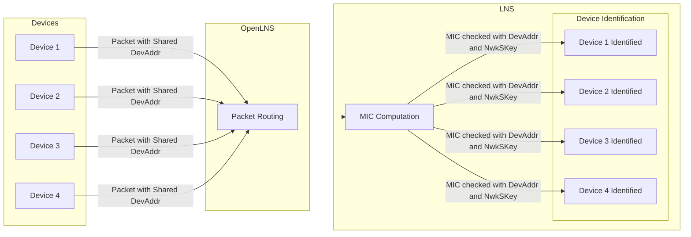

## What is an Organizationally Unique Identifier?

Each LoRaWAN Network Server (LNS) on the Helium Network is managed using an Organizationally Unique
Identifier (OUI). This registers the LNS with the blockchain and allocates two very important
routing objects owned and maintained by the OUI operator:

- Up to five **filters**, describing the sets (AppEUI, DevEUI) expected by the LNS
- One or more **slabs** of DevAddrs, reserving address space for the OUI's devices on the Helium
  Network

A device, defined by `(AppEUI, DevEUI)`, can be allocated any of the [DevAddrs](#devaddr-explained)
owned by the OUI. It is even possible to multiplex many devices on the same DevAddr at the same
time, using the Message Integrity Check (MIC) to disambiguate.

## Pricing

The cost of an OUI is US$100. This is a one-time fee. DevAddrs are sold in blocks of 8 and cost
US$100 per devAddr for a total of $800. This is a one-time fee.

A devAddr slab must be purchased when purchasing an OUI, therefore, the total minimum cost is US$900
: $100 for the OUI itself and $800 for eight DevAddr's.

You will find instructions on what you need and who to contact at the end of the next section.

### Purchasing OUI and devAddr Slab

Currently, the purchasing of OUIs and devAddrs must be done by contacting the Helium Foundation. In
the future, these registrations will be will be self-service.

Before you can purchase an OUI and devAddr Slab, you need to do the following.

- Generate an owner key pair
- Generate a delegate key pair
- Make sure you have a Helium Wallet

You can create a Helium Wallet following the guide [here](/wallets/helium-wallet-app). Let's now
generate the key pairs.

1. Run the following commands to pull & build the config service CLI:

   ```bash
   $ git clone https://github.com/helium/helium-config-service-cli.git
   $ curl https://sh.rustup.rs -sSf | sh
   $ source "$HOME/.cargo/env"
   $ brew update
   $ brew install protobuf
   $ cd helium-config-service-cli
   $ cargo b --release
   ```

1. You can then find the built binary file `helium-config-service-cli` under `./target/release`
   inside the `helium-config-service-cli` directory. We would recommend renaming it into something
   short such as `main` so you can type less words (you can rename it by running
   `mv helium-config-service-cli main`)

1. Now that we have the CLI binary, let’s just put it in a separate folder. This is recommended only
   for simplicity's sake. Just copy `main` into the folder you created. You can reference the
   following commands:

   ```bash
   $ cd ..
   $ mkdir cli-testing
   $ cd cli-testing
   $ cp ../helium-config-service-cli/target/release/main .
   ```

1. Generate the keypairs you'll be using to authenticate your interactions with the config service,
   so only you can create/modify/delete routes. Run this command twice for 1) owner keypair and 2)
   delegate kepair and name files accordingly. Run
   `./main env generate-keypair <key file name>.bin.` and you should find a file called
   `<key file name>.bin`. Print out the public key of your keypair by running:

   ```bash
   $ ./main env info --keypair <key file name>.bin
   ```

   **Delegate Keypair**: The delegate key is actively used to create and manage routes. In case it
   is ever compromised, it can be updated using the owner key.

   **Owner Keypair**: The owner key is irreplaceable and should be kept safe, secure, and private at
   all times. If lost or compromised, you could lose your OUI.

Now, please send an email to [hello@helium.foundation](mailto:hello@helium.foundation) to purchase
an OUI.

- The public key of your owner key pair
- The public key of your delegate key pair
- The Helium Wallet address
- The number of devAddrs you want

Once you receive your OUI, the next step is to fund it. Learn how [here](fund-an-oui).

---

## DevAddr Explained

Device addresses or `DeviceAddr` are assigned to a device by the LNS during the join procedure See
the
[LoRaWAN 1.0.3 Specification](https://lora-alliance.org/resource_hub/lorawan-specification-v1-0-3/)
for more info about the join procedure.

DevAddrs purchased through the methods outlined above are issued under the Helium Foundation's
NetID, 0x00003C, which was assigned on May 2, 2023, as part of the Helium Foundation's membership in
the LoRa Alliance.

Customers using their own netID don't need devAddr from the Helium Foundation. Those with their own
netID assigned by the LoRa Alliance should implement [roaming](/iot/lorawan-roaming) to allow their
devices to use the Helium Network.

| NetID (hex) | NetID (decimal) | NwkID (bits) | DevAddr Subnet |
| ----------- | --------------- | ------------ | -------------- |
| 0x00003C    | 60              | 6b'111100    | 78000000/7     |



### Why & when should I purchase more `DeviceAddr`?

You may be wondering, how many `DeviceAddr` do you need? This depends on a few factors:

1. number of devices
1. location / concentration of devices

To better figure out the right number for you, you will need to understand how `DeviceAddr` are
assigned to Devices by Router.

### Couple things to know before

First you will need a basic understanding of the location system used by the Helium Network
[Full Description](/architecture/hexagons). If you are aware of `H3 Indexes` & `Hexagons` you can
skip this.

Then let's talk about the offer / purchase machanism on the Helium Network.

The Helium Network (HN) is not your "typical" LoraWan Network in which a Hotspot (or Gateway) will
send its packets to an LNS directly and for "free". In the HN, a Hotspot will make an offer to the
appropriate LNS and if said LNS decided to purchase it, the hotspot will then deliver the "full"
packet to the LNS. Note that the LNS can refuse an offer from a Hotspot if it thinks that it is not
interested by the data from this device.

:::info

Offers only contain:

- the routing information for a packet (`DeviceAddr` for uplinks or `EUIs` for join)
- a hash of the packet, to not reveal its content but still be uniquely trackable by the LNS
- the Hotspot it came from

:::

:::info

Note that an OUI is only ever charged when a packet is received and properly identified.

:::

### Assigning a `DeviceAddr`

When a device joins the Helium Network it is assigned a `DeviceAddr` based on the location of the
hotspot that the device is communicating through. Router will lookup the hotspot's location and find
its parent hexagon at [resolution 3](https://h3geo.org/docs/core-library/restable/) (resolution 3 is
the default value but it can changed via the env variable `ROUTER_DevAddr_ALLOCATE_RESOLUTION`) it
will then assign the lowest `DeviceAddr` in its slab to the device. If another device was to join in
the same hexagon it would get the following `DeviceAddr` in the slab, ex:
`Device1 -> DevAddr1, Device2 -> DevAddr2`.

:::info

At resolution 3 (Average Hexagon Edge Length: 59.8 km), they are `41,162` unique hexagon in the
world, so a slab of `8 DeviceAddr` would provide `41,162 * 8 = 329,296` devices, see
[doc](https://h3geo.org/docs/core-library/restable/).

:::

The maybe not so obvious problem here is: what if you have more devices than `DeviceAddr` in one
Hexagon? This is when conflicts can happen. A `DeviceAddr` conflict is when Router receives an offer
but cannot be entirely sure if the offer is from for `Device1` or `Device9`:

#### Example

You have 2 devices `Device1` and `Device9` both sending through the same hotspot and therefor in the
same resolution 3 hexagon. As we have 9 devices that have joined in the Hexagon, the assignment
rolled back to the first `DeviceAddr` and gave `Device9` the same `DeviceAddr1` as `Device1`.

- Assignment
  `Device1 -> DevAddr1, Device2 -> DevAddr2, ..., Device8 -> DevAddr8, Device9 -> DevAddr1`.
- Scenario: `Device1` is sending an uplink.

At this point 2 things can happen:

1. The Router identified the offer from the hotspot to be from `Device1`. The Router can then
   process the offer accordingly.
2. The Router **misidentify** the offer thinking that it is from `Device9` (as they both share
   `DeviceAddr1`)
   1. If Router deems offers associated with `Device9` worthy of purchasing, the offer will be
      purchased and then the packet will be properly identified via the `MIC` (Message Integrity
      Code,
      [see LoraWan spec for more info](https://lora-alliance.org/resource_hub/lorawan-specification-v1-0-3/)
      ). This is essentially a conflict with **happy path**.
   2. If Router does not deem offers associated with `Device9` worthy of purchasing (e.g. maybe
      `Device9` was de-activated by a user in Console, or maybe `Device9`'s Console Organisation ran
      out of [Data Credit](/tokens/data-credit)) the offer will be rejected and data never
      delivered. This is a conflict with **non-happy path**.

The non-happy path is fairly rare as Router will do its best to find out the right device but this
is where buying extra `DeviceAddr` can help prevent bad conflicts.

This should help you figure out the number of `DeviceAddr` that is right for you.

:::info

Moving devices can trigger the same effect as well as they can get an assigned `DeviceAddr` in our
Hexagaon and move to another one, potentially causing a conflict as specified above.

:::
