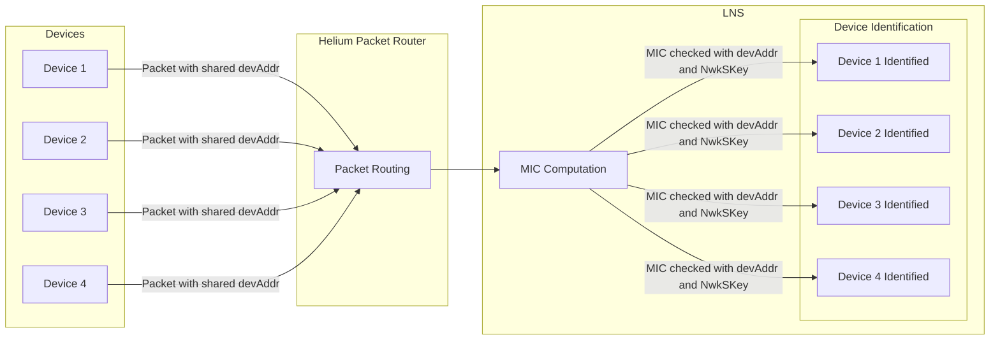

Each LoRaWAN Network Server (LNS) on the Helium Network is registered with an Organizationally
Unique Identifier (OUI), which holds the [devAddrs](#devaddr-explained),
[Data Credits](/tokens/data-credit), and routes for the LNS's device traffic.

OUIs and devAddrs are [purchased by contacting Helium](#purchase-an-oui-and-devaddr-slab).

Operators that hold their own LoRa Alliance NetID do not need a devAddr slab and should use
[roaming](/iot/lorawan-roaming) instead. An OUI and Data Credits are required in either case.

## Pricing

The minimum cost to deploy an LNS to the Helium Network using Helium devAddrs is \$235 USD, divided
into three parts. Operators with their own LoRa Alliance NetID skip the devAddr slab, so their
minimum is \$135.

The cost of an OUI is \$100. This is a one-time fee.

devAddrs are issued in slabs of 8 and cost \$12.50 per devAddr for a total of \$100. devAddrs are
also purchased as a one-time fee.

A minimum of 3,500,000 Data Credits (\$35) must be held in the escrow account associated with the
OUI. DC are consumed in proportion to the network traffic transferred[^1]. If the DC balance drops
below this minimum, device traffic to the routes associated with the OUI will halt until the balance
is topped up. See [Minimum Balance](/iot/run-an-lns/fund-an-oui#minimum-balance) for details.

| Item                | Fee                 |
| ------------------- | ------------------- |
| OUI                 | \$100               |
| devAddr             | \$12.50 × 8 (\$100) |
| Data Credit Minimum | \$35                |

The OUI and devAddr fees are paid to Helium as part of the purchase. The Data Credit minimum is not
a fee collected by Helium. It is a balance funded by the operator after the OUI is issued, as
described in [Fund an OUI](/iot/run-an-lns/fund-an-oui).

[^1]: [Data Credits and IoT network traffic explained](/tokens/data-credit#dc-and-iot).

## Prerequisites

Before purchasing an OUI and devAddr slab, a Helium wallet, OUI owner key pair, and OUI delegate key
pair need to be created.

The steps provided below outline how to do so:

1. [Create Helium Wallet in Solana Format](#create-wallet)
2. [Convert Solana Formatted Public Key to Legacy Helium Format](#convert-wallet)
3. [Install the Helium Config Service CLI](#install-cli)
4. [Generate OUI Keys](#generate-keys)

### 1. Create Helium Wallet in Solana Format {#create-wallet}

To create a Helium wallet, follow
[Creating a New Account](/wallets/helium-wallet-app#creating-a-new-account) in the Helium Wallet App
guide, or create one with the [Helium CLI Wallet](/wallets/cli-wallet#create-wallet).

In doing so, a Helium wallet will be generated with key pairs in the native Solana format.

### 2. Convert Solana Formatted Public Key to Legacy Helium Format {#convert-wallet}

The OUI configuration process currently leverages public keys in a format from the legacy Helium L1
blockchain. To convert a Solana public key into the legacy format, use the conversion tool below.

To use the tool, simply paste your Helium wallet public key in the Solana format into the top "Enter
Helium or Solana Wallet Address" field and copy the result from the "Helium Address" field.

**This value will be the Helium wallet public key in the legacy format required for purchasing an
OUI.**

import { DisplayLegacyWallet } from '@theme/DisplayLegacyWallet'

<div className="screensnippet-wrapper">
  <DisplayLegacyWallet />
</div>

### 3. Install the Helium Config Service CLI {#install-cli}

The [Helium Config Service CLI](https://github.com/helium/helium-config-service-cli) will be used to
generate the key pairs used for the OUI.

#### Running From a Release

Download the archive for your platform from the
[latest release](https://github.com/helium/helium-config-service-cli/releases/latest), unpack it,
and place the `helium-config-service-cli` binary somewhere on your `$PATH`, such as
`/usr/local/bin`. Prebuilt binaries are published for Apple Silicon macOS, x86-64 Linux, and x86-64
Windows.

#### Building From Source

If a prebuilt binary is not available for your platform, build the CLI from source. Run the
following commands to pull and build the Config Service CLI:

```bash title="Copy the latest source code from GitHub"
git clone https://github.com/helium/helium-config-service-cli.git
```

To build the copied code, the Rust compiler must be installed.

```bash title="Install the Rust toolchain"
curl https://sh.rustup.rs -sSf | sh
```

```bash title="Add Rust to path"
source "$HOME/.cargo/env"
```

Add the protobuf library, which will be used during the compile process.

```bash title="Install protobuf (macOS)"
brew update && brew install protobuf
```

```bash title="Install protobuf (Ubuntu)"
sudo apt update && sudo apt install protobuf-compiler
```

With the build toolchain installed, compile the CLI.

```bash title="Enter the directory and compile the CLI"
cd helium-config-service-cli && cargo build --release
```

The built binary is at `target/release/helium-config-service-cli`. Copy it into `/usr/local/bin` so
it is available on the command line:

```bash title="Install the CLI binary"
sudo cp target/release/helium-config-service-cli /usr/local/bin/
```

### 4. Generate OUI Keys {#generate-keys}

Generate the key pairs you'll be using to authenticate your interactions with the Config Service.
These keys are implemented such that only you can create, modify, and delete routes.

After this step you will have two key pairs:

- **Owner Key Pair**: The owner key is irreplaceable and should be kept safe, secure, and private at
  all times. If lost or compromised, you could lose your OUI. The owner key pair is used for
  delegate key management.

- **Delegate Key Pair**: The delegate key is actively used to create and manage routes. In case it
  is ever compromised, it can be updated using the owner key. Note that an OUI can have multiple
  delegate key pairs. Guidance on managing delegate key pairs is in
  [Add and Remove Delegate Keys](/iot/run-an-lns/advanced-configuration#add-and-remove-delegate-keys).

Run the generate key pair command twice: first for the owner key pair and second for the delegate
key pair. Name the files accordingly.

```bash title="Generate key pair"
helium-config-service-cli env generate-keypair <key file name>.bin
```

Print out the public key of the key pair by running:

```bash
helium-config-service-cli env info --keypair <key file name>.bin
```

```json {9} title="Example response from the info command highlighting the key pair"
{
  "arguments": {
    "config_host": "unset",
    "key_type_from_keypair": "ed25519",
    "keypair": "/Users/me/test.bin",
    "max_copies": null,
    "net_id": null,
    "oui": null,
    "public_key_from_keypair": "13eY9uE5fjMzKC7PZ1nsDigiyurhXhV3bbj8pxbD2KtQTSC1ZHP"
  },
  "environment": {
    "HELIUM_CONFIG_HOST": "unset",
    "HELIUM_KEYPAIR_BIN": "unset",
    "HELIUM_MAX_COPIES": "unset",
    "HELIUM_NET_ID": "unset",
    "HELIUM_OUI": "unset",
    "key_type_from_keypair": "unset",
    "public_key_from_keypair": "unset"
  }
}
```

The `environment` values are `unset` until the environment variables are exported in
[Initialize Helium Config Service CLI](/iot/run-an-lns/configure-routing-rules#initialize-helium-config-service-cli).

The `.bin` files should be kept safe and never shared.

**The public keys of the owner and delegate key pairs are required for purchasing an OUI and are the
only parts that should be shared.**

## Purchase an OUI and devAddr Slab {#purchase-an-oui-and-devaddr-slab}

To purchase an OUI and devAddrs, email [iot@helium.com](mailto:iot@helium.com) with the following
information:

- Your Helium wallet address in the legacy format from [step 2](#convert-wallet). This becomes the
  OUI's payer key, from which the OUI's Data Credit escrow is derived. See
  [Tracking OUI Balance](/iot/run-an-lns/fund-an-oui#tracking-oui-balance).
- The public key of your owner key pair
- The public key of your delegate key pair
- The number of devAddrs you want, in slabs of 8 (see
  [How Many devAddrs Are Needed?](#how-many-devaddrs-are-needed)), or your non-Helium NetID

Once you receive your OUI, the next step is to fund it. There are several options in the
[Fund an OUI](/iot/run-an-lns/fund-an-oui) guide.

## Share the LNS With the Community

- **Add the LNS to the "Well Known" list.**  
  Helium operates as a permissionless network, which means it is possible to leverage the network
  with complete anonymity. In the interest of making the network more transparent, an LNS can be
  added to the [Well Known](https://github.com/helium/well-known) list by opening a pull request
  that adds the OUI to `lists/ouis.json`.

  This list is used to label OUIs with a human-readable name on public Helium Foundation
  [dashboards](https://dune.com/helium-foundation/helium-data-credits) and other community-run
  dashboards.

- **Add the LNS to the LNS Providers list.**  
  If the OUI is being used for publicly accessible operations, open a pull request adding the
  business to the
  [LNS Providers](https://github.com/helium/well-known/tree/main/lists/lns-providers) list, which
  populates the [Find an LNS Provider](/iot/find-a-lns-provider) page. Eligible providers have
  onboarded 200+ sensors, offer a commercially ready service to the public, and have a website
  describing their Helium offering.

---

## devAddr Explained {#devaddr-explained}

Device addresses (devAddrs) are assigned to a device by the LNS during the join procedure, as
defined in the
[LoRaWAN 1.0.3 Specification](https://lora-alliance.org/resource_hub/lorawan-specification-v1-0-3/).
A device, identified by its `(AppEUI, DevEUI)` pair, can be allocated any of the devAddrs owned by
the OUI.

devAddrs purchased from Helium are issued under NetID 0x00003C, which was assigned to the Helium
Foundation on May 2, 2023, through its LoRa Alliance membership.

| NetID (hex) | NetID (decimal) | NwkID (bits) | devAddr Subnet |
| ----------- | --------------- | ------------ | -------------- |
| 0x00003C    | 60              | 0b111100     | 78000000/7     |

Operators with their own LoRa Alliance NetID do not use Helium devAddrs. They connect their devices
through [roaming](/iot/lorawan-roaming) instead.

### Multiplexing With devAddrs

Multiplexing in LoRaWAN, specifically devAddr multiplexing, refers to the process where multiple
devices share the same device address (devAddr). It's a way to manage the limited available range of
devAddrs and allows more devices to join the network.

[ChirpStack](/iot/run-an-lns/configure-chirpstack) randomly assigns a devAddr at join or re-join to
the device from the available range and then multiplexes each devAddr as needed. It does this
through the assignment of the network session key (NwkSKey).

In the event of devAddr collisions, i.e., when two or more devices have the same devAddr, the
network server (LNS) uses a Message Integrity Code (MIC) check to identify the real device behind
each data packet. For instance, if there are 4 devices all sending uplinks on the same devAddr as
shown in the diagram below, the LNS should have 4 network session keys on the same devAddr. Upon
receiving an uplink on that devAddr, the LNS will attempt a MIC check with each of the 4 network
session keys, and the uplink will be attributed to the device whose network session key was
successfully validated.

Each MIC check is cheap, since the computation is designed to run on low-power devices. The LNS
repeats it once per network session key registered on the devAddr, so in high-traffic scenarios it
may be best to allocate a larger set of devAddrs rather than additional compute.


```mermaid
graph LR
    subgraph Devices
        D1[Device 1]
        D2[Device 2]
        D3[Device 3]
        D4[Device 4]
    end
    subgraph HPR[Helium Packet Router]
        PR[Packet Routing]
    end
    subgraph LNS
        MC[MIC Computation]
        subgraph Device Identification
            DI1[Device 1 Identified]
            DI2[Device 2 Identified]
            DI3[Device 3 Identified]
            DI4[Device 4 Identified]
        end
    end
    D1 -->|Packet with shared devAddr| PR
    D2 -->|Packet with shared devAddr| PR
    D3 -->|Packet with shared devAddr| PR
    D4 -->|Packet with shared devAddr| PR
    PR --> MC
    MC -->|MIC checked with devAddr and NwkSKey| DI1
    MC -->|MIC checked with devAddr and NwkSKey| DI2
    MC -->|MIC checked with devAddr and NwkSKey| DI3
    MC -->|MIC checked with devAddr and NwkSKey| DI4
```

### How Many devAddrs Are Needed? {#how-many-devaddrs-are-needed}

A slab of 8 devAddrs is enough for all operators to get started. Additional devAddrs are rarely
needed until tens of thousands of frequently uplinking devices are onboarded, and the exact need
depends on:

1. Number of devices.
1. Frequency of uplink.
1. Number of copies of a message received.
1. LNS system specs.

In practice, some deployers are able to successfully support 100k+ devices with 32 devAddrs.

More devAddrs can be purchased at any time by
[contacting Helium](#purchase-an-oui-and-devaddr-slab), and LNSs generally accommodate
non-sequential ranges.
