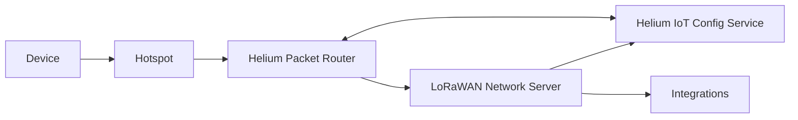

import useBaseUrl from '@docusaurus/useBaseUrl'

 
 

OpenLNS is the platform that enables any compatible LoRaWAN Network Server (LNS) to use Helium's IoT
Network. In this guide, we'll walk you through the process of setting up and configuring OpenLNS
with the popular open-source LNS, [ChirpStack](https://www.chirpstack.io/).

## What to Expect

There are four major steps to run your own LNS.

1. [Purchase a Helium Organizationally Unique Identifier (OUI)](/iot/run-an-lns/buy-an-oui)
1. [Fund a Helium Organizationally Unique Identifier (OUI)](/iot/run-an-lns/fund-an-oui)
1. [Configure and deploy a LoRaWAN Network Server (LNS)](/iot/run-an-lns/configure-chirpstack)
1. [Configure Routing Rules with Config Service](/iot/run-an-lns/configure-routing-rules)

## High-Level Architecture

Before deep-diving into configuration it is helpful to understand how Helium manages a large,
decentralized, ecosystem of gateways and network operators. At the core, Helium Packet Router (HPR)
handles the connectivity between LoRaWAN Network Servers and Hotspots (gateways).

The IoT Config Service coordinates routing for devices between HPR and the LNS.

In the architecture, the LNS does not directly interface with the Hotspot.

For a deeper understanding of the architecture of Helium's IoT network, visit the
[LoRaWAN on Helium](/iot/lorawan-on-helium) documentation.

## Advanced Configuration

There are additional configurations, automations, and data you can access with OpenLNS. You can
learn more about these in the [Advanced Configuration](/iot/run-an-lns/advanced-configuration)
section.
