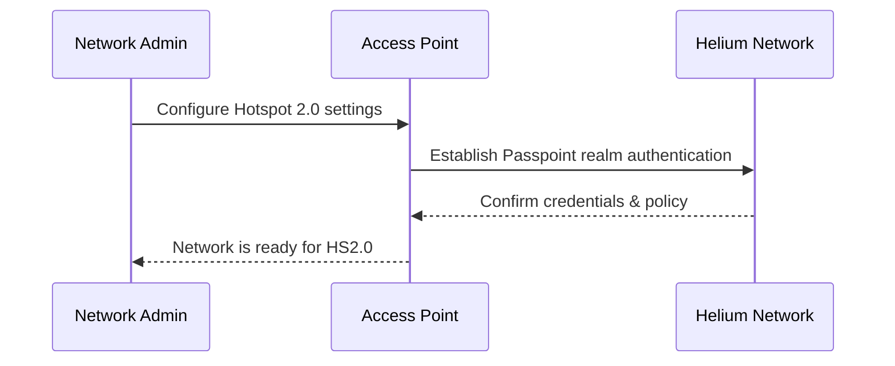

# Overview

This guide provides a high-level, brand-agnostic walkthrough of how to set up Hotspot 2.0
(Passpoint) for Helium Mobile or any other Passpoint service. While specific steps vary across
vendors—Aruba, Cisco Meraki, Ruckus, Fortinet, Extreme, Ubiquiti, etc.—the core configuration is
similar. The sections below reflect details typically required for a Helium-compatible deployment.

Below is a simplified flow of how Hotspot 2.0 typically operates:

---

## Core Configuration Steps

### 1. Hotspot 2.0 / Passpoint Enablement

1. **Enable the Feature**: Look for a toggle or option labeled "Hotspot 2.0," "Passpoint," or
   "HS2.0" on your AP or WLAN controller.
2. **NAI Realms**: For Helium Mobile, two realms must be configured:
   - `freedomfi.com` (EAP Method: `EAP-TLS`, Sub-Methods: `Certificate`)
   - `hellohelium.com` (EAP Method: `EAP-TLS`, Sub-Methods: `Certificate`)
3. **OSU (Online Sign-Up)**: Some controllers require you to specify an OSU URL or provider name. If
   necessary, consult Helium docs for exact OSU details.
4. **RCOI (Roaming Consortium OI)**: Add the consortium identifier if provided by your Hotspot 2.0
   service.

### 2. SSID Profile

1. **Create a New SSID** (e.g., named `Helium`) or modify an existing one.
2. **Security**: Configure WPA2-Enterprise or WPA3-Enterprise for 802.1X/EAP.
3. **Passpoint Advertising**: Under advanced or manual settings, enable Hotspot 2.0/Passpoint mode.
4. **Venue & Network Type**: Some platforms allow you to specify a venue name/type (e.g.,
   `Chargeable Public Network`).
5. **IP Address Type Availability**: If the controller supports it, set IPv4 to
   `Double NATed private IPv4` and IPv6 to `Unavailable` if that matches your environment.
6. **Add Realms**: Input `freedomfi.com` and `hellohelium.com` with EAP Method `EAP-TLS` and
   Sub-Method `Certificate`.
7. **Domain List**: Optionally include the domain names `freedomfi.com` and `hellohelium.com` in the
   domain list.
8. **NAS-ID**: If your provider requires a NAS-ID, you can set it to the MAC address of your
   controller or AP.

### 3. AAA and RADIUS / RadSec Integration

Hotspot 2.0 deployments with Helium generally use RADIUS over TLS (RadSec) for secure
authentication.

1. **Create/Configure RADIUS Profile**:

   - Upload a **Client Certificate**, **Private Key**, and **CA Certificate**. These are typically
     provided by Helium for early-access or production environments.
   - Enter the **RadSec Servers** and shared secrets:
     - `52.37.147.195:2083` (Shared Secret: `radsec`)
     - `44.229.62.214:2083` (Shared Secret: `radsec`)
     - `44.241.107.197:2083` (Shared Secret: `radsec`)
   - Enable **RADIUS Accounting** and configure the same servers if required.
   - (Optional) Set an **Interim Update Interval**, such as 300 seconds.

2. **Certificate Validation**:
   - Ensure the CA chain is trusted by client devices.
   - Keep track of certificate expiration to avoid service disruption.

### 4. Network & Firewall Rules

1. **Domains & Ports**: Whitelist or allow traffic to any Helium OSU or AAA endpoints used by your
   network. RadSec typically uses TCP port `2083`.
2. **Walled Garden**: If your controller enforces pre-auth access, ensure Helium domains or IP
   ranges are reachable during OSU or AAA transactions.

### 5. VLAN Assignments

1. **Designate VLAN**: Decide which VLAN or subnet handles Passpoint traffic. Provide DHCP, DNS, and
   other essential services.
2. **Isolation**: Follow best practices to segment Hotspot 2.0 traffic from internal resources.

### 6. Testing

1. **Client Device**: Use a smartphone or laptop known to support Hotspot 2.0. It should discover
   and automatically connect to your newly configured SSID.
2. **Logs & Controller**: Review logs for successful EAP authentication events. Confirm correct
   realm usage (`freedomfi.com` / `hellohelium.com`).
3. **Connectivity**: Verify that a connected device obtains the expected IP address, can access the
   internet, and is properly accounted for in RADIUS logs.

---

## Platform-Specific Tips

- **Aruba**: Look under WLAN Security settings in Mobility Controller or Aruba Central for “Hotspot
  2.0.” Add the realms, OSU, and RCOI.
- **Cisco Meraki**: Enable Passpoint under “Wireless > Configure > Access control” with
  WPA2-Enterprise. Add the Helium realms to NAI.
- **Ruckus**: Use the Hotspot 2.0 wizard in ZoneDirector or SmartZone. Provide the domain(s) and
  realm(s), then set EAP type in the AAA profile.
- **Fortinet**: Within “Wireless Controller > SSID,” enable Passpoint. Enter the relevant AAA and
  OSU details.
- **Extreme**: Under VNS config, enable HS2.0/Passpoint. Configure realms, domain, and EAP.
- **Ubiquiti**: Configure RadSec and SSID passpoint settings. Set realms to `freedomfi.com` and
  `hellohelium.com`; upload certificates; ensure you set WPA2/WPA3-Enterprise with EAP-TLS.

---

## Best Practices

- **Keep AP Firmware Updated**: Use a version that fully supports Passpoint (HS2.0) features.
- **Validate Certificates**: Use trusted CA certs for RADIUS/EAP to avoid client-side warnings.
- **Segment Traffic**: A dedicated VLAN or subnet for Passpoint traffic enhances security.
- **Test Multiple OSes**: Different devices can behave differently with Passpoint.
- **Monitor Logs**: Authentication or certificate issues typically appear in RADIUS or controller
  logs.

---

## Conclusion

Whether you’re using Aruba, Cisco Meraki, Ruckus, Fortinet, Extreme, or Ubiquiti, the Hotspot 2.0
(Passpoint) setup follows the same general workflow:

1. Enable Hotspot 2.0 on your AP or controller.
2. Use WPA2/WPA3-Enterprise with 802.1X/EAP.
3. Provide the RadSec server details, certificates, and realms (`freedomfi.com` /
   `hellohelium.com`).
4. Allow traffic to relevant domains/IPs for OSU, RADIUS, or certificate checks.
5. Confirm end-to-end connectivity and logs.

For Helium Mobile, refer to [Helium Mobile documentation](https://docs.helium.com/mobile) for exact
OSU addresses, realms, certificates, and other details. For other providers, substitute their realms
and AAA endpoints. With these steps and your vendor-specific documentation, you can deliver a
seamless, secure Passpoint experience for your users.
