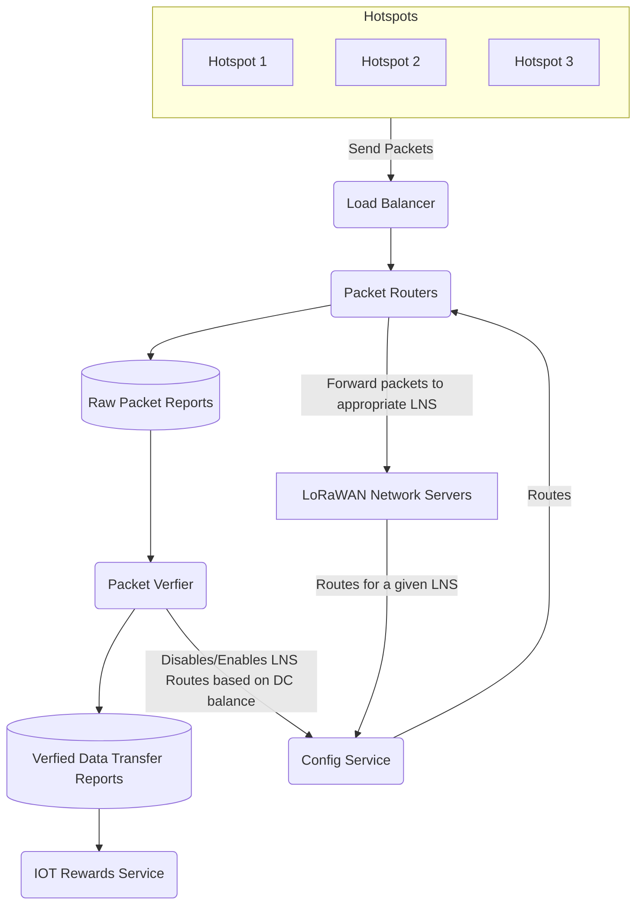

import useBaseUrl from '@docusaurus/useBaseUrl'

Moving the entire data transfer logic off-chain to Oracles will increase scalability and reduce
points of failure.

## LoRaWAN Network Server Streamlining

In comparison with its operation on the Helium L1, the LoRaWAN Network Server (LNS) has a more
focused role on Solana which emphasizes the execution of LoRaWAN specific functions without the
overhead of administering blockchain-specific functionality. After purchasing Organizationally
Unique Identifier (OUI) and slabs, the LNS must inform the Config Service of the routing for the
devices under their network. The LNS can optionally curate an allow-list to, for example, not accept
packets from disabled devices or tenants/devices with a depleted Data Credit (DC) balance. The LNS
will directly transmit these routes and their allow-list to the Config Service.

The update brings the responsibilities of a Helium LNS much more in line with a generic LNS while
also easing the integrations of existing LNS systems, further helping the expansion of the Helium
Network.

## Config Service

The Config Service keeps track of all routing rules for all devices connected to the Helium Network,
aggregating from the LNSs into a database of routes that propagate to each Packet Router. The Config
Service immediately updates the Packet Routers whenever it receives an update.

The Packet Verifier uses the Config Service to fetch the list of OUIs, wallet addresses per gateway,
and wallet addresses per OUI.

## Packet Router Service

The Packet Routers are responsible for routing packets received from Hotspots to the appropriate
LNS. This streamlined service follows the routing rules given to it by the Config Service.

If a Packet Router can match a received packet to a defined route, it will forward that message to
the appropriate LNS and submit a packet report to the Packet Reports Database.

Each packet report includes OUI, network ID, region, gateway, and payload hash metadata. The full
definition can be found
[here](https://github.com/helium/proto/blob/master/src/service/packet_router.proto#L8).

## Load Balancing Service

Hotspots interface directly with Load Balancers, helping the Helium Network scale horizontally when
needed.

## Packet Verifier Service

The Packet Verifier verifies the submitted packets. Its primary responsibilities are to:

- Confirm that each OUI and the associated LNS have enough DC to pay for the packets received.
  - If a given OUI does not, the Packet Verifier will inform the Config Service that it should
    disable the associated routes.
  - Once a disabled OUI has a positive DC balance, it will re-enable the associated routes.
- Confirm that the Message Integrity Code (MIC) check passes.
- Process reports into a separate database of verified and denied reports (denied reports include
  the cause of denial).
- Based on data transfer, calculate Rewards and the amount of DC to debit from each wallet
  associated with an OUI.

