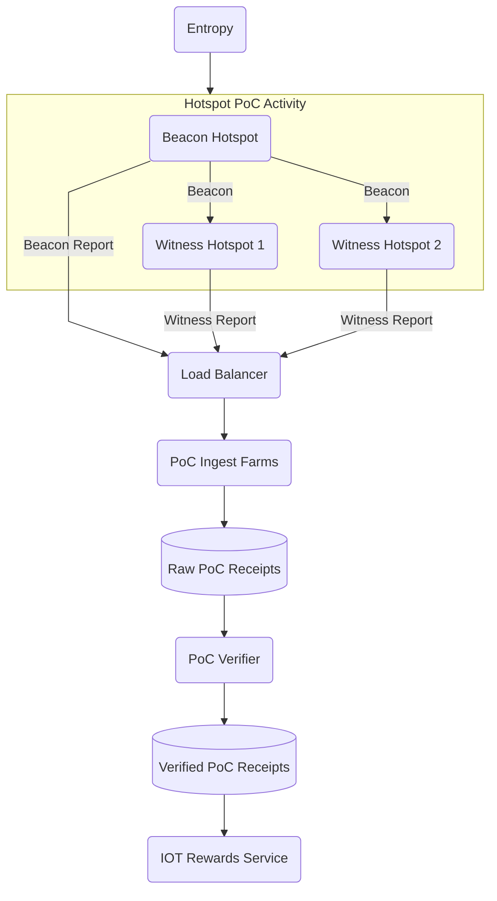

import useBaseUrl from '@docusaurus/useBaseUrl'

:::warning 🚧 This document is a work in progress. 🚧

The documentation on Oracles and the upcoming Migration is under development and subject to change.

:::

<!--TODO: remove warning banner post migration  -->

<!--TODO: remove all of this, as it is covered in PoC documentation already.  -->

On the Helium L1, Validators constructed Challenges and perform Validation of the Proof of Coverage
(PoC) on the Helium Network, with each Hotspot connected to a Validator.

A Validator informs linked Hotspots when they are selected to be challenged, prompting a beacon to
be sent by the Hotspot.

Upon witnessing a beacon, Hotposts request routing information to the Challenger Validator through
their linked Validator. to submit Witness Receipts, which the Challenger Validator uses to submit a
PoC Receipt transaction to the blockchain.

Separately, Challenge Rate is related to the amount of active Hotspots on the Helium Network. The
more Hotspots there are, the less each Hotspot will be challenged, with Hotspots currently being
challenged once a day on average.

While functional, the Helium blockchain is at a crossroads where PoC Challenges and Witnesses can be
lost if the Hotspot's linked Validator has fallen behind the blockchain. Additionally, PoC activity
is registered on-chain, limiting the number of Witnesses per beacon and how many Challenges can
process in a given interval leaving Hotspot Owners unable to get quick feedback on their setups,
resulting in uneven earnings and sub-optimal coverage.

## Post Migration Implementation

On the Solana L1, all PoC activity is off-chain, removing Validators as a potential point of failure
and greatly simplifying the beaconing process by allowing Hotspots to self-beacon at regular
intervals. Additionally, off-chain PoC is much more easily scalable and will remove the limitations
on the number of Witnesses per beacon.

The main actors and their relationships with one another are as follows.

### Hotspots

- Hotspots will now self-beacon at regular intervals, targeting a 6-hour interval at launch.
- To prevent premature beaconing and replay attacks, the beacon will include some entropy.
- Hotspots beacon their Challenge and submit it to the PoC Ingest Farm through a Load Balancer
  proxy.
- When a Hotspot witnesses a beacon, the Hotspot directly submits the receipt to the PoC ingest
  farm.

### PoC Ingest Farm

The PoC Ingest farm only performs basic validation that filters out structurally invalid data and
then submits both the beacon receipt and the witness receipts to an S3 bucket. The limited duties of
the PoC Ingest farms make them easily scalable as the Network grows.

### PoC Verifier Oracle

The PoC Verifier Oracle verifies all the data submitted by correlating witnesses to receipts and
confirming the series of events, then submits these processed rewardable and invalid receipts to a
separate S3 bucket, including how many shares to give to each Hotspot.

