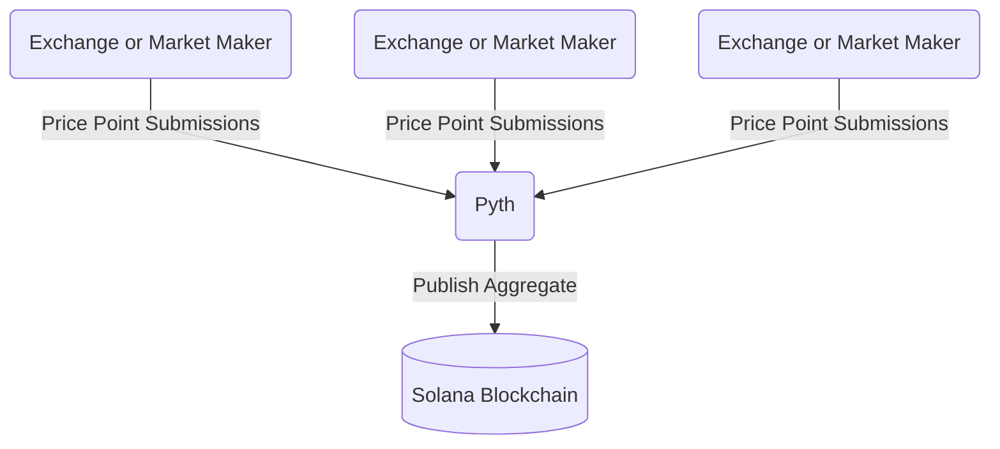

import useBaseUrl from '@docusaurus/useBaseUrl'

:::warning 🚧 This document is a work in progress. 🚧

The documentation on Solana and the upcoming Migration is under development and subject to change.

:::

On the Helium L1, the Price Oracle is the only existing Oracle on the Helium Network. It is required
on-chain as the price of HNT is needed to calculate HNT to burn when minting Data Credits (DC).

### Current Implementation

The price of HNT is updated every ten blocks on-chain by requiring Price Oracles run by several
anonymous community members to submit prices through a specific transaction.

Then, if most Oracles have submitted prices in the past 24 hours, the blockchain can calculate the
new price by taking a trailing 24-hour median. It does this by taking the 24-hour median of
submitted prices.

### Post Migration Implementation

With the migration to Solana, the Helium Network can now take advantage of the larger Solana
ecosystem.

The Helium Network will replace our hand-spun price oracle with the tried and tested
[Pyth Network](https://pyth.network/), which publishes financial market data.

At an overview, Pyth works by having publishers (exchanges and market makings firms) submit price
points for given coin pair values and then aggregates this data and makes it available on-chain.

Pyth's
[exponentially-weighted moving average (EMA) price aggregation](https://docs.pyth.network/how-pyth-works/ema-price-aggregation)
adds time to the aggregation with a heavier weight given to more recent price samples, smoothing the
price and controlling for outliers and further increases trust in the price and helps shield against
potential bad actors.

An out-of-the-box Oracle solution means fewer developer requirements for the Helium core developers
and ensures more reliable service.

