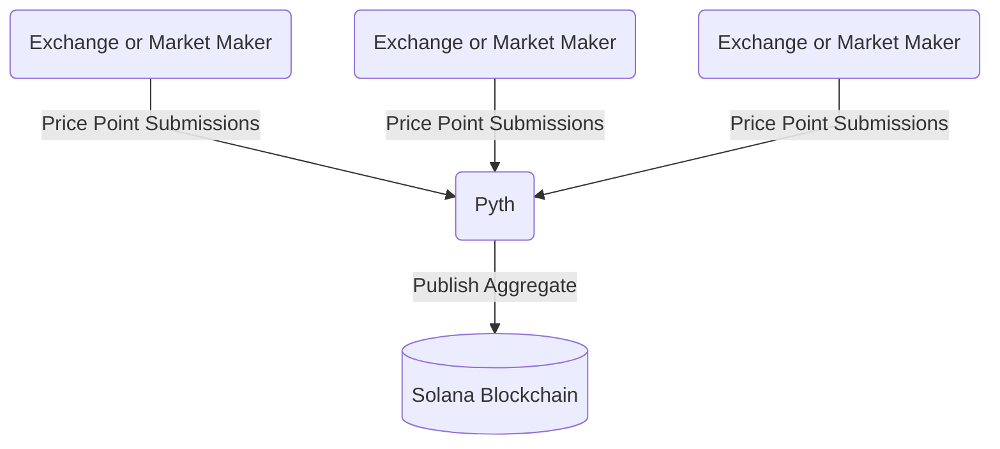
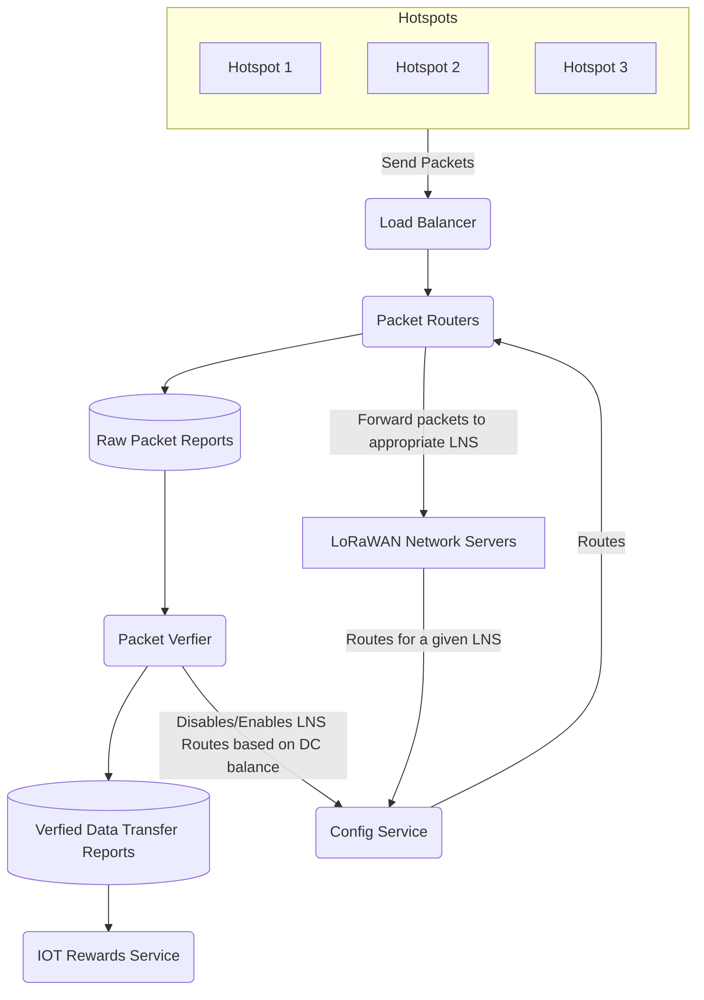
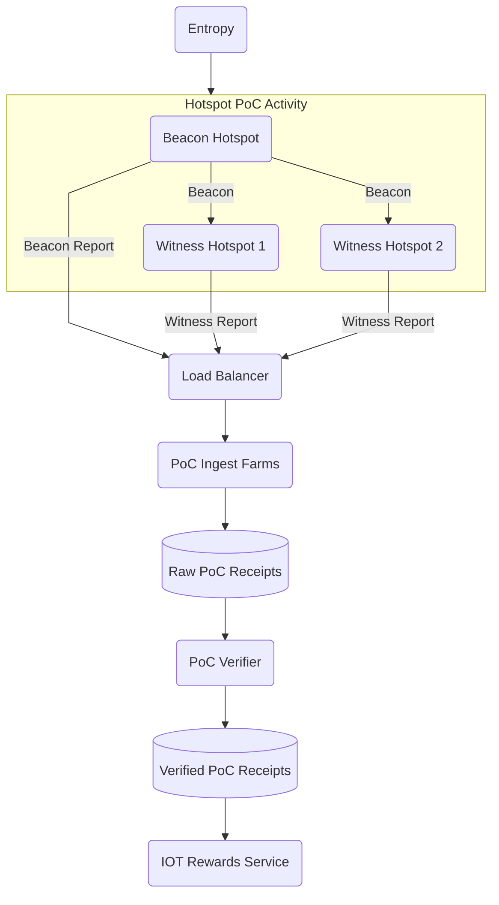
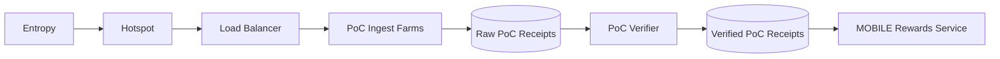
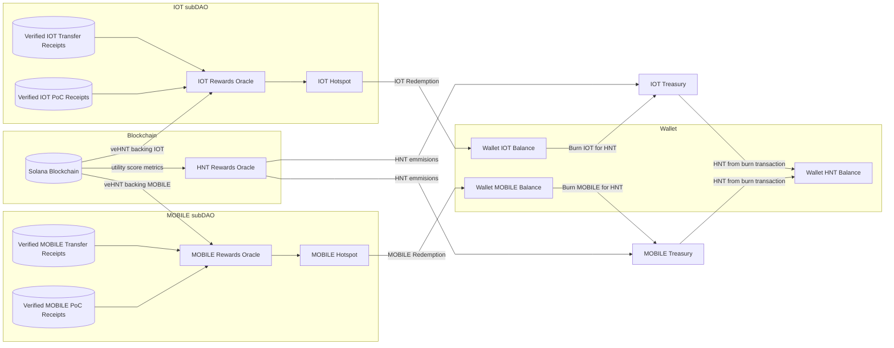

import useBaseUrl from '@docusaurus/useBaseUrl'

# Solana Migration for Infrastructure

The migration of the Helium Network from its L1 to Solana brings several changes to the setup of the
Network and its associated subDAOs infrastructure. Chief among these changes is moving a lot of data
that has until now been on-chain (namely PoC data) off-chain.

As such, this migration introduces several Oracles which serve as bridges between the external world
and the blockchain. These infrastructure changes will allow the Helium Network to effectively
introduce new Networks as Decentralized Network Protocol (DNP) subDAOs and more easily scale
existing DNP subDAOs by removing existing bottlenecks. This document outlines the future state of
the infrastructure post-migration.

---

## Price Oracle

On the Helium L1, the Price Oracle is the only existing Oracle on the Helium Network. It is required
on-chain as the price of HNT is needed to calculate HNT to burn when minting Data Credits (DC).

### Current Implementation

The price of HNT is updated every ten blocks on-chain by requiring Price Oracles run by several
anonymous community members to submit prices through a specific transaction.

Then, if most Oracles have submitted prices in the past 24 hours, the blockchain can calculate the
new price by taking a trailing 24-hour median. It does this by taking the 24-hour median of
submitted prices.

### Post Migration Implementation

With the migration to Solana, the Helium Network can now take advantage of the larger Solana
ecosystem.

The Helium Network will replace our hand-spun price oracle with the tried and tested
[Pyth Network](https://pyth.network/), which publishes financial market data.

At an overview, Pyth works by having publishers (exchanges and market makings firms) submit price
points for given coin pair values and then aggregates this data and makes it available on-chain.

Pyth's
[exponentially-weighted moving average (EMA) price aggregation](https://docs.pyth.network/how-pyth-works/ema-price-aggregation)
adds time to the aggregation with a heavier weight given to more recent price samples, smoothing the
price and controlling for outliers and further increases trust in the price and helps shield against
potential bad actors.

An out-of-the-box Oracle solution means fewer developer requirements for the Helium core developers
and ensures more reliable service.

---

## Data Transfer Oracle

Moving the entire data transfer logic off-chain will increase scalability and reduce points of
failure.

### Lorawan Network Server Streamlining

On the Helium L1, being a LoRaWAN Network Server (LNS) on the Helium Network requires running the
router, [state channels](/blockchain/packet-purchasing/#state-channels), and the Helium chain, a
significant hurdle for non-blockchain native LNS configurations.

On the Solana L1, the LNS will have a much-reduced role. After purchasing their Organizationally
Unique Identifier (OUI) and slabs, they must inform the Config Service of the routing for the
devices under their network. The LNS can optionally curate an allow-list to, for example, not accept
packets from disabled devices or tenants/devices with a depleted Data Credit (DC) balance. The LNS
will directly transmit these routes and their allow-list to the Config Service.

The updated and reduced role brings the responsibilities of a Helium LNS much more in line with a
generic LNS while also easing the integrations of existing LNS systems, further helping the
expansion of the Helium Network.

### Config Service

The Config Service will keep track of all the routing rules for all the devices connected to the
Helium Network, aggregating from the LNSs into a database of routes that will propagate to each
Packet Router. The Config Service will immediately update the Packet Routers whenever it receives an
update.

The Packet Verifier also uses the Config Service to fetch the list of OUIs, wallet addresses per
gateway, and wallet addresses per OUI.

### Packet Router Service

The Packet Routers are responsible for routing the packets it receives from Hotspots to the
appropriate LNS. This streamlined service follows the routing rules given to it by the Config
Service.

If a Packet Router can match a received packet to a defined route, it will forward that message to
the appropriate LNS and submit a packet report to the Packet Reports Database.

Each packet report includes OUI, network ID, region, gateway, and payload hash metadata. The full
definition can be found
[here](https://github.com/helium/proto/blob/master/src/service/packet_router.proto#L8).

### Load Balancing Service

Hotspots will interface directly with Load Balancers, helping the Helium Network scale horizontally
when needed.

### Packet Verifier Service

The Packet Verifier verifies the submitted packets. Its primary responsibilities are to:

- Confirm that each OUI and the associated LNS have enough DC to pay for the packets received. If a
  given OUI does not, the packet verifier will inform the config service that it should disable the
  associated routes. Once a disabled OUI has a positive DC balance, it will re-enable the associated
  routes.
- Confirms that the Message Integrity Code (MIC) check passes.
- Processes these reports into a separate database of verified and denied reports (denied reports
  include the cause of denial).
- Based on data transfer, calculate Rewards and the amount of DC to debit from each wallet
  associated with an OUI.

---

## IOT Proof Of Coverage Oracle

### Current Implementation

On the Helium L1, Validators construct Challenges and perform Validation of the Proof of Coverage
(PoC) on the Helium Network, with each Hotspot connected to a Validator.

A Validator informs linked Hotspots when they are selected to be challenged, prompting a beacon to
be sent by the Hotspot.

Upon witnessing a beacon, Hotposts request routing information to the Challenger Validator through
their linked Validator. to submit Witness Receipts, which the Challenger Validator uses to submit a
PoC Receipt transaction to the blockchain.

Separately, Challenge Rate is related to the amount of active Hotspots on the Helium Network. The
more Hotspots there are, the less each Hotspot will be challenged, with Hotspots currently being
challenged once a day on average.

While functional, the Helium blockchain is at a crossroads where PoC Challenges and Witnesses can be
lost if the Hotspot's linked Validator has fallen behind the blockchain. Additionally, PoC activity
is registered on-chain, limiting the number of Witnesses per beacon and how many Challenges can
process in a given interval leaving Hotspot Owners unable to get quick feedback on their setups,
resulting in uneven earnings and sub-optimal coverage.

### Post Migration Implementation

On the Solana L1, all PoC activity will be off-chain, removing Validators as a potential point of
failure and greatly simplifying the beaconing process by allowing Hotspots to self-beacon at regular
intervals. Additionally, off-chain PoC is much more easily scalable and will remove the limitations
on the number of Witnesses per beacon.

The main actors and their relationships with one another are as follows.

### Hotspots

Beaconing: Hotspots will now self-beacon at regular intervals, targeting a 6-hour interval at
launch.

To prevent premature beaconing and replay attacks, the beacon will include some entropy. This
Hotspot will beacon their Challenge and submit it to the PoC Ingest Farm through a Load Balancer
proxy.

Witnessing: When a Hotspot witnesses a beacon, the Hotspot directly submits the receipt to the PoC
ingest farm.

### PoC Ingest Farm

The PoC Ingest farm will only perform basic validation that filters out structurally invalid data
and will then submit both the beacon receipt and the witness receipts to an S3 bucket. The limited
duties of the PoC Ingest farms make them easily scalable as the Network evolves.

### PoC Verifier Oracle

The PoC Verifier Oracle will verify all the data submitted by correlating witnesses to receipts and
confirming the series of events, then submitting these processed rewardable and invalid receipts to
a separate S3 bucket, including how many shares to give to each Hotspot.

---

## Mobile PoC Oracle

As the MOBILE subDAO is still in its infancy, its
[PoC model is relatively straightforward](/5g-on-helium/mobile-poc) and based on the following
factors:

1. The Small Cell Radio Type.
2. Heartbeats and Reliability of Service.
3. Speed Tests and Quality of Service.

Heartbeats and Speed Tests are submitted off-chain to the MOBILE Ingest farm to be verified and used
by the rewards service.

In the following year, the team plans to add modeled coverage, location-based coverage, and mappers
to MOBILE PoC. You can read this
[roadmap](https://blog.helium.com/mobile-proof-of-coverage-the-road-ahead-73a25601a13d) to learn
more about these plans.

---

## Rewards Oracles And Infrastructure

There will initially be three Rewards Oracles, one for each subDAO (MOBILE and IOT) and one for HNT,
which ingest the work of all of the above Oracles to determine the appropriate emissions for each
subDAO.

Epochs will increase from around 30 blocks (or about 30 minutes) to 24 hours, with rewards issued
every 24 hours.

### Lazy Distribution of Rewards

With the migration to Solana, Rewards will now be "lazily distributed" to each Hotspot, meaning that
instead of passively receiving tokens, Hotspot Owners will redeem them.

When a Hotspot Owner makes a redemption request, the Rewards Oracle will compute the difference
between the `lifetime` and `claimed` token Rewards to determine the amount of unclaimed tokens per
Hotspot. It will then pre-sign a transaction which the Hotspot Owner will submit to the blockchain.
It is only at this point that Rewards will be registered on-chain and associated with the owning
Helium Wallet.

### IOT Rewards Oracle

The IOT Rewards Oracle combines the Verified PoC Receipts, the Verified IOT Data Transfer Receipts,
and the veHNT backing the IOT Network and emits rewards to each Hotspot.

As a reminder, the Data Transfer Verifier and the PoC Verifier already do much of the heavy lifting
by including the shares each Hotspot should receive.

### Mobile Rewards Oracle

The MOBILE Rewards Oracle combines the Verified MOBILE Receipts, the Verified MOBILE Data Transfer
Receipts, and the veHNT backing the MOBILE Network and emits rewards to each Hotspot.

### HNT Rewards Oracle

As defined in [HIP-51](https://github.com/helium/HIP/blob/main/0051-helium-dao.md), the HNT Rewards
Oracle will issue HNT Reward emissions to each subDAOs treasury using each subDAOs Utility Score to
determine which percentage of the total rewards each subDAO is due.

The following comprise the subDAO Utility Score:

- subDAO's DCs burned in USD
- subDAO's active device count and device activation fee
- veHNT backing each subDAO

DC burned, active device count, and veHNT staked are submitted to the chain through the proxy of
[Switchboard](https://switchboard.xyz/) to facilitate this process and keep a record.

Device count is a fluctuating number based on recent PoC activity and is not readily available
on-chain; a dedicated Oracle will submit device count to the blockchain via Switchboard.

### SubDAO to HNT Conversion

Each subDAO is responsible for defining its Treasury Reserve Decentralized Network Token (DNT)
Market Making Curve.

The curves for
[IOT](https://github.com/helium/HIP/blob/main/0052-iot-dao.md#treasury-reserve-dnt-market-making-curve)
and [MOBILE](https://github.com/helium/HIP/blob/main/0053-mobile-dao.md) can be found in their
respective HIPs.

This is a "one-way" transaction to convert your subDNT into HNT, as you can not burn HNT for subDNT.

## Other Notes

- Initially, all of these Oracles will be run by the Helium Foundation, with the long-term goal that
  community members will also run them.
- The buckets with raw PoC and Data Transfer receipts will be available for verification/security
  purposes.
- During the transition to Solana, data transmission will be temporarily interrupted while Makers
  roll out the new `gateway-rs` image, which will tell Hotspots to communicate with the packet
  routers instead of LNS state channels.
- To learn more about how staking and governance will change, refer to the documentation on
  [Validators and Voting Power](/mine-hnt/validators/validators-and-voting-power).
