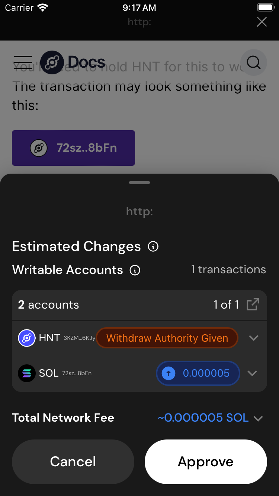

Helium is built on top of Solana, a general purpose blockchain. Because Helium is built on Solana, 
there are many things you can do with your wallet both inside and outside of the Helium ecosystem.

This article serves as an interactive quickstart on Solana transactions, and how to make sure you're
staying safe!

## Was my wallet compromised?

There are only two ways a wallet on Solana can be compromised.

  1. Someone gained access to your 12 or 24 word seed phrase.

      a. You are the ONLY person who has access to this phrase. Do not give it out.

  2. You approved a malicious transaction.

If neither (1) or (2) happened, your wallet is safe. Some examples:

> An NFT appeared in my wallet and I visited the site listed. Am I compromised?

No, simply visiting a website is not enough to compromise your wallet.

> I took a screenshot of my seed phrase and stored it in iCloud. My iCloud was hacked

Yes. You have been compromised.

> Helium Support contacted me and said I need to give them my seed phrase to fix my hotspot. I gave it to them.

Yes. You have been compromised. Nobody from Helium will EVER ask you for your seed phrase.

> A website failed to connect to my wallet and said I needed to manually connect my wallet with my seed phrase. I input the seed phrase.

Yes. You have been compromised. No website should EVER ask you for your seed phrase.

> An NFT appeared in my wallet claiming I had free tokens to claim. I went to the website, clicked the claim button, and clicked approve

Yes. You may have been compromised by approving a bad transaction.

What is a bad transaction? How can you tell if a transaction is suspicious? In general, you should never
sign a transaction from an app you do not trust. When in doubt, do not sign.

This page will serve as a guide to help you identify suspicious transactions.

## The Basics

### What is a Transaction?

A transaction refers to a set of instructions that are executed on the Solana blockchain. 
A Solana transaction typically includes a sequence of operations or instructions that modify the
state of the blockchain. These operations can involve transferring tokens, executing smart contracts, 
or interacting with decentralized applications (dApps). 

### What is an Account?

In the context of Solana, an account refers to a data structure that holds information on the 
state of a particular entity on the blockchain. Accounts in Solana are fundamental components that 
store data, tokens, or program code.

If you hold HNT tokens, those tokens are in an Account that is tied to your wallet.

### Anatomy of a Solana Transaction

A Solana transaction is made up of 

  1. Accounts - Pieces of state on Solana

      a. Read-only Accounts - Accounts that are used during a transaction, but cannot be changed.

      b. Writable Accounts - Accounts that can change during a transaction. For example, if your USDC account is writable, it is able to send (or receive) tokens in this transaction

  2. Instructions - A set of actions to make changes to Accounts. Examples include transfers, or claiming rewards on a Helium hotspot.
  3. Signers - A set of Wallets that must agree to this transaction for it to be valid

Accounts are generally tied to particular wallets - this means that **only** that wallet can make
changes to the Account. For example, if you hold $HNT, only your wallet can send those tokens. This
is why it is important to **never give out your seed phrase** and **never sign a transaction you don't trust**.

## Transaction Previews

Most wallets, including the Helium Wallet App, come with a transaction preview. To follow this guide on Helium Wallet,
open the wallet app and navigate to this page using the DApp Browser (globe icon on the far right).

These previews use a Solana feature called *simulation*. On Solana, *simulation* allows you
to simulate what a transaction will change without actually executing the transaction. These simulations
can be useful for estimating changes to your wallet, such as changes in token balance.

It is important to note that **simulations can be manipulated by scammers**. As such, never take a simulation as gospel.

Want to see a transaction preview in your wallet? Click the button below and it will create a transaction to send 0.01 SOL.

Note that none of the transactions on this page will actually be sent.

import { Simulate } from '@theme/Simulate';
import { Spoiler } from '@theme/Spoiler';
import { SystemProgram, PublicKey, LAMPORTS_PER_SOL } from '@solana/web3.js';

<Simulate 
  getInstructions={async ({ connection, wallet }) => {
    return { instructions: [
      [
        await SystemProgram.transfer({
          fromPubkey: wallet.publicKey,
          toPubkey: new PublicKey('1nc1nerator11111111111111111111111111111111'),
          lamports: BigInt(0.01 * LAMPORTS_PER_SOL)
        })
      ]
    ] }
  }}
/>

You should see the following:

Here we can see a few things. First, there are 2 accounts that are `writable` in this transaction.
The first is your sol account, the second is the destination sol account. Second, you can see the total
network fee (denominated in SOL) that you will pay to run this transaction.

**How will this transaction change your SOL Balance?**

  <Spoiler>
  While it is estimated that you will send `0.010005` SOL in this transaction, the transcation *could*
  send away all of your SOL. This is only a simulation, the actual changes may differ. As always, be sure
  you trust any application you approve transactions from within.
  </Spoiler>

**How will this transaction change your HNT Balance?**

  <Spoiler>
  Your HNT balance **can not** change from this transaction, because your HNT account is not labeled as `writable`.
  The only accounts at risk in a transaction are the ones that are `writable`
  </Spoiler>

## Common Attacks

Now that you are familiar with Solana transactions, and their previews, lets go through some examples
of suspicious transactions.

Generally, these transactions will come under the guise of another function. An attacker may claim this
transaction will give you free tokens, mint an NFT, or even repair your hotspot. The attacker is lying.
If anyone tells you to ignore the transaction preview warnings, they are suspicious.

### The Obvious Drainer

import { getObviousDrain } from './transactions'

The following transaction(s) will attempt to drain all of your token accounts:

<Simulate 
  getInstructions={async ({ connection, wallet, publicKey }) => {
      return getObviousDrain({ connection, wallet, publicKey })
  }}
/>

You should see a preview like this:

  

  
  

Given this preview, it is pretty obvious that all your token accounts are getting drained. Not only
are they all labeled as writable, the simulation shows that all tokens are getting sent away!

You should never approve a transaction that looks like this.

### The Bitflip Drainer

The above drainer was obvious because the simulation showed all tokens leaving your account.

But what if the simulation didn't show any account changes? In a bitflip attack, an attacker creates
a program on-chain that has a remote-enabled switch to rug you. The attacker waits until after you approve
the transaction to flip the switch. What does one of these look like in preview?

import { getBitflipDrain } from './transactions'

<Simulate 
  getInstructions={async ({ connection, wallet, publicKey }) => {
      return getBitflipDrain({ connection, wallet, publicKey })
  }}
/>

You should see a preview like this. Note that we did not create a bitflip program, this is just what it would look like in preview:

  

  
  

Given this preview, it's not clear that you are getting rugged. Your accounts are labeled as writable,
bt they do not change in simulation.

An attacker may mix such a transaction with other accounts as a smoke-screen. Remember **any account that is writable is at risk of getting drained.**

### Simulation Failed

Another common tactic of drainers is to just fail the simulation. If you can't see what changes, you
can't make an educated decision. Generally, these attackers will have some text on the website telling
you to ignore failed transaction simulations. This is a lie. Do not approve these transactions

import { getFailedSimulation } from './transactions'

<Simulate 
  getInstructions={async ({ connection, wallet, publicKey }) => {
      return getFailedSimulation({ connection, wallet, publicKey })
  }}
/>

You should see a preview like this:

  

  
  

### The Smoke Screen

Not every transaction you approve will be executed. In a smoke screen attack, the attacker creates
multiple transactions, the sum of which is a positive outcome.

In this attack, you may see that you sent all of your $HNT to the attacker. But you may also see another
transaction that's sending you $1,000,000 $USDC. Or some "free" airdrop. You figure that its worth
losing the HNT for the USDC. The site could also be convincing you that this is a legitimate swap of some sort.

The transaction may look something like this:

import { getSmokeScreen } from './transactions'

<Simulate 
  getInstructions={async ({ connection, wallet, publicKey }) => {
      return getSmokeScreen({ connection, wallet, publicKey })
  }}
/>

You should see a preview like this:

  

  
  

This looks appealing. After all, the simulation is telling you you'll get $1,000,000
and all you have to do is send 0.01 SOL! As always, if it seems too good to be true, it is.
If you approve a transaction like this, the attacker will only send the transactions where you
give them funds.

### The Slow Rug

Did you know that if you approve a malicious transaction, it may not take all of your funds at that momemnt?

Some attacks compromise your wallet, and then lay in wait until more funds are transferred into the wallet.
Imagine you signed a suspicious transaction to mint an NFT, but then you got the NFT. Everything is good, right?
Wrong. Later on you transfer $50,000 USDC into this wallet, and it immediately disappears. This actually happened
to someone. How can this happen?

Solana token accounts have an ability called `delegation`. Think of delegation as a way to give another wallet
permissions to withdraw a set amount of tokens from your wallet. This is
generally used for subscription services and escrowless NFT listing. An attacker will use this feature
to give themselves unlimited delegation on your account. They then wait until you transfer in more funds,
and steal them.

You'll need to hold HNT for this to work. The transaction may look something like this:

import { getDelegate } from './transactions'

<Simulate 
  getInstructions={async ({ connection, wallet, publicKey }) => {
      return getDelegate({ connection, wallet, publicKey })
  }}
/>

You should see a preview like this:

  

  
  

Note that typically this attack is combined with a smoke screen. The attacker
will have multiple transactions, or disguise this transaction to look like a legitimate transaction.
This attack can also be combined with a bitflip attack so you do not see "Withdraw Authority Given"
in the simulation. As always, be careful about what you sign.

### The Owner Change

Similar to the slow rug, malicious actors can change the owner of your token account. This gives them full
permission to withdraw your tokens, and removes your ability to withdraw your tokens. Once the owner is
changed, the token account is theirs.

You'll need to hold HNT for this to work. The transaction may look something like this:

import { getOwnerChange } from './transactions'

<Simulate 
  getInstructions={async ({ connection, wallet, publicKey }) => {
      return getOwnerChange({ connection, wallet, publicKey })
  }}
/>

You should see a preview like this:

  

  
  

Note that typically this attack is combined with a smoke screen. The attacker
will have multiple transactions, or disguise this transaction to look like a legitimate transaction.
This attack can also be combined with a bitflip attack so you do not see "Owner Change"
in the simulation. As always, be careful about what you sign.

### Fake Token/Mint

Attack sites will try to make the transaction preview look like it is giving you what you expect.

For example, an attacker may claim to be giving out free $JUP. When you see the transaction preview, it
says you are receiving $JUP. But is it actually $JUP?

On Solana, token names and symbols **are not unique**. Anybody can create a token that is a duplicate
of another token. If you are unsure, verify the public key of the token you are receiving.

### Address Poisoning

You are trying to send your SOL to an exchange like coinbase. Imagine the following workflow

   1. You send 0.01 SOL as a test to the address coinbase specified
   2. You verify it arrived in coinbase
   3. You go into your transaction history and copy the succesful coinbase address
   4. You send the remaining 100 SOL to coinbase
   5. It never arrives.

What happened? This attack is called dusting. Notice in step 3 you copied an address from your transaction history.
There was a hidden step 2.5. The scammer sent you a transaction from an address that looks exactly like
the coinbase address -- the first 4 and last 4 characters of the public key are the same! When you went
into your transaction history and clicked the first transaction, it was the scammer's dust transacion. NOT your
testing transaction.

To avoid this attack, always copy addresses directly from the exchange, and never from your transaction history.

## Where do Scams Come From?

Scammers will try to find any way to get your attention. Some common ways include:

  * Discord DMs
  * Twitter replies
  * Sending you NFTs with a link attached
  * Sending you Tokens with a link attached
  * Sending you a small amount of SOL from a domain that takes you to a link
  * Texting you
  * Pretending to be support
  * Pretending to be a reporter

Generally, trust no one. Always verify who you are talking to, and never approve transactions for a website
you just discovered. You wouldn't give out your bank account password, so never give out your seed phrase.

## My wallet is compromised, now what?

As seen above, an attack can do more than just drain your wallet. It can leave landmines that
await future funds to steal those as well.

Because of this, if your wallet is compromised, **create a new wallet with a new seed phrase**.

## Hot/Cold Wallet

These attacks may seem scary, but there is a way to limit their blast radius. When you walk around in
the real world, do you carry the entire contents of your bank account in your wallet? Of course not!

You keep enough money for a few days in your wallet, and not more. Crypto is no different.

A **hot wallet** is a wallet you use for daily interactions. Do not keep more in this wallet than you
are willing to lose.

A **cold wallet** is a wallet you use for storing funds. With few exceptions, this wallet should only
be used for transactions within your wallet of choice. It should never interact with applications.

Treat your cold wallet like a savings account. For an added layer of safety, you can make your cold wallet
a hardware wallet (Ledger, Trezor, Keystone, Ryder, etc). You can also use a multisig like [Squads](https://squads.so/).
